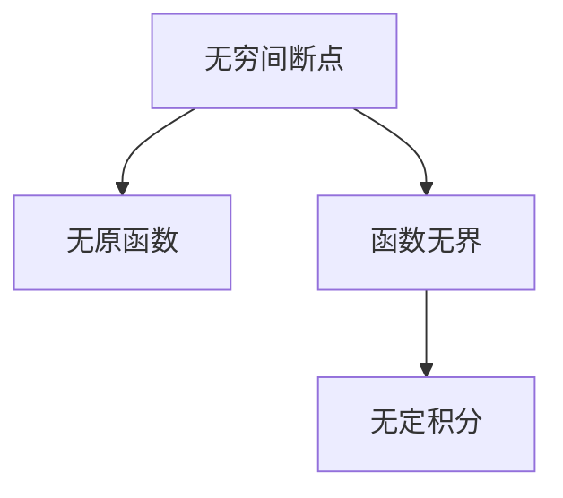

# 第八讲. 一元函数积分学的概念与性质
## 例题：
### 8.1
- 利用原函数与导数的关系求解其他函数
[[Excalidraw/例题/第八讲例题.md#^KeKxI65O]]
### 8.2
- 求分段函数的原函数
- **不连续的函数不能作为原函数**
- 确定连续后再判断哪个选项是题目中 $f(x)$ 的原函数
[[Excalidraw/例题/第八讲例题.md#^dEjPAzTX]]
### 8.3（十分综合，覆盖面广，可以作为综合复习用） #重要 
- 选项一
	- 函数有跳跃间断点，没有原函数 [[[数一\1 高数\4 一元函数积分学及其应用\1. 概念\不定积分|不定积分]]](1-4.%20一元函数积分学/1.%20概念/不定积分.md#^dkls6i)
	- 函数在闭区间上有界，且有有限个间断点，存在定积分[定积分](1-4.%20一元函数积分学/1.%20概念/定积分.md#^f7k6z9)
- 选项二
	- 函数存在**震荡间断点**，无法直接确定是否存在原函数
		- 构造[辅助函数](1-3.%20一元函数微分学/3.%20应用/2.%20[[数一\1 高数\2 一元函数微分学及其应用\1-3. 一元函数微分学\3. 应用\2. 中值定理、微分等式与微分不等式\中值定理|中值定理]]、微分等式与[[数一\1 高数\2 一元函数微分学及其应用\1-3. 一元函数微分学\3. 应用\2. 中值定理、微分等式与微分不等式\微分不等式|微分不等式]]/中值定理.md#^ioeeax)，求原函数
	- 函数在 $x=0$ 的邻域**无界震荡**，无界 $\rightarrow$ 无定积分
		- [[[0. 杂项\灵光乍现|灵光乍现]]](0.%20杂项/灵光乍现.md#[[数一\1 高数\1 函数 极限与连续\无穷小|无穷小]]%20times%20有界函数)
- 选项三
	- 函数存在无穷间断点

- 选项四
	- 与选项二类似
	- 函数在闭区间上有界，且有有限个间断点，存在定积分
> [!tip] 
> 函数有定积分**推不出**函数有不定积分
> 函数有不定积分**推不出**函数有定积分

[[Excalidraw/例题/第八讲例题.md#^gpQKWPyJ]]
### 8.4（几何法，理解积分的几何意义更好做题）
- 题目给出的两个函数是一条函数曲线
	- [反函数](1-1.%20函数的极限与连续/[[数一\1 高数\1 函数 极限与连续\函数的概念、特性与图像|函数的概念、特性与图像]].md#2%204%20图像关系%20重要)
- 画图比较面积
[[Excalidraw/例题/第八讲例题.md#^mn3pPWMl]]
### 8.5
- [启航教育在线考研官网-考研辅导培训_启航教育考研网络课堂](https://www.iqihang.com/ark/record/1033924/126603/12067828/17FFDA9051B0FE61753C612EB38A8D5A/3/3654/1/4779/0) 33:31
- 本题要求解图像与 x 轴围成的面积的总和，不分正负
[[Excalidraw/例题/第八讲例题.md#^tXZ8Nz67]]
### 8.6（考研经常出现的题型，掌握精确定义）
- [[[数一\1 高数\4 一元函数积分学及其应用\1. 概念\定积分|定积分]]](1-4.%20一元函数积分学/1.%20概念/定积分.md#数列和的极限)
- 这种类型的题目可能是使用凑[精确定义](1-4.%20一元函数积分学/1.%20概念/定积分.md#精确定义)或[[数一\1 高数\1 函数 极限与连续\夹逼准则|夹逼准则]]
- 本题是凑精确定义，使用夹逼准则做不出来
[[Excalidraw/例题/第八讲例题.md#^gzr8QsbL]]
### 8.7
- [启航教育在线考研官网-考研辅导培训_启航教育考研网络课堂](https://www.iqihang.com/ark/record/1033924/126603/12067828/17FFDA9051B0FE61753C612EB38A8D5A/3/3654/1/4779/0) 55:41
- 对[保号性](1-4.%20一元函数积分学/1.%20概念/定积分.md#^0vi3qw)的证明
- 连续函数 $\rightarrow x_{0}$ 两侧的点无限靠近

> [!tip] 
> 若连续函数 $f(x),g(x)$ 满足 $f(x)\geq g(x)$ ，且 $f(x)$ 不恒等于 $g(x)$ ，又 $a <b$ ，则必有严格不等式 $\int_{a}^{b}f(x)\mathrm{d}x > \int_{a}^{b}g(x)\mathrm{d}x$ 

[[Excalidraw/例题/第八讲例题.md#^zASD6WWF]]
### 8.8
- 使用拉格朗日[[数一\1 高数\2 一元函数微分学及其应用\1-3. 一元函数微分学\3. 应用\2. 中值定理、微分等式与微分不等式\中值定理|中值定理]]证明[[[数一\1 高数\4 一元函数积分学及其应用\积分中值定理|积分中值定理]]](1-4.%20一元函数积分学/1.%20概念/[[数一\1 高数\4 一元函数积分学及其应用\1. 概念\定积分|定积分]].md#性质6：中值定理)
[[Excalidraw/例题/第八讲例题.md#^PS71OprW]]
### 8.9
- 利用[重要不等式](1-2.%20[[数一\1 高数\1 函数 极限与连续\数列极限|数列极限]]/[[数一\1 高数\1 函数 极限与连续\放缩法|放缩法]].md#2%20重要不等式)判断原函数的大小关系
- 再利用[积分的保号性](1-4.%20一元函数积分学/1.%20概念/定积分.md#性质4：积分的保号性)判断积分的大小关系
[[Excalidraw/例题/第八讲例题.md#^WMxKfZ89]]
### 8.10
- 利用[重要不等式](1-2.%20数列极限/放缩法.md#2%20重要不等式)判断原函数的大小关系
- 再利用[积分的保号性](1-4.%20一元函数积分学/1.%20概念/定积分.md#性质4：积分的保号性)判断积分的大小关系
- $\sin x,\cos x$ 一拱的面积是 2 [[[数一\1 高数\1 函数 极限与连续\函数的概念、特性与图像|函数的概念、特性与图像]]](1-1.%20函数的极限与连续/函数的概念、特性与图像.md#^ycixyx)
- [定积分两个规定](1-4.%20一元函数积分学/1.%20概念/定积分.md#两个规定)
[[Excalidraw/例题/第八讲例题.md#^BU1VIweJ]]
### 8.11
- [[数一\1 高数\4 一元函数积分学及其应用\变限积分|变限积分]]的性质
- 变限积分存在 $\rightarrow$ 原函数在区间内**连续**[变限积分](1-4.%20一元函数积分学/1.%20概念/变限积分.md#^wktzxq)，排除 B 选项
- 将 $x=0$ 的点带入，得到原函数在原点的值是 0
- 被积函数有两个跳跃间断点 $\rightarrow$ 有两个尖点[变限积分](1-4.%20一元函数积分学/1.%20概念/变限积分.md#^zxmwfh)
[[Excalidraw/例题/第八讲例题.md#^7lETFPOk]]
### 8.12
- 变限积分的性质
- $x=\pi$ 是 $f(x)$ 的**跳跃间断点**[变限积分](1-4.%20一元函数积分学/1.%20概念/变限积分.md#^hrmsoe)
[[Excalidraw/例题/第八讲例题.md#^IquFkn2U]]
### 8.13
- 变限积分的性质
- [变限积分](1-4.%20一元函数积分学/1.%20概念/变限积分.md#^wktzxq)
- [变限积分](1-4.%20一元函数积分学/1.%20概念/变限积分.md#^cq4hla)
[[Excalidraw/例题/第八讲例题.md#^XuqMWx6r]]
### 8.14（害怕纸老虎。别怕，多看，看熟练！）
- 函数有界 $\rightarrow|f(x)\leq M|$ #重要 
- 利用三角不等式，[亡羊补牢](1-4.%20一元函数积分学/1.%20概念/定积分.md#^0vesv8)等一系列方法对函数进行放缩，得到只含有常数的式子，证得函数有界
[[Excalidraw/例题/第八讲例题.md#^fA4iaicT]]
### 8.15（母题，深刻理解比阶的含义）
若极限存在，则[[数一\1 高数\4 一元函数积分学及其应用\1. 概念\反常积分|反常积分]]**收敛**，否则为**发散**：[反常积分](1-4.%20一元函数积分学/1.%20概念/反常积分.md#无穷区间上的反常积分)
- 积分存在两个奇点，需要拆分
- 将 1 作为第三个点，方便后面使用[两个重要结论](1-4.%20一元函数积分学/1.%20概念/反常积分.md#[[数一\1 高数\4 一元函数积分学及其应用\比较判别法|比较判别法]]的极限形式)
- 找[[瑕点]]
- 令 x 趋向于瑕点，**利用[[数一\1 高数\1 函数 极限与连续\等价无穷小|等价无穷小]]于/等价[[数一\1 高数\1 函数 极限与连续\无穷大|无穷大]]化简积分**，转化为[两个重要结论](1-4.%20一元函数积分学/1.%20概念/反常积分.md#比较判别法的极限形式)的形式（不是求极限）
	- 常用等价无穷小的条件：$x \rightarrow 0$
- 利用[两个重要结论](1-4.%20一元函数积分学/1.%20概念/反常积分.md#比较判别法的极限形式)判断收敛的条件
[[Excalidraw/例题/第八讲例题.md#^6ibGWAJu]]
### 8.16
- 找[[瑕点]]
- 令 x 趋向于瑕点，利用等价无穷小化简积分，转化为[两个重要结论](1-4.%20一元函数积分学/1.%20概念/反常积分.md#比较判别法的极限形式)的形式
- 利用[两个重要结论](1-4.%20一元函数积分学/1.%20概念/反常积分.md#比较判别法的极限形式)判断收敛的条件
[[Excalidraw/例题/第八讲例题.md#^AAFQuRL3]]
### 8.17（综合性极高，每个选项都会，那就都会了！）
#### A
- 利用[对数运算法则](0.%20杂项/[[0. 杂项\常用公式|常用公式]].md#对数运算法则)转变函数形式，利用[拉格朗日中值定理](1-3.%20一元函数微分学/3.%20应用/2.%20中值定理、微分等式与[[数一\1 高数\2 一元函数微分学及其应用\1-3. 一元函数微分学\3. 应用\2. 中值定理、微分等式与微分不等式\微分不等式|微分不等式]]/中值定理.md#7%20拉格朗日中值定理)求解函数的值域
	- 注意取倒数时，不等式的符号变换 #重要 
	- 这一步也是[放缩法⑫](1-2.%20数列极限/放缩法.md#2%20重要不等式)，利用这个可直接得到结果
- 求选项中被积函数的值域
- 构造不等式，利用[两个重要结论](1-4.%20一元函数积分学/1.%20概念/反常积分.md#比较判别法的极限形式)的**极限**
- 根据[比较判别法](1-4.%20一元函数积分学/1.%20概念/反常积分.md#比较判别法)得到选项中反常积分的敛散性
#### B
- 对于存在多个瑕点的反常积分，要进行拆分，拆成只含有一个瑕点
- 第一部分
	- $\int^{1}_{0} \frac{1}{1+x^2} \mathrm{d}x$ 为常定积分，敛散性取决于其他部分
- 第二部分
	- 利用[两个重要结论](1-4.%20一元函数积分学/1.%20概念/反常积分.md#比较判别法的极限形式)判断敛散性
#### C
- 找瑕点，构造积分
- 利用[两个重要结论](1-4.%20一元函数积分学/1.%20概念/反常积分.md#比较判别法的极限形式)判断敛散性
#### D
- 对于存在多个瑕点的反常积分，要进行拆分，拆成只含有一个瑕点
- 加绝对值构造不等关系
- 根据比较判别法、[绝对收敛](1-4.%20一元函数积分学/1.%20概念/反常积分.md#绝对收敛%20熟记)得到原积分的敛散性
- 在 $(0,\infty)$ 且**积分收敛时**可以用**偶倍奇零**
	- [启航教育在线考研官网-考研辅导培训_启航教育考研网络课堂](https://www.iqihang.com/ark/record/1033927/126606/12067828/17FFDA9051B0FE610498CE5AAF1F53F5/3/3654/1/4547/0) 1:13:00
### 8.18（重要题目，记住结论！）
- 找[[瑕点]]
- 构造包含题目函数与与[两个重要结论](1-4.%20一元函数积分学/1.%20概念/反常积分.md#比较判别法的极限形式)的**极限**
- 根据[两个重要结论](1-4.%20一元函数积分学/1.%20概念/反常积分.md#比较判别法的极限形式)求在不同取值范围的敛散性
- 根据[比较判别法的极限形式 ](1-4.%20一元函数积分学/1.%20概念/反常积分.md#比较判别法的极限形式) 判断题目积分的敛散性
> [!tip] 
> $\ln x$ 趋向于无穷的速度远小于幂函数趋向于无穷的速度

[[Excalidraw/例题/第八讲例题.md#^ICcwntqv]]
### 8.19（重要题目，记住结论！）
- 找[[瑕点]]
- 构造包含题目函数与与[两个重要结论](1-4.%20一元函数积分学/1.%20概念/[[数一\1 高数\4 一元函数积分学及其应用\1. 概念\反常积分|反常积分]].md#[[数一\1 高数\4 一元函数积分学及其应用\比较判别法|比较判别法]]的极限形式)的**极限**
- 根据[两个重要结论](1-4.%20一元函数积分学/1.%20概念/反常积分.md#比较判别法的极限形式)求在不同取值范围的敛散性
- 根据[比较判别法的极限形式 ](1-4.%20一元函数积分学/1.%20概念/反常积分.md#比较判别法的极限形式)判断题目积分的敛散性
[[Excalidraw/例题/第八讲例题.md#^FIMTVCgd]]
## 习题
### 8.1
- 利用[重要不等式](1-2.%20[[数一\1 高数\1 函数 极限与连续\数列极限|数列极限]]/[[数一\1 高数\1 函数 极限与连续\放缩法|放缩法]].md#2%20重要不等式)判断原函数的大小关系
- 再利用[积分的保号性](1-4.%20一元函数积分学/1.%20概念/[[数一\1 高数\4 一元函数积分学及其应用\1. 概念\定积分|定积分]].md#性质4：积分的保号性)判断积分的大小关系
[[Excalidraw/习题/第八讲习题.md#^cDKBt8ld]]
相似题目：[[Excalidraw/例题/第八讲例题.md#^WMxKfZ89]]
### 8.2
- 判断是否存在间断点
	- [[[数一\1 高数\4 一元函数积分学及其应用\1. 概念\不定积分|不定积分]]](1-4.%20一元函数积分学/1.%20概念/不定积分.md#^dkls6i)
- [[[数一\1 高数\4 一元函数积分学及其应用\定积分存在定理|定积分存在定理]]](1-4.%20一元函数积分学/1.%20概念/定积分.md#^f7k6z9)
- [[[数一\1 高数\4 一元函数积分学及其应用\变限积分|变限积分]]的性质](1-4.%20一元函数积分学/1.%20概念/变限积分.md#^hrmsoe)
[[Excalidraw/习题/第八讲习题.md#^vpxF8OaM]]
相似题目：[[Excalidraw/例题/第八讲例题.md#^IquFkn2U]]
### 8.3
- 将反常积分拆为只有一个瑕点的形式
- 构造不等式，利用[两个重要结论](1-4.%20一元函数积分学/1.%20概念/反常积分.md#比较判别法的极限形式)判断新积分的敛散性
- 再利用[比较判别法](1-4.%20一元函数积分学/1.%20概念/反常积分.md#比较判别法)判断原积分的敛散性
[[Excalidraw/习题/第八讲习题.md#^qJAKYsr8]]
### 8.4
- 将式子写为求和的形式
- 凑[精确定义](1-4.%20一元函数积分学/1.%20概念/定积分.md#精确定义)
- 求解定积分
[[Excalidraw/习题/第八讲习题.md#^8PCV4sWn]]
相似题目：[[Excalidraw/例题/第八讲例题.md#^gzr8QsbL]]
### 8.5
- 变换函数形式，凑[[数一\1 高数\1 函数 极限与连续\夹逼准则|夹逼准则]]
- 使用[精确定义](1-4.%20一元函数积分学/1.%20概念/定积分.md#精确定义)求解造出的新极限
- 利用[夹逼准则](../1-1.%20函数的极限与连续/夹逼准则.md)得到题目的结果
[[Excalidraw/习题/第八讲习题.md#^pjcNBCnI]]
### 8.6
- 画出被积函数图像
- **利用导数定义求导数** #困难 
- 方法二
	-  结合图像快速得到导数值，无需计算
### 8.7
- 取 p 等于 1 和不等于 1，分别进行讨论
- 当 $p\neq 1$ 时，计算 p 取不同值时，函数的极限
- 判断积分的敛散性

## 1000题
### 1.
- 方法一：
	- 带入特殊点计算
- 方法二：
	- 精确定义
[[Excalidraw/1000题/基础篇/第八章.md#^AiFxuiLQ]]
### 2.
- 写成求和的形式，凑[精确定义](1-4.%20一元函数积分学/1.%20概念/[[数一\1 高数\4 一元函数积分学及其应用\1. 概念\定积分|定积分]].md#精确定义)
[[Excalidraw/1000题/基础篇/第八章.md#^nVLlSxxx]]
### 3.
- 阴影部分为每个时间段的路程差 #待验证
- 计算有多少次的前后位置交换
[[Excalidraw/1000题/基础篇/第八章.md#^U3CyhehA]]
### 4.
- M
	- 可直接求解得出
- K
	- 使用[[[数一\1 高数\1 函数 极限与连续\放缩法|放缩法]]](1-2.%20[[数一\1 高数\1 函数 极限与连续\数列极限|数列极限]]/放缩法.md#2%20重要不等式)可得到被积函数与 1 的关系
	- 根据[积分的保号性](1-4.%20一元函数积分学/1.%20概念/定积分.md#性质4：积分的保号性)可得积分大于 1
- M
	- 无法直接得到分子、分母的大小关系
	- [[数一\1 高数\0 汇总\方法与思维\构造辅助函数|构造辅助函数]]，求分子、分母的差
	- 求导判断单调性，得到被积函数小于 1
	- 使用[积分的保号性](1-4.%20一元函数积分学/1.%20概念/定积分.md#性质4：积分的保号性)得到积分小于 1
[[Excalidraw/1000题/基础篇/第八章.md#^RKZAhnnw]]
### 5.
- 根据题目画出图像
- 判断两函数的定积分大小也就是**判断面积的大小**，由图可以简单看出
- 注意积分上下限交换时，结果要变正负号
	- [定积分](1-4.%20一元函数积分学/1.%20概念/定积分.md#两个规定)
[[Excalidraw/1000题/基础篇/第八章.md#^s59NcyUj]]
### 6. 
- 求在哪个积[[数一\1 高数\0 汇总\方法与思维\分区间|分区间]]，积分值最小，找积分区间扩大/缩小都会使积分值增大的上下限
- 求导数，极值，0 点，画函数图像
- 找面积**代数和**最小的区间
[[Excalidraw/1000题/基础篇/第八章.md#^8gCOy7LP]]
### 7.
- [重要不等式](1-2.%20数列极限/放缩法.md#2%20重要不等式) ⑤ 
- 根据题目条件可画出图像，比较面积大小
- 当**积分上限小于积分下限时**，积分值添负号
[[Excalidraw/1000题/基础篇/第八章.md#^DBfEQ2yV]]
### 8.
- 原函数 $\rightarrow$ 导数工具
- 求导，得到函数的具体表达式
- 使用定积分的**几何意义**，求得定积分的大小
[[Excalidraw/1000题/基础篇/第八章.md#^2Kl08Hdq]]
### 9.
- 变量与不变量为同阶，使用[精确定义](1-4.%20一元函数积分学/1.%20概念/定积分.md#精确定义)
	- [[[0. 杂项\灵光乍现|灵光乍现]]](0.%20杂项/灵光乍现.md#求数列的极限)
- 求定积分
[[Excalidraw/1000题/基础篇/第八章.md#^c3zME4su]]
### 10.
- 利用题目条件得到 $f(x)$ 为周期函数
- 判断函数的奇偶性
	- [[[0. 杂项\常用公式|常用公式]]](0.%20杂项/常用公式.md#奇偶性判断)
	- [[[数一\1 高数\4 一元函数积分学及其应用\2. 计算\变限积分的计算|变限积分的计算]]](1-4.%20一元函数积分学/2.%20计算/变限积分的计算.md#重要结论)
	- [内偶则偶，内奇同外](1-1.%20函数的极限与连续/[[数一\1 高数\1 函数 极限与连续\函数的概念、特性与图像|函数的概念、特性与图像]].md#^gb5wqa)
[[Excalidraw/1000题/基础篇/第八章.md#^8PGJdqPi]]
### 11.
- 根据题目画出图像
	- 导数在一点大于 0，只能说明该点附近右侧的函数值会比该点的函数值大一些，但不能据此判断函数在一段区间上单调递增。 #重要 
- 画出的图像为所求函数的导数，所以，函数图像大于 0 的区间为所求区间
[[Excalidraw/1000题/基础篇/第八章.md#^RVUlawhh]]

> [!tip] 小技巧
> 可判断出本题要求解的函数为奇函数，奇函数的单调区间是对称的
> 对于本题只有 C 是这样的😜

### 12.
- 根据题目画出图像
	- 凹凸性的判断
	- $g(x)$ 是 $f(x)$ 的反函数 $\rightarrow$ 两函数的函数图像关于 $y=x$ 对称 #重要 
	- [[[数一\1 高数\1 函数 极限与连续\函数的概念、特性与图像|函数的概念、特性与图像]]](1-1.%20函数的极限与连续/函数的概念、特性与图像.md#2%204%20图像关系%20重要)
- 求函数与 x 轴围成的面积区间
[[Excalidraw/1000题/基础篇/第八章.md#^FkQaJiQL]]

> [!tip] 
> 小技巧
> 可判断出本题要求解的函数为奇函数，奇函数的单调区间是对称的
> 对于本题只有 C 是这样的😜

### 13.
- #### A
	- [[数一\1 高数\4 一元函数积分学及其应用\分部积分|分部积分]]法
- #### B
	- 直接求积分
	- [[数一\1 高数\4 一元函数积分学及其应用\1. 概念\反常积分|反常积分]]收敛，可以使用偶倍奇零
- #### C
	- 直接求积分
	- 反常积分收敛，可以使用偶倍奇零
- #### D
	- 直接求积分
	- 反常积分不收敛，**不可以使用偶倍奇零**
[[Excalidraw/1000题/基础篇/第八章.md#^FmscuntU]]

> [!note] 
> 
> 上图中的两个式子不同
> **无穷与无穷并不相等**，对于**不收敛**的[[数一\1 高数\4 一元函数积分学及其应用\1. 概念\反常积分|反常积分]]，不能使用偶倍奇零
> 若确定反常积分**收敛**，可以使用偶倍奇零

### 14.
- 含有两个瑕点，拆分
- 找函数中的**无关项**，去掉无关项，简化对敛散性的分析
- 利用[两个重要结论](1-4.%20一元函数积分学/1.%20概念/[[数一\1 高数\4 一元函数积分学及其应用\1. 概念\反常积分|反常积分]].md#[[数一\1 高数\4 一元函数积分学及其应用\比较判别法|比较判别法]]的极限形式)求解收敛区间
[[Excalidraw/1000题/基础篇/第八章.md#^WVRVNx37]]
### 15.
- #### A
	- 直接计算
- #### B
	- 结论
- #### C
	- 在瑕点处拆分
	- 构造极限，计算敛散性
- #### D
	- 构造极限，计算敛散性
		- [两个重要结论](1-4.%20一元函数积分学/1.%20概念/反常积分.md#比较判别法的极限形式)
[[Excalidraw/1000题/基础篇/第八章.md#^DyhiEYpM]]
### 16.
- 变量与不变量同阶，凑精确定义
- 利用[[数一\1 高数\4 一元函数积分学及其应用\1. 概念\定积分|定积分]]的**几何意义**求定积分，同[[Excalidraw/1000题/基础篇/第八章.md#^2Kl08Hdq]]
[[Excalidraw/1000题/基础篇/第八章.md#^EPgihGGP]]
### 17.
- 变量与不变量同阶，凑精确定义
- 求定积分
[[Excalidraw/1000题/基础篇/第八章.md#^mlsBsJ90]]
### 18.
- 求出被积函数的单调性
	- 方法一：求导
	- 方法二：[重要不等式](1-2.%20[[数一\1 高数\1 函数 极限与连续\数列极限|数列极限]]/[[数一\1 高数\1 函数 极限与连续\放缩法|放缩法]].md#2%20重要不等式)
- 将最大、最小值带入积分，得到被积函数的取值范围
- 利用[定积分的保号性](1-4.%20一元函数积分学/1.%20概念/定积分.md#性质4：积分的保号性)，得到积分值的区间范围
[[Excalidraw/1000题/基础篇/第八章.md#^oAIfVxzX]]
### 19.
- 求导后，函数的奇偶性会互换
- 以 0 为下限的[[数一\1 高数\4 一元函数积分学及其应用\变限积分|变限积分]]，求积分后，奇偶性互换
- [[[0. 杂项\常用公式|常用公式]]](0.%20杂项/常用公式.md#奇偶性判断)
[[Excalidraw/1000题/基础篇/第八章.md#^7Rb9NLON]]
### 20.
- 判断被积函数的奇偶性，使用偶倍奇零计算积分
[[Excalidraw/1000题/基础篇/第八章.md#^ncxux5xr]]
### 21.
- 含有两个瑕点，拆分
- 第一部分 
	- 使用[[数一\1 高数\1 函数 极限与连续\等价无穷小|等价无穷小]]求得原被积函数的等价，等价后的被积函数为[两个重要结论](1-4.%20一元函数积分学/1.%20概念/反常积分.md#比较判别法的极限形式)的形式
	- 使用[两个重要结论](1-4.%20一元函数积分学/1.%20概念/反常积分.md#比较判别法的极限形式)求得积分的敛散性
- 第二部分 #困难 
	- 使用等价无穷小求得原被积函数的等价，等价后的被积函数为[两个重要结论](1-4.%20一元函数积分学/1.%20概念/反常积分.md#比较判别法的极限形式)的形式
		- 拆分 tanx
		- 诱导公式
	- 使用[两个重要结论](1-4.%20一元函数积分学/1.%20概念/反常积分.md#比较判别法的极限形式)求得积分的敛散性
[[Excalidraw/1000题/基础篇/第八章.md#^sjU080WR]]
### 22.
- 同[[Excalidraw/习题/第八讲习题.md#^ji2exAHg]]
- 方法二
	- 结合图像快速得到导数值，无需计算
[[Excalidraw/1000题/基础篇/第八章.md#^Sgf4xcFg]]
### 23.
#### A, C, D
- [[数一\1 高数\6 多元函数微分学及其应用\基本概念|基本概念]]
#### B
- 函数可积不代表有原函数
[[Excalidraw/1000题/基础篇/第八章.md#^oGc2gGCt]]
### 24.
- 换元 #重要 
- 积[[数一\1 高数\0 汇总\方法与思维\分区间|分区间]]内存在瑕点，拆分
- 使用[两个重要结论](1-4.%20一元函数积分学/1.%20概念/反常积分.md#比较判别法的极限形式)求得积分的敛散性
[[Excalidraw/1000题/基础篇/第八章.md#^lnzchoGQ]]
### 25.
- #### A
	- 定积分的保号性
- #### B
	- 判断被积函数的奇偶性
		- 偶倍奇零
- #### C
	- 当被积函数有负值时，可能不成立
- #### D
	- 只对偶函数成立
[[Excalidraw/1000题/基础篇/第八章.md#^2C0Wui2b]]
