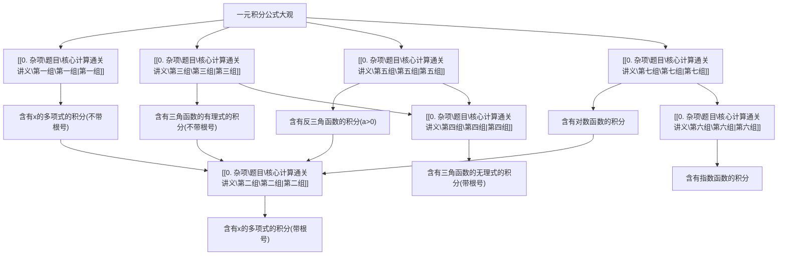

# 核心计算通关讲义

flowchart

本部分又可称为“一元积分公式大观”，专门整理了可以手算的常用积分公式，有两个目的：

一、用于提高积分计算能力. 这里几乎囊括了（部分需要经过简单变形或换元）积分题的积分方法和原函数，将这些积分全部演算一遍，可使积分计算能力达到炉火纯青、登峰造极的水平，这是数学计算能力的重要衡量指标. 再往深走，基本都要借助其他方法，或者根本算不出初等函数形式的原函数了.  
二、用于查找积分结果. 随着现代技术的发展, 寻找原函数早已不是主流的方法, 今后的学习或者研究中, 对于积分结果的获取, 可以寻求两种帮助, 一是查积分表, 本部分内容只是一个有初等函数形式的简单积分表, 国内外有不少积分结果汇编成册的资料, 以后各位要用时, 查表即可. 二是用数值计算等方法, 绕开原函数, 甚至绕开分析学, 都有很好的办法达到目的, 这些方法就请考生在考研后自行研究了, 那是更为广阔的天地.

所有积分公式的计算过程附于本部分最后，供各位参考，希望大家先不看答案，自行尝试解决。同样地，本部分的公式要常看，常练，以巩固掌握。

# [[0. 杂项\题目\核心计算通关讲义\第一组\第一组|第一组]]

“含有 x 的多项式的积分（不带根号）”.

1.  $\int \frac {\mathrm{d} x}{a x + b} = \frac {1}{a} \ln | a x + b | + C.$
2. $\int (ax + b)^{\mu}\mathrm{d}x = \frac{1}{a(\mu + 1)} (ax + b)^{\mu + 1} + C, \mu \neq -1.$   
3. $\int \frac{x}{ax + b} \mathrm{d}x = \frac{1}{a^2} (ax - b \ln |ax + b|) + C$ .   
4. $\int \frac{\mathrm{d}x}{x(ax + b)} = -\frac{1}{b}\ln \left|\frac{ax + b}{x}\right| + C.$   
5. $\int \frac{x}{(ax + b)^2} \mathrm{d}x = \frac{1}{a^2} \left( \ln |ax + b| + \frac{b}{ax + b} \right) + C$ .   
6. $\int \frac{\mathrm{d}x}{ax^2 + b} = \left\{ \begin{array}{ll}\frac{1}{\sqrt{ab}}\arctan \sqrt{\frac{a}{b}} x + C, & a > 0, b > 0,\\ \frac{1}{2\sqrt{-ab}}\ln \left|\frac{\sqrt{a}x - \sqrt{-b}}{\sqrt{a}x + \sqrt{-b}}\right| + C, & a > 0,b <   0. \end{array} \right.$   
7. $\int \frac{x}{ax^2 + b} \mathrm{d}x = \frac{1}{2a} \ln |ax^2 + b| + C$   
8. $\int \frac{\mathrm{d}x}{1 - x^2} = \frac{1}{2}\ln \left|\frac{1 + x}{1 - x}\right| + C.$   
9. $\int\frac{x}{1+x^{2}}dx=\frac{1}{2}\ln(1+x^{2})+C$   
10. $\int \frac{\mathrm{d}x}{1 + x^3} = \frac{1}{3}\ln \frac{|1 + x|}{\sqrt{1 - x + x^2}} +\frac{1}{\sqrt{3}}\arctan \frac{2x - 1}{\sqrt{3}} +C.$   
11. $\int\frac{dx}{1-x^{3}}=\frac{1}{3}\ln\frac{\sqrt{1+x+x^{2}}}{|1-x|}+\frac{1}{\sqrt{3}}\arctan\frac{2x+1}{\sqrt{3}}+C$   
12. $\int \frac{\mathrm{d}x}{1 + x^4} = \frac{\sqrt{2}}{4}\arctan \frac{\sqrt{2}(x^2 - 1)}{2x} -\frac{\sqrt{2}}{8}\ln \frac{x^2 - \sqrt{2}x + 1}{x^2 + \sqrt{2}x + 1} +C.$   
13. $\int \frac{\mathrm{d}x}{1 - x^4} = \frac{1}{4}\ln \left|\frac{1 + x}{1 - x}\right| + \frac{1}{2}\arctan x + C.$   
14. $\int \frac{x}{1 + x^3} \, \mathrm{d}x = \frac{1}{6} \ln \frac{x^2 - x + 1}{(1 + x)^2} + \frac{1}{\sqrt{3}} \arctan \frac{2x - 1}{\sqrt{3}} + C$   
15. $\int \frac{x}{1 - x^3} \, \mathrm{d}x = \frac{1}{6} \ln \frac{1 + x + x^2}{(1 - x)^2} - \frac{1}{\sqrt{3}} \arctan \frac{2x + 1}{\sqrt{3}} + C$   
16. $\int \frac{x}{1 + x^4} \mathrm{d}x = \frac{1}{2} \arctan x^2 + C$ .   
17. $\int \frac{x}{1 - x^4}\mathrm{d}x = \frac{1}{4}\ln \left|\frac{1 + x^2}{1 - x^2}\right| + C.$   
18. $\int \frac{\mathrm{d}x}{c^2 + x^2} = \frac{1}{c}\arctan \frac{x}{c} +C.$

19. $\int \frac{\mathrm{d}x}{(c^2 + x^2)^2} = \frac{1}{2c^3}\left(\frac{cx}{c^2 + x^2} +\arctan \frac{x}{c}\right) + C.$   
20. $\int \frac{\mathrm{d}x}{(c^2 + x^2)^3} = \frac{1}{8c^5}\left(\frac{cx}{c^2 + x^2} + 3\arctan \frac{x}{c}\right) - \frac{1}{4x(c^2 + x^2)^2} + \frac{1}{4c^4x} + C.$   
21. $\int \frac{x}{c^2 + x^2} \, \mathrm{d}x = \frac{1}{2} \ln (c^2 + x^2) + C$ .   
22. $\int \frac{x}{(c^2 + x^2)^2} \, \mathrm{d}x = -\frac{1}{2(c^2 + x^2)} + C$   
23. $\int \frac{x^2}{c^2 + x^2} \mathrm{d}x = x - c\arctan \frac{x}{c} + C$ 一手+V: kaoyan33311  
24. $\int \frac{x^2}{(c^2 + x^2)^2} \, \mathrm{d}x = -\frac{x}{2(c^2 + x^2)} + \frac{1}{2c} \arctan \frac{x}{c} + C.$   
25. $\int \frac{x^3}{c^2 + x^2} \, \mathrm{d}x = \frac{x^2}{2} - \frac{c^2}{2} \ln (c^2 + x^2) + C$ .   
26. $\int \frac{x^3}{(c^2 + x^2)^2} \, \mathrm{d}x = \frac{c^2}{2(c^2 + x^2)} + \frac{1}{2} \ln (c^2 + x^2) + C$ .   
27. $\int \frac{\mathrm{d}x}{x(c^2 + x^2)} = \frac{1}{2c^2}\ln \frac{x^2}{c^2 + x^2} + C.$   
28. $\int \frac{\mathrm{d}x}{x(c^2 + x^2)^2} = \frac{1}{2c^2(c^2 + x^2)} + \frac{1}{2c^4}\ln \frac{x^2}{c^2 + x^2} + C.$   
29. $\int \frac{\mathrm{d}x}{x^2(c^2 + x^2)} = -\frac{1}{c^2x} - \frac{1}{c^3}\arctan \frac{x}{c} + C.$   
30. $\int \frac{\mathrm{d}x}{x^2(c^2 + x^2)^2} = -\frac{1}{c^4x} - \frac{x}{2c^4(c^2 + x^2)} - \frac{3}{2c^5}\arctan \frac{x}{c} + C.$   
31. $\int \frac{\mathrm{d}x}{c^2 - x^2} = \frac{1}{2c}\ln \left|\frac{c + x}{c - x}\right| + C.$   
32. $\int \frac{\mathrm{d}x}{(c^2 - x^2)^2} = \frac{x}{2c^2(c^2 - x^2)} + \frac{1}{4c^3}\ln \left|\frac{c + x}{c - x}\right| + C.$   
33. $\int \frac{x^2}{c^2 - x^2} \, \mathrm{d}x = -x + \frac{c}{2} \ln \left| \frac{c + x}{c - x} \right| + C$ .   
34. $\int \frac{x^2}{(c^2 - x^2)^2} \, \mathrm{d}x = \frac{x}{2(c^2 - x^2)} - \frac{1}{4c} \ln \left|\frac{c + x}{c - x}\right| + C$ .   
35. $\int \frac{\mathrm{d}x}{x^2(c^2 - x^2)} = -\frac{1}{c^2x} + \frac{1}{2c^3}\ln \left|\frac{c + x}{c - x}\right| + C.$   
36. $\int \frac{\mathrm{d}x}{x^2 - c^2} = \frac{1}{2c}\ln \left|\frac{x - c}{x + c}\right| + C.$

37. $\int \frac{x}{x^2 - c^2} \, \mathrm{d}x = \frac{1}{2} \ln \left|x^2 - c^2\right| + C$   
38. $\int \frac{a + x}{a^3 + x^3} \, \mathrm{d}x = \frac{2}{\sqrt{3} a} \arctan \frac{2x - a}{\sqrt{3} a} + C$   
39. $\int \frac{a + x}{a^3 - x^3} \, \mathrm{d}x = -\frac{1}{3a} \ln \frac{(a - x)^2}{x^2 + ax + a^2} + C$   
40. $\int \frac{a - x}{a^3 + x^3} \, \mathrm{d}x = \frac{1}{3a} \ln \frac{(a + x)^2}{x^2 - ax + a^2} + C$ .   
41. $\int \frac{a - x}{a^3 - x^3} \, \mathrm{d}x = \frac{2}{\sqrt{3} a} \arctan \frac{2x + a}{\sqrt{3} a} + C$   
42. $\int \frac{\mathrm{d}x}{ax^2 + bx + c} = \left\{ \begin{array}{ll}\frac{1}{\sqrt{b^2 - 4ac}}\ln \left|\frac{2ax + b - \sqrt{b^2 - 4ac}}{2ax + b + \sqrt{b^2 - 4ac}}\right| + C, & b^2 >4ac,\\ \frac{2}{\sqrt{4ac - b^2}}\arctan \frac{2ax + b}{\sqrt{4ac - b^2}} +C, & b^2 < 4ac,\\ -\frac{2}{2ax + b} +C, & b^2 = 4ac. \end{array} \right.$

# [[0. 杂项\题目\核心计算通关讲义\第二组\第二组|第二组]]

“含有 x 的多项式的积分（带根号）”.

在以下含有 $\sqrt{a^2\pm x^2}$ ， $\sqrt{x^2\pm a^2}$ 类似的式子中，均默认 $a > 0$ ：

1. $\int \sqrt{ax + b} \, \mathrm{d}x = \frac{2}{3a} \sqrt{(ax + b)^3} + C$ .   
2. $\int x\sqrt{ax + b} dx = \frac{2}{15a^2} (3ax - 2b)\sqrt{(ax + b)^3} + C$   
3. $\int \frac{\mathrm{d}x}{x\sqrt{ax + b}} = \left\{ \begin{array}{ll} \frac{1}{\sqrt{b}}\ln \left|\frac{\sqrt{ax + b} - \sqrt{b}}{\sqrt{ax + b} + \sqrt{b}}\right| + C, & b > 0,\\  \frac{2}{\sqrt{-b}}\arctan \sqrt{\frac{ax + b}{-b}} +C, & b <   0. \end{array} \right.$   
4. $\int \frac{\sqrt{ax + b}}{x^2}\mathrm{d}x = -\frac{\sqrt{ax + b}}{x} +\frac{a}{2}\int \frac{\mathrm{d}x}{x\sqrt{ax + b}}.$   
5. $\int \frac{x}{\sqrt{x^2 - a^2}}\mathrm{d}x = \sqrt{x^2 - a^2} + C.$   
6. $\int \frac{x}{\sqrt{(x^2 - a^2)^3}}\mathrm{d}x = -\frac{1}{\sqrt{x^2 - a^2}} +C.$

7. $\int \frac{x^2}{\sqrt{x^2 - a^2}}\mathrm{d}x = \frac{x}{2}\sqrt{x^2 - a^2} +\frac{a^2}{2}\ln \left|x + \sqrt{x^2 - a^2}\right| + C.$

8. $\int \frac{\mathrm{d}x}{x\sqrt{x^2 - a^2}} = \frac{1}{a}\arccos \frac{a}{|x|} +C.$

9. $\int \frac{\mathrm{d}x}{x^2\sqrt{x^2 - a^2}} = \frac{\sqrt{x^2 - a^2}}{a^2x} + C.$

10. $\int x\sqrt{x^2 - a^2}\mathrm{d}x = \frac{1}{3}\sqrt{(x^2 - a^2)^3} +C.$

11. $\int \frac{\sqrt{x^2 - a^2}}{x} \, \mathrm{d}x = \sqrt{x^2 - a^2} - a \arccos \frac{a}{|x|} + C$ .

12. $\int \frac{\sqrt{x^2 - a^2}}{x^2} \, \mathrm{d}x = -\frac{\sqrt{x^2 - a^2}}{x} + \ln \left|x + \sqrt{x^2 - a^2}\right| + C.$

13. $\int \frac{\mathrm{d}x}{\sqrt{(a^2 - x^2)^3}} = \frac{x}{a^2\sqrt{a^2 - x^2}} + C.$

14. $\int \frac{x}{\sqrt{a^2 - x^2}}\mathrm{d}x = -\sqrt{a^2 - x^2} + C.$

15. $\int \frac{x}{\sqrt{(a^2 - x^2)^3}}\mathrm{d}x = \frac{1}{\sqrt{a^2 - x^2}} +C.$

16. $\int \frac{x^2}{\sqrt{a^2 - x^2}}\mathrm{d}x = -\frac{x}{2}\sqrt{a^2 - x^2} +\frac{a^2}{2}\arcsin \frac{x}{a} +C.$

17. $\int \frac{x^2}{\sqrt{(a^2 - x^2)^3}}\mathrm{d}x = \frac{x}{\sqrt{a^2 - x^2}} -\arcsin \frac{x}{a} +C.$

18. $\int \frac{\mathrm{d}x}{x^2\sqrt{a^2 - x^2}} = -\frac{\sqrt{a^2 - x^2}}{a^2x} + C.$

19. $\int x\sqrt{a^2 - x^2}\mathrm{d}x = -\frac{1}{3}\sqrt{(a^2 - x^2)^3} + C$

20. $\int \frac{\sqrt{a^2 - x^2}}{x^2}\mathrm{d}x = -\frac{\sqrt{a^2 - x^2}}{x} -\arcsin \frac{x}{a} +C.$

21. $\int \sqrt{(a^2 - x^2)^3} \, \mathrm{d}x = \frac{1}{4}\left[x\sqrt{(a^2 - x^2)^3} + \frac{3a^2x}{2}\sqrt{a^2 - x^2} + \frac{3a^4}{2}\arcsin \frac{x}{a}\right] + C.$

22. $\int x^{2}\sqrt{a^{2} - x^{2}}\mathrm{d}x = -\frac{x}{4}\sqrt{(a^{2} - x^{2})^{3}} +\frac{a^{2}}{8}\left(x\sqrt{a^{2} - x^{2}} +a^{2}\arcsin \frac{x}{a}\right) + C.$

23. $\int \sqrt{2ax - x^2} \, \mathrm{d}x = \frac{1}{2}\left[(x - a)\sqrt{2ax - x^2} + a^2 \arcsin \frac{x - a}{a}\right] + C$ .

24. $\int \frac{\mathrm{d}x}{\sqrt{2ax - x^2}} = -\arccos \frac{x - a}{a} + C = \arcsin \frac{x - a}{a} + C.$

25. $\int \frac{\mathrm{d}x}{\sqrt{2ax + x^2}} = \ln \left|x + a + \sqrt{2ax + x^2}\right| + C.$

26. $\int \frac{\mathrm{d}x}{x\sqrt{x^n + a^2}} = \frac{2}{na}\ln \frac{\sqrt{x^n + a^2} - a}{\sqrt{x^n}} +C.$

27. $\int \frac{\mathrm{d}x}{x\sqrt{x^n - a^2}} = -\frac{2}{na}\arcsin \frac{a}{\sqrt{x^n}} +C.$

28. $\int \sqrt{\frac{x}{a^3 - x^3}}\mathrm{d}x = \frac{2}{3}\arcsin \left(\frac{x}{a}\right)^{\frac{3}{2}} + C.$

29. $\int \sqrt{\frac{a + bx}{a - bx}}\mathrm{d}x = -\frac{1}{b}\sqrt{(a + bx)(a - bx)} +\frac{a}{b}\arcsin \frac{bx}{a} +C.$

30. $\int \sqrt{\frac{a - bx}{a + bx}}\mathrm{d}x = \frac{1}{b}\sqrt{(a + bx)(a - bx)} +\frac{a}{b}\arcsin \frac{bx}{a} +C.$

31. $\int \sqrt{\frac{1 + x}{1 - x}}\mathrm{d}x = \arcsin x - \sqrt{1 - x^2} +C.$

32. $\int \frac{\mathrm{d}x}{\sqrt{x^2 + a^2}} = \ln (x + \sqrt{x^2 + a^2}) + C.$

33. $\int \frac{\mathrm{d}x}{\sqrt{(x^2 + a^2)^3}} = \frac{x}{a^2\sqrt{x^2 + a^2}} + C.$

34. $\int \frac{x}{\sqrt{x^2 + a^2}}\mathrm{d}x = \sqrt{x^2 + a^2} +C.$

35. $\int \frac{x}{\sqrt{(x^2 + a^2)^3}}\mathrm{d}x = -\frac{1}{\sqrt{x^2 + a^2}} +C.$

36. $\int \frac{x^2}{\sqrt{x^2 + a^2}}\mathrm{d}x = \frac{x}{2}\sqrt{x^2 + a^2} -\frac{a^2}{2}\ln (x + \sqrt{x^2 + a^2}) + C.$

37. $\int \frac{\mathrm{d}x}{x^2\sqrt{x^2 + a^2}} = -\frac{\sqrt{x^2 + a^2}}{a^2x} + C.$

38. $\int \sqrt{x^2 + a^2} \, \mathrm{d}x = \frac{x}{2}\sqrt{x^2 + a^2} + \frac{a^2}{2}\ln (x + \sqrt{x^2 + a^2}) + C$ .

39. $\int x\sqrt{x^2 + a^2}\mathrm{d}x = \frac{1}{3}\sqrt{(x^2 + a^2)^3} +C.$

40. $\int \frac{\sqrt{x^2 + a^2}}{x^2}\mathrm{d}x = -\frac{\sqrt{x^2 + a^2}}{x} +\ln (x + \sqrt{x^2 + a^2}) + C.$

41. $\int \frac{\mathrm{d}x}{\sqrt{ax^2 + bx + c}} = \left\{ \begin{array}{ll}\frac{1}{\sqrt{a}}\ln \left|2ax + b + 2\sqrt{a}\sqrt{ax^2 + bx + c}\right| + C, & b^2 -4ac\neq 0,\\ \frac{1}{\sqrt{a}}\ln \left|x + \frac{b}{2a}\right| + C, & b^2 -4ac = 0. \end{array} \right.$

42. $\int \frac{\mathrm{d}x}{\sqrt{c + bx - ax^2}} = \frac{1}{\sqrt{a}}\arcsin \frac{2ax - b}{\sqrt{b^2 + 4ac}} +C.$

43. $\int \sqrt{\frac{x - a}{x - b}}\mathrm{d}x = (x - b)\sqrt{\frac{x - a}{x - b}} +(b - a)\ln (\sqrt{|x - a|} +\sqrt{|x - b|}) + C.$

44. $\int \sqrt{\frac{x - a}{b - x}}\mathrm{d}x = (x - b)\sqrt{\frac{x - a}{b - x}} +(b - a)\arctan \sqrt{\frac{x - a}{b - x}} +C.$

45. $\int \frac{\mathrm{d}x}{\sqrt{(x - a)(b - x)}} = 2\arcsin \sqrt{\frac{x - a}{b - a}} +C,a <   b$

46. $\int \sqrt{(x - a)(b - x)}\mathrm{d}x = \frac{2x - a - b}{4}\cdot \sqrt{(x - a)(b - x)} +\frac{(b - a)^2}{4}\arcsin \sqrt{\frac{x - a}{b - a}} +C,a <   b$

# [[0. 杂项\题目\核心计算通关讲义\第三组\第三组|第三组]]

“含有三角函数的有理式的积分（不带根号）”.

1. $\int \cos^3 ax\mathrm{d}x = \frac{\sin ax}{a} -\frac{\sin^3ax}{3a} +C.$

2. $\int \tan^2 ax\mathrm{d}x = \frac{1}{a}\tan ax - x + C$

3. $\int \tan^3 ax\mathrm{d}x = \frac{1}{2a}\tan^2 ax + \frac{1}{a}\ln |\cos ax| + C$

4. $\int \cot^2 ax\mathrm{d}x = -\frac{1}{a}\cot ax - x + C$

5. $\int \cot^3 ax\mathrm{d}x = -\frac{1}{2a}\cot^2 ax - \frac{1}{a}\ln |\sin ax| + C$

6. $\int \frac{\mathrm{d}x}{\sin^3ax} = -\frac{\cos ax}{2a\sin^2ax} +\frac{1}{2a}\ln \left|\tan \frac{ax}{2}\right| + C.$

7. $\int \frac{\mathrm{d}x}{\cos^3ax} = \frac{\sin ax}{2a\cos^2ax} +\frac{1}{2a}\ln \left|\tan \left(\frac{\pi}{4} +\frac{ax}{2}\right)\right| + C.$

8. $\int \sin mx\sin nx\mathrm{d}x = \frac{\sin(m - n)x}{2(m - n)} -\frac{\sin(m + n)x}{2(m + n)} +C,\quad m^2\neq n^2.$

9. $\int \sin mx\cos nx\mathrm{d}x = -\frac{\cos(m - n)x}{2(m - n)} -\frac{\cos(m + n)x}{2(m + n)} +C,m^2\neq n^2.$

10. $\int \cos mx\cos nx\mathrm{d}x = \frac{\sin(m - n)x}{2(m - n)} +\frac{\sin(m + n)x}{2(m + n)} +C,\ m^2\neq n^2.$

11. $\int \sin ax\cos axdx = \frac{1}{2a}\sin^2 ax + C$

12. $\int \sin^2 ax\cos axdx = \frac{\sin^3ax}{3a} +C.$

13. $\int \sin^2 ax\cos^2 ax\mathrm{d}x = -\frac{\sin 4ax}{32a} +\frac{x}{8} +C.$

14. $\int \sin^2 ax\cos^3 ax\mathrm{d}x = \frac{1}{3a}\sin^3 ax - \frac{1}{5a}\sin^5 ax + C.$

15. $\int \sin^3 ax\cos axdx = \frac{\sin^4ax}{4a} +C.$

16. $\int \sin^3 ax\cos^2 ax\mathrm{d}x = -\frac{\cos^3ax}{3a} +\frac{\cos^5ax}{5a} +C.$

17. $\int \sin^3 ax\cos^3 ax\mathrm{d}x = -\frac{1}{16a}\cos 2ax + \frac{1}{48a}\cos^3 2ax + C.$

18. $\int \frac{\sin ax}{\cos^2 ax} \, \mathrm{d}x = \frac{1}{a \cos ax} + C = \frac{\sec ax}{a} + C$

19. $\int \frac{\sin^2 ax}{\cos^3 ax} \, \mathrm{d}x = \frac{\sin ax}{2a \cos^2 ax} - \frac{1}{2a} \ln \left| \tan \left( \frac{\pi}{4} + \frac{ax}{2} \right) \right| + C.$

20. $\int \frac{\sin^2ax}{\cos^4ax} dx = \frac{\tan^3ax}{3a} + C.$

21. $\int \frac{\sin^3ax}{\cos ax} \, \mathrm{d}x = -\frac{\sin^2ax}{2a} - \frac{1}{a} \ln |\cos ax| + C.$

22. $\int \frac{\sin^3ax}{\cos^2ax} dx = \frac{\cos ax}{a} +\frac{1}{a\cos ax} +C.$

23. $\int \frac{\sin^3ax}{\cos^6ax} dx = \frac{1}{5a\cos^5ax} -\frac{1}{3a\cos^3ax} +C.$

24. $\int \frac{\cos^2ax}{\sin ax} dx = \frac{\cos ax}{a} +\frac{1}{a}\ln \left|\tan \frac{ax}{2}\right| + C.$

25. $\int \frac{\cos^2ax}{\sin^3ax} \mathrm{d}x = -\frac{\cos ax}{2a\sin^2ax} - \frac{1}{2a}\ln \left|\tan \frac{ax}{2}\right| + C.$

26. $\int \frac{\cos^2ax}{\sin^4ax} dx = -\frac{\cot^3ax}{3a} + C$

27. $\int \frac{\cos^3 ax}{\sin ax} \, \mathrm{d}x = \frac{\cos^2 ax}{2a} + \frac{1}{a} \ln |\sin ax| + C$

28. $\int \frac{\cos^3ax}{\sin^2ax} \, \mathrm{d}x = -\frac{\sin ax}{a} - \frac{1}{a\sin ax} + C$   
29. $\int \frac{\cos^3ax}{\sin^4ax} dx = -\frac{1}{3a\sin^3ax} +\frac{1}{a\sin ax} +C.$   
30. $\int \frac{\mathrm{d}x}{\sin ax\cos ax} = \frac{1}{a}\ln |\tan ax| + C.$   
31. $\int \frac{\mathrm{d}x}{\sin ax\cos^2ax} = \frac{1}{a}\left(\sec ax + \ln \left|\tan \frac{ax}{2}\right|\right) + C.$   
32. $\int \frac{\mathrm{d}x}{\sin^2 ax\cos ax} = -\frac{1}{a}\csc ax + \frac{1}{a}\ln \left|\tan \left(\frac{\pi}{4} +\frac{ax}{2}\right)\right| + C.$   
33. $\int \frac{\mathrm{d}x}{\sin^2ax\cos^2ax} = -\frac{2}{a}\cot 2ax + C.$   
34. $\int \frac{\mathrm{d}x}{\sin^2ax\cos^3ax} = \frac{1}{2a\sin ax}\left(\frac{1}{\cos^2ax} -3\right) + \frac{3}{2a}\ln \left|\tan \left(\frac{\pi}{4} +\frac{ax}{2}\right)\right| + C.$   
35. $\int \frac{\mathrm{d}x}{\sin^2ax\cos^4ax} = \frac{\tan^3ax}{3a} +\frac{\tan ax}{a} -\frac{2}{a}\cot 2ax + C.$   
36. $\int \frac{\mathrm{d}x}{\sin^3ax\cos ax} = -\frac{1}{2a\sin^2ax} +\frac{1}{a}\ln |\tan ax| + C.$   
37. $\int \frac{\mathrm{d}x}{\sin^3ax\cos^2ax} = \frac{1}{a\cos ax} -\frac{\cos ax}{2a\sin^2ax} +\frac{3}{2a}\ln \left|\tan \frac{ax}{2}\right| + C.$   
38. $\int \frac{\mathrm{d}x}{\sin^3ax\cos^3ax} = -\frac{2\cos 2ax}{a\sin^22ax} +\frac{2}{a}\ln |\tan ax| + C.$   
39. $\int \frac{\mathrm{d}x}{\sin^3ax\cos^4ax} = \frac{2}{a\cos ax} +\frac{1}{3a\cos^3ax} -\frac{\cos ax}{2a\sin^2ax} +\frac{5}{2a}\ln \left|\tan \frac{ax}{2}\right| + C.$   
40. $\int \frac{\mathrm{d}x}{1\pm \sin ax} = \mp \frac{1}{a}\tan \left(\frac{\pi}{4}\mp \frac{ax}{2}\right) + C.$   
41. $\int \frac{x}{1 + \sin ax} \, \mathrm{d}x = -\frac{x}{a} \tan \left( \frac{\pi}{4} - \frac{ax}{2} \right) + \frac{1}{a^2} \ln |1 + \sin ax| + C.$   
42. $\int \frac{x}{1 - \sin ax} \, \mathrm{d}x = \frac{x}{a} \tan \left( \frac{\pi}{4} + \frac{ax}{2} \right) + \frac{1}{a^2} \ln |1 - \sin ax| + C$ .   
43. $\int \frac{\sin ax}{1 \pm \sin ax} \mathrm{d}x = \pm x + \frac{1}{a} \tan \left( \frac{\pi}{4} \mp \frac{ax}{2} \right) + C$ .   
44. $\int \frac{\cos ax}{1 \pm \sin ax} \, \mathrm{d}x = \pm \frac{1}{a} \ln |1 \pm \sin ax| + C$ .

45. $\int \frac{\mathrm{d}x}{\sin ax(1\pm\sin ax)} = \frac{1}{a}\tan\left(\frac{\pi}{4}\mp \frac{ax}{2}\right) + \frac{1}{a}\ln\left|\tan\frac{ax}{2}\right| + C.$   
46. $\int \frac{\mathrm{d}x}{\sin ax(1\pm\cos ax)} = \pm \frac{1}{2a(1\pm\cos ax)} + \frac{1}{2a}\ln \left|\tan \frac{ax}{2}\right| + C.$   
47. $\int \frac{\mathrm{d}x}{\cos ax(1\pm \sin ax)} = \mp \frac{1}{2a(1\pm \sin ax)} +\frac{1}{2a}\ln \left|\tan \left(\frac{\pi}{4} +\frac{ax}{2}\right)\right| + C.$   
48. $\int \frac{\sin ax}{\cos ax(1\pm\sin ax)}\mathrm{d}x = \frac{1}{2a(1\pm\sin ax)}\pm \frac{1}{2a}\ln \left|\tan \left(\frac{\pi}{4} +\frac{ax}{2}\right)\right| + C.$   
49. $\int \frac{\sin ax}{\cos ax(1 \pm \cos ax)} \, \mathrm{d}x = \frac{1}{a} \ln |\sec ax \pm 1| + C$ .   
50. $\int \frac{\cos ax}{\sin ax(1 \pm \sin ax)} \, \mathrm{d}x = -\frac{1}{a} \ln |\csc ax \pm 1| + C$   
51. $\int \frac{\cos ax}{\sin ax(1 \pm \cos ax)} \, \mathrm{d}x = -\frac{1}{2a(1 \pm \cos ax)} \pm \frac{1}{2a} \ln \left| \tan \frac{ax}{2} \right| + C$   
52. $\int \frac{\mathrm{d}x}{(1 + \sin ax)^2} = -\frac{1}{2a}\cot \left(\frac{\pi}{4} +\frac{ax}{2}\right) - \frac{1}{6a}\cot^3\left(\frac{\pi}{4} +\frac{ax}{2}\right) + C.$   
53. $\int \frac{\mathrm{dx}}{(1 - \sin ax)^2} = -\frac{1}{2a}\cot \left(\frac{ax}{2} -\frac{\pi}{4}\right) - \frac{1}{6a}\cot^3\left(\frac{ax}{2} -\frac{\pi}{4}\right) + C.$   
54. $\int \frac{\sin ax}{(1 + \sin ax)^2} dx = -\frac{2}{a}\frac{1}{\left(\tan\frac{ax}{2} + 1\right)^2} +\frac{4}{3a}\frac{1}{\left(\tan\frac{ax}{2} + 1\right)^3} +C.$   
55. $\int \frac{\sin ax}{(1 - \sin ax)^2} dx = -\frac{2}{a}\frac{1}{\left(\tan\frac{ax}{2} - 1\right)^2} -\frac{4}{3a}\frac{1}{\left(\tan\frac{ax}{2} - 1\right)^3} +C.$   
56. $\int \frac{\mathrm{d}x}{1 + \cos ax} = \frac{1}{a}\tan \frac{ax}{2} +C.$   
57. $\int \frac{\mathrm{d}x}{1 - \cos ax} = -\frac{1}{a}\cot \frac{ax}{2} + C.$   
58. $\int \frac{x}{1 + \cos ax} \mathrm{d}x = \frac{x}{a} \tan \frac{ax}{2} + \frac{2}{a^2} \ln \left|\cos \frac{ax}{2}\right| + C$ .   
59. $\int \frac{x}{1 - \cos ax} \mathrm{d}x = -\frac{x}{a} \cot \frac{ax}{2} + \frac{2}{a^2} \ln \left|\sin \frac{ax}{2}\right| + C.$   
60. $\int \frac{\sin ax}{1 \pm \cos ax} \mathrm{d}x = \mp \frac{1}{a} \ln (1 \pm \cos ax) + C$ .   
61. $\int \frac{\cos ax}{1 + \cos ax} dx = -\frac{1}{a}\tan \frac{ax}{2} +x + C.$

62. $\int \frac{\cos ax}{1 - \cos ax} \, \mathrm{d}x = -\frac{1}{a} \cot \frac{ax}{2} - x + C$   
63. $\int \frac{\mathrm{d}x}{\cos ax(1 + \cos ax)} = -\frac{1}{a}\tan \frac{ax}{2} -\frac{1}{a}\ln \left|\frac{\tan\frac{ax}{2} - 1}{\tan\frac{ax}{2} + 1}\right| + C.$   
64. $\int \frac{\mathrm{d}x}{\cos ax(1 - \cos ax)} = -\frac{1}{a}\cot \frac{ax}{2} -\frac{1}{a}\ln \left|\frac{\tan\frac{ax}{2} - 1}{\tan\frac{ax}{2} + 1}\right| + C.$   
65. $\int \frac{\mathrm{d}x}{(1 + \cos ax)^2} = \frac{1}{2a}\tan \frac{ax}{2} +\frac{1}{6a}\tan^3{\frac{ax}{2}} +C.$   
66. $\int \frac{\mathrm{d}x}{(1 - \cos ax)^2} = -\frac{1}{2a}\cot \frac{ax}{2} -\frac{1}{6a}\cot^3\frac{ax}{2} +C.$   
67. $\int \frac{\cos ax}{(1 + \cos ax)^2} dx = \frac{1}{2a}\tan \frac{ax}{2} -\frac{1}{6a}\tan^3\frac{ax}{2} +C.$   
68. $\int \frac{\cos ax}{(1 - \cos ax)^2} dx = \frac{1}{2a}\cot \frac{ax}{2} -\frac{1}{6a}\cot^3\frac{ax}{2} +C.$   
69. $\int \frac{\mathrm{d}x}{1 + \cos ax + \sin ax} = \frac{1}{a}\ln \left|1 + \tan \frac{ax}{2}\right| + C.$   
70. $\int \frac{\mathrm{d}x}{1 + \sin^2ax} = \frac{1}{\sqrt{2}a}\arctan (\sqrt{2}\tan ax) + C.$   
71. $\int \frac{\mathrm{d}x}{1 + b\sin^2ax} = \frac{1}{a\sqrt{1 + b}}\arctan (\sqrt{1 + b}\tan ax) + C,\quad b > - 1.$   
72. $\int \frac{\mathrm{d}x}{1 - \sin^2ax} = \frac{1}{a}\tan ax + C.$   
73. $\int \frac{\mathrm{d}x}{1 - b\sin^2ax} = \left\{ \begin{array}{ll}\frac{1}{a\sqrt{1 - b}}\arctan (\sqrt{1 - b}\tan ax) + C, & 0 <   b <   1,\\ \frac{1}{2a\sqrt{b - 1}}\ln \left|\frac{\sqrt{b - 1}\tan ax + 1}{\sqrt{b - 1}\tan ax - 1}\right| + C, & b > 1. \end{array} \right.$   
74. $\int \frac{\mathrm{d}x}{(1 - b\sin^2ax)^2} = -\frac{b}{2a(1 - b)^2}\frac{\tan ax}{\tan^2ax + \frac{1}{1 - b}} +\frac{2 - b}{2a\sqrt{1 - b}(1 - b)}\arctan (\sqrt{1 - b}\tan ax) + C,b <   1.$   
75. $\int \frac{\sin ax\cos ax}{1\pm b\sin^2 ax}\mathrm{d}x = \pm \frac{1}{2ab}\ln |1\pm b\sin^2 ax| + C, b\neq 0.$   
76. $\int \frac{\mathrm{d}x}{1 + b\cos^2ax} = \frac{1}{a\sqrt{1 + b}}\arctan \frac{\tan ax}{\sqrt{1 + b}} +C,b > - 1.$   
77. $\int \frac{\mathrm{d}x}{1 - \cos^2ax} = -\frac{1}{a}\cot ax + C.$

78. $\int \frac{\mathrm{d}x}{1 - b\cos^2ax} = \left\{ \begin{array}{ll}\frac{1}{a\sqrt{1 - b}}\arctan \frac{\tan ax}{\sqrt{1 - b}} +C, & 0 <   b <   1,\\ \frac{1}{2a\sqrt{b - 1}}\ln \left|\frac{\tan ax - \sqrt{b - 1}}{\tan ax + \sqrt{b - 1}}\right| + C, & b > 1. \end{array} \right.$

79. $\int \frac{\mathrm{d}x}{(1 - b\cos^2ax)^2} = \frac{b\sin 2ax}{4a(1 - b)(1 - b\cos^2ax)} +\frac{2 - b}{2a(1 - b)}\cdot \left\{ \begin{array}{ll}\frac{1}{\sqrt{1 - b}}\arctan \frac{\tan ax}{\sqrt{1 - b}} +C, & 0 <   b <   1,\\ \frac{1}{2\sqrt{b - 1}}\ln \left|\frac{\tan ax - \sqrt{b - 1}}{\tan ax + \sqrt{b - 1}}\right| + C, & b > 1. \end{array} \right.$

80. $\int \frac{\sin^2 ax}{1 + b\cos^2 ax} \, \mathrm{d}x = -\frac{x}{b} + \frac{\sqrt{1 + b}}{ab} \arctan \frac{\tan ax}{\sqrt{1 + b}} + C, b > -1$ ，且 $b \neq 0$ 。

81. $\int \frac{\cos^2 ax}{1 + b\cos^2 ax} \mathrm{d}x = \frac{x}{b} - \frac{1}{ab\sqrt{1 + b}} \arctan \frac{\tan ax}{\sqrt{1 + b}} + C, b > -1$ ，且 $b \neq 0$ 。

82. $\int \frac{\sin ax\cos ax}{1\pm b\cos^2 ax}\mathrm{d}x = \mp \frac{1}{ab}\ln \sqrt{|1\pm b\cos^2 ax|} +C,b\neq 0.$

83. $\int \frac{\sin^2 ax}{1 - b\cos^2 ax}\mathrm{d}x = \left\{ \begin{array}{ll} - \frac{\sqrt{1 - b}}{ab}\arctan \frac{\tan ax}{\sqrt{1 - b}} +\frac{x}{b} +C, & 0 <   b <   1,\\  \frac{\sqrt{b - 1}}{2ab}\ln \left|\frac{\tan ax - \sqrt{b - 1}}{\tan ax + \sqrt{b - 1}}\right| + \frac{x}{b} +C, & b > 1. \end{array} \right.$

84. $\int \frac{\cos^2ax}{1 - b\cos^2ax}\mathrm{d}x = \left\{ \begin{array}{ll}\frac{1}{ab\sqrt{1 - b}}\arctan \frac{\tan ax}{\sqrt{1 - b}} -\frac{x}{b} +C, & 0 <   b <   1,\\ \frac{1}{2ab\sqrt{b - 1}}\ln \left|\frac{\tan ax - \sqrt{b - 1}}{\tan ax + \sqrt{b - 1}}\right| - \frac{x}{b} +C, & b > 1. \end{array} \right.$

85. $\int \frac{\mathrm{d}x}{a + b\sin x} = \left\{ \begin{array}{ll}\frac{2}{\sqrt{a^2 - b^2}}\arctan \frac{a\tan\frac{x}{2} + b}{\sqrt{a^2 - b^2}} +C, & a^2 >b^2,\\ \frac{1}{\sqrt{b^2 - a^2}}\ln \left|\frac{a\tan\frac{x}{2} + b - \sqrt{b^2 - a^2}}{a\tan\frac{x}{2} + b + \sqrt{b^2 - a^2}}\right| + C, & a^2 < b^2, \end{array} \right.$ $a > 0$

86. $\int \frac{\mathrm{d}x}{a + b\cos x} = \left\{ \begin{array}{ll}\frac{2\mathrm{sgn}(a + b)}{\sqrt{a^2 - b^2}}\arctan \frac{\sqrt{a^2 - b^2}\tan\frac{x}{2}}{|a + b|} +C, & a^2 >b^2,\\ \frac{1}{a}\tan \frac{x}{2} +C, & a = b,\\ -\frac{1}{a}\cot \frac{x}{2} +C, & a = -b,\\ \frac{1}{\sqrt{b^2 - a^2}}\ln \left|\frac{\sqrt{b^2 - a^2}\tan\frac{x}{2} + |a + b|}{\sqrt{b^2 - a^2}\tan\frac{x}{2} - |a + b|}\right| + C, & a^2 < b^2. \end{array} \right.$

87. $\int \frac{\mathrm{d}x}{(a + b\sin x)^2} = \left\{ \begin{array}{ll}\frac{b\cos x}{(a^2 - b^2)(a + b\sin x)} +\frac{2a}{(a^2 - b^2)^{\frac{3}{2}}} \arctan \frac{a\tan\frac{x}{2} + b}{\sqrt{a^2 - b^2}} +C, & a^2 >b^2,\\ \frac{b\cos x}{(a^2 - b^2)(a + b\sin x)} -\frac{a}{(b^2 - a^2)^{\frac{3}{2}}} \ln \left|\frac{a\tan\frac{x}{2} + b - \sqrt{b^2 - a^2}}{a\tan\frac{x}{2} + b + \sqrt{b^2 - a^2}}\right| + C, & a^2 < b^2, \end{array} \right.$ $a > 0$   
88. $\int \frac{\mathrm{d}x}{(a + b\cos x)^2} = \frac{b\sin x}{(b^2 - a^2)(a + b\cos x)} -\frac{a}{b^2 - a^2}\int \frac{\mathrm{d}x}{a + b\cos x}.$   
89. $\int \frac{\mathrm{d}x}{\sin x(a + b\sin x)} = \frac{1}{a}\ln \left|\tan \frac{x}{2}\right| - \frac{b}{a}\int \frac{\mathrm{d}x}{a + b\sin x}$   
90. $\int \frac{\mathrm{d}x}{\cos x(a + b\cos x)} = \frac{1}{a}\ln \left|\tan \left(\frac{\pi}{4} +\frac{x}{2}\right)\right| - \frac{b}{a}\int \frac{\mathrm{d}x}{a + b\cos x}.$   
91. $\int \frac{\sin x}{a + b\sin x}\mathrm{d}x = \frac{x}{b} -\frac{a}{b}\int \frac{\mathrm{d}x}{a + b\sin x}.$   
92. $\int \frac{\cos x}{a + b\cos x} dx = \frac{x}{b} -\frac{a}{b}\int \frac{dx}{a + b\cos x}.$   
93. $\int \frac{\cos x}{(a + b\cos x)^2}\mathrm{d}x = \frac{a\sin x}{(a^2 - b^2)(a + b\cos x)} -\frac{b}{a^2 - b^2}\int \frac{\mathrm{d}x}{a + b\cos x}.$   
94. $\int \frac{\mathrm{d}x}{a^2\cos^2x + b^2\sin^2x} = \frac{1}{ab}\arctan \frac{b\tan x}{a} +C.$   
95. $\int \frac{\sin cx}{a\cos cx + b\sin cx}\mathrm{d}x = \frac{1}{c(a^2 + b^2)} (bcx - a\ln |a\cos cx + b\sin cx|) + C.$   
96. $\int \frac{\cos cx}{a\cos cx + b\sin cx}\mathrm{d}x = \frac{1}{c(a^2 + b^2)} (acx + b\ln |a\cos cx + b\sin cx|) + C.$   
97. $\int \frac{\sin cx\cos cx}{a\cos^2cx + b\sin^2cx}\mathrm{d}x = \frac{1}{2c(b - a)}\ln \left|a\cos^2 cx + b\sin^2 cx\right| + C.$   
98. $\int \frac{\mathrm{d}x}{a^2 + b^2\sin^2cx} = \frac{1}{ac\sqrt{a^2 + b^2}}\arctan \frac{\sqrt{a^2 + b^2}\tan cx}{a} +C.$   
99. $\int \frac{\cos^2 cx}{a^2 + b^2 \sin^2 cx} \, \mathrm{d}x = \frac{\sqrt{a^2 + b^2}}{ab^2c} \arctan \frac{\sqrt{a^2 + b^2} \tan cx}{a} - \frac{x}{b^2} + C$ .   
100. $\int \frac{\mathrm{d}x}{a^2 - b^2\sin^2cx} = \left\{ \begin{array}{ll}\frac{1}{ac\sqrt{a^2 - b^2}}\arctan \frac{\sqrt{a^2 - b^2}\tan cx}{a} +C, & a^2 >b^2,\\ \frac{1}{2ac\sqrt{b^2 - a^2}}\ln \left|\frac{\sqrt{b^2 - a^2}\tan cx + a}{\sqrt{b^2 - a^2}\tan cx - a}\right| + C, & a^2 < b^2, \end{array} \right.$ $a > 0$   
101. $\int \frac{\mathrm{d}x}{a^2 + b^2\cos^2cx} = \frac{1}{ac\sqrt{a^2 + b^2}}\arctan \frac{a\tan cx}{\sqrt{a^2 + b^2}} +C.$

102. $\int \frac{\mathrm{d}x}{a^2 - b^2\cos^2cx} = \left\{ \begin{array}{ll}\frac{1}{ac\sqrt{a^2 - b^2}}\arctan \frac{a\tan cx}{\sqrt{a^2 - b^2}} +C, & a^2 >b^2,\\ \frac{1}{2ac\sqrt{b^2 - a^2}}\ln \left|\frac{a\tan cx - \sqrt{b^2 - a^2}}{a\tan cx + \sqrt{b^2 - a^2}}\right| + C, & a^2 < b^2, \end{array} \right.$ $a,b > 0$   
103. $\int \frac{\mathrm{d}x}{a^2 + b^2 - 2ab\cos cx} = \frac{2}{c(a^2 - b^2)}\arctan \left(\frac{a + b}{a - b}\tan \frac{cx}{2}\right) + C.$   
104. $\int\frac{x+\sin x}{1+\cos x}dx=x\tan\frac{x}{2}+C$   
105. $\int \frac{x - \sin x}{1 - \cos x} \mathrm{d}x = -x \cot \frac{x}{2} + C$ .   
106. $\int \frac{\mathrm{d}x}{\sin ax\pm\cos ax} = \frac{1}{\sqrt{2}a}\ln \left|\tan \left(\frac{ax}{2}\pm \frac{\pi}{8}\right)\right| + C.$   
107. $\int \frac{\mathrm{d}x}{(\sin ax\pm\cos ax)^2} = \frac{1}{2a}\tan\left(ax\mp \frac{\pi}{4}\right) + C.$   
108. $\int \frac{\sin ax}{\sin ax \pm \cos ax} \mathrm{d}x = \frac{1}{2a} (ax \mp \ln |\sin ax \pm \cos ax|) + C$   
109. $\int \frac{\cos ax}{\sin ax \pm \cos ax} \, \mathrm{d}x = \frac{1}{2a} (\ln |\sin ax \pm \cos ax| \pm ax) + C$   
110. $\int \frac{\mathrm{d}x}{a\cos x + b\sin x} = \frac{\ln\left|\tan\left(\frac{x}{2} + \frac{1}{2}\arctan\frac{a}{b}\right)\right|}{\sqrt{a^2 + b^2}} + C.$   
111. $\int \frac{\mathrm{d}x}{a^2\cos^2x + b^2\sin^2x} = \frac{1}{ab}\arctan \left(\frac{b}{a}\tan x\right) + C.$   
112. $\int \frac{\mathrm{d}x}{a^2\cos^2x - b^2\sin^2x} = \frac{1}{2ab}\ln \left|\frac{b\tan x + a}{b\tan x - a}\right| + C.$   
113. $\int x\sin ax\mathrm{d}x = \frac{1}{a^2}\sin ax - \frac{1}{a} x\cos ax + C.$   
114. $\int x^{2}\sin ax\mathrm{d}x = -\frac{1}{a} x^{2}\cos ax + \frac{2}{a^{2}} x\sin ax + \frac{2}{a^{3}}\cos ax + C.$   
115. $\int x\cos ax\mathrm{d}x = \frac{1}{a^2}\cos ax + \frac{1}{a} x\sin ax + C.$   
116. $\int x^{2}\cos ax\mathrm{d}x = \frac{1}{a} x^{2}\sin ax + \frac{2}{a^{2}} x\cos ax - \frac{2}{a^{3}}\sin ax + C.$

# [[0. 杂项\题目\核心计算通关讲义\第四组\第四组|第四组]]

“含有三角函数的无理式的积分（带根号）”.

1. $\int \sqrt{1 + \sin ax} \, \mathrm{d}x = \mp \frac{2\sqrt{2}}{a} \cos \left( \frac{\pi}{4} + \frac{ax}{2} \right) + C$   
2. $\int \sqrt{1 - \sin ax} \, \mathrm{d}x = \mp \frac{2\sqrt{2}}{a} \sin \left( \frac{\pi}{4} + \frac{ax}{2} \right) + C$   
3. $\int \frac{\mathrm{d}x}{\sqrt{1 + \sin ax}} = \pm \frac{\sqrt{2}}{a}\ln \left|\tan \left(\frac{ax}{4} +\frac{\pi}{8}\right)\right| + C.$   
4. $\int \frac{\mathrm{d}x}{\sqrt{1 - \sin ax}} = \pm \frac{\sqrt{2}}{a}\ln \left|\tan \left(\frac{ax}{4} -\frac{\pi}{8}\right)\right| + C.$

text_image

考研
小舟

关注公众号【考研小舟】免费考研资料&无水印PDF

text_image

云上印

黑白&彩印都是5分/页，满4.9全国包邮下单备注：考研小舟，送草稿纸

# [[0. 杂项\题目\核心计算通关讲义\第五组\第五组|第五组]]

“含有反三角函数的积分 $(a>0)$ ”.

1. $\int\arcsin\frac{x}{a}dx=x\arcsin\frac{x}{a}+\sqrt{a^{2}-x^{2}}+C$   
2. $\int x\arcsin \frac{x}{a}\mathrm{d}x = \left(\frac{x^2}{2} -\frac{a^2}{4}\right)\arcsin \frac{x}{a} +\frac{x}{4}\sqrt{a^2 - x^2} +C.$   
3. $\int \arccos \frac{x}{a} \mathrm{d}x = x \arccos \frac{x}{a} - \sqrt{a^2 - x^2} + C$   
4. $\int x\arccos \frac{x}{a}\mathrm{d}x = \left(\frac{x^2}{2} -\frac{a^2}{4}\right)\arccos \frac{x}{a} -\frac{x}{4}\sqrt{a^2 - x^2} +C.$   
5. $\int \arctan \frac{x}{a} \, \mathrm{d}x = x \arctan \frac{x}{a} - \frac{a}{2} \ln \left( a^2 + x^2 \right) + C$   
6. $\int x\arctan \frac{x}{a}\mathrm{d}x = \frac{1}{2} (a^2 +x^2)\arctan \frac{x}{a} -\frac{a}{2} x + C.$   
7. $\int \arcsin ax\mathrm{d}x = x\arcsin ax + \frac{\sqrt{1 - a^2x^2}}{a} +C.$   
8. $\int \arccos ax\mathrm{d}x = x\arccos ax - \frac{\sqrt{1 - a^2x^2}}{a} +C.$   
9. $\int \arctan ax\mathrm{d}x = x\arctan ax - \frac{1}{2a}\ln (1 + a^2 x^2) + C$   
10. $\int \operatorname{arccot} ax \, dx = x \operatorname{arccot} ax + \frac{1}{2a} \ln\left(1 + a^{2}x^{2}\right) + C$

11. $\int \operatorname{arcsec} ax \, \mathrm{d}x = x \operatorname{arcsec} ax - \frac{1}{a} \ln \left| ax + \sqrt{a^2 x^2 - 1} \right| + C (x > 0)$ .   
12. $\int \operatorname{arccsc} ax \, \mathrm{d}x = x \operatorname{arccsc} ax + \frac{1}{a} \ln \left| ax + \sqrt{a^2 x^2 - 1} \right| + C (x > 0)$ .   
13. $\int x\arcsin ax\mathrm{d}x = \frac{1}{4a^2}\left[(2a^2 x^2 -1)\arcsin ax + ax\sqrt{1 - a^2x^2}\right] + C.$   
14. $\int x\arccos ax\mathrm{d}x = \frac{1}{4a^2}\left[(2a^2 x^2 -1)\arccos ax - ax\sqrt{1 - a^2x^2}\right] + C.$   
15. $\int x\arctan ax\mathrm{d}x = \frac{1 + a^2x^2}{2a^2}\arctan ax - \frac{x}{2a} +C.$   
16. $\int x\operatorname {arccot}ax\mathrm{d}x = \frac{1 + a^2x^2}{2a^2}\operatorname {arccot}ax + \frac{x}{2a} +C.$   
17. $\int x\operatorname {arcsec}ax\mathrm{d}x = \frac{x^2}{2}\operatorname {arcsec}ax - \frac{1}{2a^2}\sqrt{a^2x^2 - 1} +C(x > 0)$   
18. $\int x\operatorname{arccsc}ax\mathrm{d}x = \frac{x^2}{2}\operatorname{arccsc}ax + \frac{1}{2a^2}\sqrt{a^2x^2 - 1} +C(x > 0)$   
19. $\int (\arcsin ax)^2\mathrm{d}x = x(\arcsin ax)^2 -2x + \frac{2\sqrt{1 - a^2x^2}}{a}\arcsin ax + C.$   
20. $\int (\arccos ax)^{2}dx = x(\arccos ax)^{2} - 2x - \frac{2\sqrt{1 - a^{2}x^{2}}}{a}\arccos ax + C.$   
21. $\int \frac{\arcsin ax}{x^2} \mathrm{d}x = -\frac{1}{x} \arcsin ax + a \ln \left| \frac{1 - \sqrt{1 - a^2 x^2}}{ax} \right| + C$   
22. $\int \frac{\arccos ax}{x^2} \mathrm{d}x = -\frac{1}{x} \arccos ax + a \ln \left| \frac{1 + \sqrt{1 - a^2 x^2}}{ax} \right| + C$   
23. $\int \frac{\arctan ax}{x^2} \, \mathrm{d}x = -\frac{1}{x} \arctan ax - \frac{a}{2} \ln \frac{1 + a^2 x^2}{a^2 x^2} + C$   
24. $\int \frac{\operatorname{arccot} ax}{x^2} \mathrm{d}x = -\frac{1}{x} \operatorname{arccot} ax - \frac{a}{2} \ln \frac{a^2 x^2}{1 + a^2 x^2} + C$   
25. $\int \frac{\operatorname{arcsec} ax}{x^2} \mathrm{d}x = -\frac{1}{x} \operatorname{arcsec} ax + \frac{\sqrt{a^2 x^2 - 1}}{x} + C$   
26. $\int \frac{\operatorname{arccsc} ax}{x^2} \mathrm{d}x = -\frac{1}{x} \operatorname{arccsc} ax - \frac{\sqrt{a^2 x^2 - 1}}{x} + C$   
27. $\int \frac{\arcsin ax}{\sqrt{1 - a^2x^2}}\mathrm{d}x = \frac{1}{2a} (\arcsin ax)^2 +C.$   
28. $\int \frac{\arccos ax}{\sqrt{1 - a^2x^2}}\mathrm{d}x = -\frac{1}{2a} (\arccos ax)^2 +C.$

29. $\int \frac{\arctan ax}{1 + a^2x^2}\mathrm{d}x = \frac{1}{2a} (\arctan ax)^2 +C.$

30. $\int \frac{\operatorname{arccot} ax}{1 + a^2 x^2} \, \mathrm{d}x = -\frac{1}{2a} (\operatorname{arccot} ax)^2 + C$

31. $\int \arcsin \frac{x}{a} \, \mathrm{d}x = x \arcsin \frac{x}{a} + \sqrt{a^2 - x^2} + C$ .

32. $\int \left(\arcsin \frac{x}{a}\right)^2\mathrm{d}x = x\left(\arcsin \frac{x}{a}\right)^2 + 2\sqrt{a^2 - x^2}\arcsin \frac{x}{a} - 2x + C.$

33. $\int \left(\arcsin \frac{x}{a}\right)^{3} \mathrm{d}x = x\left(\arcsin \frac{x}{a}\right)^{3} + 3\sqrt{a^{2} - x^{2}}\left(\arcsin \frac{x}{a}\right)^{2} - 6x\arcsin \frac{x}{a} - 6\sqrt{a^{2} - x^{2}} + C.$

34. $\int x\arcsin \frac{x}{a}\mathrm{d}x = \left(\frac{x^2}{2} -\frac{a^2}{4}\right)\arcsin \frac{x}{a} +\frac{x}{4}\sqrt{a^2 - x^2} +C.$

35. $\int x^{2}\arcsin \frac{x}{a}\mathrm{d}x = \frac{x^{3}}{3}\arcsin \frac{x}{a} +\frac{x^{2} + 2a^{2}}{9}\sqrt{a^{2} - x^{2}} +C.$

36. $\int \frac{x\arcsin x}{\sqrt{1 - x^2}}\mathrm{d}x = x - \sqrt{1 - x^2}\arcsin x + C.$

37. $\int \frac{x^2\arcsin x}{\sqrt{1 - x^2}}\mathrm{d}x = \frac{x^2}{4} -\frac{x}{2}\sqrt{1 - x^2}\arcsin x + \frac{1}{4} (\arcsin x)^2 +C.$

38. $\int \frac{x^3\arcsin x}{\sqrt{1 - x^2}}\mathrm{d}x = \frac{\arcsin x\cdot(1 - x^2)^{\frac{3}{2}}}{3} +\frac{x^3}{9} -\arcsin x\cdot \sqrt{1 - x^2} +\frac{2}{3} x + C.$

39. $\int \frac{\arcsin x}{\sqrt{(1 - x^2)^3}}\mathrm{d}x = \frac{x\arcsin x}{\sqrt{1 - x^2}} +\frac{1}{2}\ln \left|1 - x^2\right| + C.$

40. $\int \frac{x\arcsin x}{\sqrt{(1 - x^2)^3}}\mathrm{d}x = \frac{\arcsin x}{\sqrt{1 - x^2}} +\frac{1}{2}\ln \left|\frac{1 - x}{1 + x}\right| + C.$

41. $\int \arccos \frac{x}{a} \mathrm{d}x = x \arccos \frac{x}{a} - \sqrt{a^2 - x^2} + C$

42. $\int x\arccos \frac{x}{a}\mathrm{d}x = \frac{x^2}{2}\arccos \frac{x}{a} -\frac{x}{4}\sqrt{a^2 - x^2} +\frac{a^2}{4}\arcsin \frac{x}{a} +C.$

43. $\int x^{2}\arccos \frac{x}{a}\mathrm{d}x = \frac{x^{3}}{3}\arccos \frac{x}{a} -\frac{x^{2} + 2a^{2}}{9}\sqrt{a^{2} - x^{2}} +C.$

44. $\int x\arctan \frac{x}{a}\mathrm{d}x = \frac{a^2 + x^2}{2}\arctan \frac{x}{a} -\frac{ax}{2} +C.$

45. $\int x^{2}\arctan \frac{x}{a}\mathrm{d}x = \frac{x^{3}}{3}\arctan \frac{x}{a} +\frac{a^{3}}{6}\ln (a^{2} + x^{2}) - \frac{ax^{2}}{6} +C.$

46. $\int \frac{\arctan\frac{x}{a}}{x^2}\mathrm{d}x = -\frac{1}{x}\arctan \frac{x}{a} -\frac{1}{a}\ln \left|\frac{a}{x}\sqrt{1 + \frac{x^2}{a^2}}\right| + C.$   
47. $\int \operatorname{arccot} \frac{x}{a} \mathrm{d}x = x \operatorname{arccot} \frac{x}{a} + \frac{a}{2} \ln (a^2 + x^2) + C$ .   
48. $\int x\operatorname {arccot}\frac{x}{a}\mathrm{d}x = \frac{a^2 + x^2}{2}\operatorname {arccot}\frac{x}{a} +\frac{ax}{2} +C.$   
49. $\int x^{2}\operatorname {arccot}\frac{x}{a}\mathrm{d}x = \frac{x^3}{3}\operatorname {arccot}\frac{x}{a} -\frac{a^3}{6}\ln (a^2 +x^2) + \frac{ax^2}{6} +C.$   
50. $\int \frac{\operatorname{arccot}\frac{x}{a}}{x^2} \mathrm{d}x = -\frac{1}{x} \operatorname{arccot}\frac{x}{a} + \frac{1}{a} \ln \left|\frac{a}{x} \sqrt{1 + \frac{x^2}{a^2}}\right| + C.$

# [[0. 杂项\题目\核心计算通关讲义\第六组\第六组|第六组]]

“含有指数函数的积分”.

1. $\int \mathrm{e}^{ax}\mathrm{d}x = \frac{1}{a}\mathrm{e}^{ax} + C$   
2. $\int x\mathrm{e}^{ax}\mathrm{d}x = \frac{(ax - 1)\mathrm{e}^{ax}}{a^2} +C.$   
3. $\int xa^{x}\mathrm{d}x = \frac{x}{\ln a} a^{x} - \frac{a^{x}}{(\ln a)^{2}} +C.$   
4. $\int \frac{\mathrm{d}x}{1 + \mathrm{e}^x} = x - \ln (1 + \mathrm{e}^x) + C = \ln \frac{\mathrm{e}^x}{1 + \mathrm{e}^x} +C.$   
5. $\int \frac{\mathrm{d}x}{a + b\mathrm{e}^{px}} = \frac{x}{a} -\frac{1}{ap}\ln (a + b\mathrm{e}^{px}) + C.$   
6. $\int \frac{\mathrm{d}x}{\sqrt{a + b\mathrm{e}^{\beta x}}} = \left\{ \begin{array}{ll}\frac{1}{\beta\sqrt{a}}\ln \frac{\sqrt{a + b\mathrm{e}^{\beta x}} - \sqrt{a}}{\sqrt{a + b\mathrm{e}^{\beta x}} + \sqrt{a}} +C, & a > 0,b > 0,\\ \frac{2}{\beta\sqrt{-a}}\arctan \frac{\sqrt{a + b\mathrm{e}^{\beta x}}}{\sqrt{-a}} +C, & a <   0,b > 0. \end{array} \right.$   
7. $\int \frac{\mathrm{d}x}{a\mathrm{e}^{mx} + b\mathrm{e}^{-mx}} = \frac{1}{m\sqrt{ab}}\arctan \left(\mathrm{e}^{mx}\sqrt{\frac{a}{b}}\right) + C,a > 0,b > 0.$   
8. $\int (a^{x} - a^{-x})\mathrm{d}x = \frac{a^{x} + a^{-x}}{\ln a} +C.$   
9. $\int a^{px}dx = \frac{a^{px}}{p\ln a} +C$

# [[0. 杂项\题目\核心计算通关讲义\第七组\第七组|第七组]]

“含有对数函数的积分”.

1. $\int \ln x\mathrm{d}x = x\ln x - x + C$   
2. $\int \frac{\mathrm{d}x}{x\ln x} = \ln |\ln x| + C$   
3. $\int x^{n}\ln x\mathrm{d}x = \frac{1}{n + 1} x^{n + 1}\left(\ln x - \frac{1}{n + 1}\right) + C.$   
4. $\int (\ln x)^2\mathrm{d}x = x(\ln x)^2 -2x\ln x + 2x + C$   
5. $\int x\ln x\mathrm{d}x = \frac{x^2}{2}\ln x - \frac{x^2}{4} +C$   
6. $\int x^{2}\ln x\mathrm{d}x = \frac{x^{3}}{3}\ln x - \frac{x^{3}}{9} +C$   
7. $\int \frac{\ln x}{(ax + b)^2} \, \mathrm{d}x = -\frac{\ln x}{a(ax + b)} + \frac{1}{ab} \ln \left| \frac{x}{ax + b} \right| + C$   
8. $\int \ln \frac{x + a}{x - a} \mathrm{d}x = (x + a) \ln |x + a| - (x - a) \ln |x - a| + C$ .   
9. $\int \frac{1}{x^2}\ln \frac{x + a}{x - a}\mathrm{d}x = \frac{1}{x}\ln \frac{x - a}{x + a} -\frac{1}{a}\ln \frac{x^2 - a^2}{x^2} +C.$

10. $\int \ln (x^{2} + a^{2})\mathrm{d}x = x\ln (x^{2} + a^{2}) - 2x + 2a\arctan \frac{x}{a} +C.$

11. $\int x\ln (x^{2} + a^{2})\mathrm{d}x = \frac{1}{2} (x^{2} + a^{2})\ln (x^{2} + a^{2}) - \frac{1}{2} x^{2} + C.$

12. $\int x^{2}\ln (x^{2} + a^{2})\mathrm{d}x = \frac{1}{3}\left[x^{3}\ln (x^{2} + a^{2}) - \frac{2}{3} x^{3} + 2a^{2}x - 2a^{3}\arctan \frac{x}{a}\right] + C.$

13. $\int x^{2n}\ln (x^2 +a^2)\mathrm{d}x = \frac{1}{2n + 1}\left[x^{2n + 1}\ln (x^2 +a^2) + (-1)^n 2a^{2n + 1}\arctan \frac{x}{a} -2\sum_{k = 0}^{n}\frac{(-1)^{n - k}}{2k + 1} a^{2n - 2k}x^{2k + 1}\right] + C.$

14. $\int \ln (x^{2} - a^{2})\mathrm{d}x = x\ln (x^{2} - a^{2}) - 2x + a\ln \left|\frac{x + a}{x - a}\right| + C.$

15. $\int \ln |x^2 - a^2| \, \mathrm{d}x = x \ln |x^2 - a^2| - 2x + a \ln \left|\frac{x + a}{x - a}\right| + C$ .

16. $\int x\ln |x^2 -a^2 |\mathrm{d}x = \frac{1}{2}\left[(x^2 -a^2)\ln |x^2 -a^2 | - x^2\right] + C.$

17. $\int x^{2}\ln \left|x^{2} - a^{2}\right|\mathrm{d}x = \frac{1}{3}\left(x^{3}\ln \left|x^{2} - a^{2}\right| - \frac{2}{3} x^{3} - 2a^{2}x + a^{3}\ln \left|\frac{x + a}{x - a}\right|\right) + C.$

18. $\int\sin(\ln x)\mathrm{d}x=\frac{x}{2}\left[\sin(\ln x)-\cos(\ln x)\right]+C$   
19. $\int\cos(\ln x)\mathrm{d}x=\frac{x}{2}\left[\cos(\ln x)+\sin(\ln x)\right]+C$   
20. $\int x^{p}\cos (b\ln x)\mathrm{d}x = \frac{x^{p + 1}}{(p + 1)^{2} + b^{2}} [(p + 1)\cos (b\ln x) + b\sin (b\ln x)] + C.$   
21. $\int x^{p}\sin (b\ln x)\mathrm{d}x = \frac{x^{p + 1}}{(p + 1)^{2} + b^{2}} [(p + 1)\sin (b\ln x) - b\cos (b\ln x)] + C.$

# 一元积分公式大观求解过程

# [[0. 杂项\题目\核心计算通关讲义\第一组\第一组|第一组]]

1. 解 $\int\frac{1}{ax+b}dx=\frac{1}{a}\int\frac{1}{ax+b}d(ax+b)=\frac{1}{a}\ln|ax+b|+C.$ 一手+V: kaoyan33311

2. 解 $\int(ax+b)^{\mu}\mathrm{d}x=\frac{1}{a}\int(ax+b)^{\mu}\mathrm{d}(ax+b)=\frac{1}{a(\mu+1)}(ax+b)^{\mu+1}+C,\quad\mu\neq-1.$

$$
\begin{array}{l} = \frac {x}{a} - \frac {b}{a} \cdot \frac {1}{a} \int \frac {1}{a x + b} d (a x + b) \\ = \frac {x}{a} - \frac {b}{a ^ {2}} \ln | a x + b | + C \\ = \frac {1}{a ^ {2}} (a x - b \ln | a x + b |) + C. \\ \end{array}
$$

3. 解 $\int\frac{x}{ax+b}dx=\frac{1}{a}\int\frac{ax+b-b}{ax+b}dx=\frac{1}{a}\int\left(1-\frac{b}{ax+b}\right)dx=\frac{1}{a}\int dx-\frac{b}{a}\int\frac{1}{ax+b}dx$

4. 解 $\int \frac{\mathrm{d}x}{x(ax + b)} = \frac{1}{b}\int \left(\frac{1}{x} -\frac{a}{ax + b}\right)\mathrm{d}x = \frac{1}{b} (\ln |x| - \ln |ax + b|) + C = \frac{1}{b}\ln \left|\frac{x}{ax + b}\right| + C = -\frac{1}{b}\ln \left|\frac{ax + b}{x}\right| + C.$

5. 解 $\int \frac{x}{(ax + b)^2} \mathrm{d}x = \frac{1}{a} \int \frac{ax + b - b}{(ax + b)^2} \mathrm{d}x = \frac{1}{a} \int \left[\frac{1}{ax + b} - \frac{b}{(ax + b)^2}\right] \mathrm{d}x$

$$
= \frac {1}{a} \cdot \frac {1}{a} \int \left[ \frac {1}{a x + b} - \frac {b}{(a x + b) ^ {2}} \right] d (a x + b) = \frac {1}{a ^ {2}} \left(\ln | a x + b | + \frac {b}{a x + b}\right) + C.
$$

6. 解 当 $a > 0, b > 0$ 时， $\int \frac{\mathrm{d}x}{ax^2 + b} = \frac{1}{\sqrt{ab}} \int \frac{\mathrm{d}\left(\sqrt{\frac{a}{b}} x\right)}{\left(\sqrt{\frac{a}{b}} x\right)^2 + 1} = \frac{1}{\sqrt{ab}} \arctan \sqrt{\frac{a}{b}} x + C;$

当 $a > 0, b < 0$ 时， $\int \frac{\mathrm{d}x}{ax^2 + b} = \int \frac{\mathrm{d}x}{(\sqrt{ax} + \sqrt{-b})(\sqrt{ax} - \sqrt{-b})} = \frac{1}{2\sqrt{-b}} \int \left(\frac{1}{\sqrt{ax} - \sqrt{-b}} - \frac{1}{\sqrt{ax} + \sqrt{-b}}\right) \mathrm{d}x$

$$
= \frac {1}{2 \sqrt {- b}} \cdot \frac {1}{\sqrt {a}} \left[ \int \frac {1}{\sqrt {a} x - \sqrt {- b}} d (\sqrt {a} x - \sqrt {- b}) - \int \frac {1}{\sqrt {a} x + \sqrt {- b}} d (\sqrt {a} x + \sqrt {- b}) \right]
$$

$$
= \frac {1}{2 \sqrt {- a b}} \ln \left| \frac {\sqrt {a} x - \sqrt {- b}}{\sqrt {a} x + \sqrt {- b}} \right| + C.
$$

7. 解 $\int \frac{x}{ax^2 + b} \mathrm{d}x = \frac{1}{2a} \int \frac{\mathrm{d}(ax^2 + b)}{ax^2 + b} = \frac{1}{2a} \ln |ax^2 + b| + C.$

8. 解 $\int \frac{\mathrm{d}x}{1 - x^2} = \int \frac{\mathrm{d}x}{(1 + x)(1 - x)} = \frac{1}{2}\int \left(\frac{1}{1 + x} +\frac{1}{1 - x}\right)\mathrm{d}x$

$$
= \frac {1}{2} \int \frac {1}{1 + x} d (1 + x) - \frac {1}{2} \int \frac {1}{1 - x} d (1 - x) = \frac {1}{2} \ln \left| \frac {1 + x}{1 - x} \right| + C.
$$

9. 解 $\int \frac{x}{1 + x^2} \mathrm{d}x = \frac{1}{2} \int \frac{1}{1 + x^2} \mathrm{d}(1 + x^2) = \frac{1}{2} \ln (1 + x^2) + C.$

10. 解 $\int \frac{\mathrm{d}x}{1 + x^3} = \int \frac{\mathrm{d}x}{(1 + x)(x^2 - x + 1)} = \frac{1}{3}\int \left(\frac{1}{1 + x} +\frac{2 - x}{x^2 - x + 1}\right)\mathrm{d}x = \frac{1}{3}\ln |1 + x| + \frac{1}{3}\int \frac{-\frac{1}{2}(2x - 1) + \frac{3}{2}}{x^2 - x + 1}\mathrm{d}x$

$$
= \frac {1}{3} \ln | 1 + x | - \frac {1}{6} \int \frac {\mathrm{d} (x ^ {2} - x + 1)}{x ^ {2} - x + 1} + \frac {1}{2} \int \frac {\mathrm{d} x}{x ^ {2} - x + 1}
$$

$$
= \frac {1}{3} \ln | 1 + x | - \frac {1}{6} \ln \left(x ^ {2} - x + 1\right) + \frac {1}{2} \int \frac {\mathrm{d} \left(x - \frac {1}{2}\right)}{\left(x - \frac {1}{2}\right) ^ {2} + \left(\frac {\sqrt {3}}{2}\right) ^ {2}}
$$

$$
= \frac {1}{3} \ln | 1 + x | - \frac {1}{3} \ln \sqrt {x ^ {2} - x + 1} + \frac {1}{2} \times \frac {2}{\sqrt {3}} \arctan \frac {x - \frac {1}{2}}{\frac {\sqrt {3}}{2}} + C
$$

$$
= \frac {1}{3} \ln \frac {| 1 + x |}{\sqrt {x ^ {2} - x + 1}} + \frac {1}{\sqrt {3}} \arctan \frac {2 x - 1}{\sqrt {3}} + C.
$$

11. 解 $\int\frac{dx}{1-x^{3}}=\int\frac{dx}{(1-x)(1+x+x^{2})}=\frac{1}{3}\int\left(\frac{1}{1-x}+\frac{x+2}{1+x+x^{2}}\right)dx=\frac{1}{3}\int\frac{1}{1-x}dx+\frac{1}{3}\int\frac{x+2}{1+x+x^{2}}dx$

$$
\begin{array}{l} = - \frac {1}{3} \int \frac {\mathrm{d} (1 - x)}{1 - x} + \frac {1}{3} \int \frac {\frac {1}{2} (2 x + 1) + \frac {3}{2}}{1 + x + x ^ {2}} \mathrm{d} x = - \frac {1}{3} \ln | 1 - x | + \frac {1}{6} \int \frac {\mathrm{d} (1 + x + x ^ {2})}{1 + x + x ^ {2}} + \frac {1}{2} \int \frac {\mathrm{d} x}{1 + x + x ^ {2}} \\ = - \frac {1}{3} \ln | 1 - x | + \frac {1}{3} \ln \sqrt {1 + x + x ^ {2}} + \frac {1}{2} \int \frac {\mathrm{d} \left(x + \frac {1}{2}\right)}{\left(x + \frac {1}{2}\right) ^ {2} + \left(\frac {\sqrt {3}}{2}\right) ^ {2}} \\ = \frac {1}{3} \ln \frac {\sqrt {1 + x + x ^ {2}}}{| 1 - x |} + \frac {1}{\sqrt {3}} \arctan \frac {2 x + 1}{\sqrt {3}} + C. \\ \end{array}
$$

12. 解 $\int\frac{dx}{1+x^{4}}=\frac{1}{2}\int\left(\frac{x^{2}+1}{1+x^{4}}-\frac{x^{2}-1}{1+x^{4}}\right)dx=\frac{1}{2}\int\frac{1+\frac{1}{x^{2}}}{x^{2}+\frac{1}{x^{2}}}dx-\frac{1}{2}\int\frac{1-\frac{1}{x^{2}}}{x^{2}+\frac{1}{x^{2}}}dx$

$$
= \frac {1}{2} \int \frac {\mathrm{d} \left(x - \frac {1}{x}\right)}{\left(x - \frac {1}{x}\right) ^ {2} + 2} - \frac {1}{2} \int \frac {\mathrm{d} \left(x + \frac {1}{x}\right)}{\left(x + \frac {1}{x}\right) ^ {2} - 2} = \frac {1}{2 \sqrt {2}} \arctan \frac {x - \frac {1}{x}}{\sqrt {2}} - \frac {1}{4 \sqrt {2}} \ln \left| \frac {x + \frac {1}{x} - \sqrt {2}}{x + \frac {1}{x} + \sqrt {2}} \right| + C
$$

$$
= \frac {\sqrt {2}}{4} \arctan \frac {\sqrt {2} (x ^ {2} - 1)}{2 x} - \frac {\sqrt {2}}{8} \ln \frac {x ^ {2} - \sqrt {2} x + 1}{x ^ {2} + \sqrt {2} x + 1} + C.
$$

13. 解 $\int \frac{\mathrm{d}x}{1 - x^4} = \int \frac{\mathrm{d}x}{(1 - x)(1 + x)(1 + x^2)} = \frac{1}{4}\int \frac{1}{1 - x}\mathrm{d}x + \frac{1}{4}\int \frac{1}{1 + x}\mathrm{d}x + \frac{1}{2}\int \frac{1}{1 + x^2}\mathrm{d}x$

$$
= - \frac {1}{4} \int \frac {1}{1 - x} d (1 - x) + \frac {1}{4} \int \frac {1}{1 + x} d (1 + x) + \frac {1}{2} \int \frac {1}{1 + x ^ {2}} d x = \frac {1}{4} \ln \left| \frac {1 + x}{1 - x} \right| + \frac {1}{2} \arctan x + C.
$$

14. 解 $\int \frac{x}{1 + x^3} \mathrm{d}x = \frac{1}{3} \int \left(-\frac{1}{1 + x} + \frac{x + 1}{x^2 - x + 1}\right) \mathrm{d}x = -\frac{1}{3} \ln |1 + x| + \frac{1}{3} \int \frac{\frac{1}{2}(2x - 1) + \frac{3}{2}}{x^2 - x + 1} \mathrm{d}x$

$$
= - \frac {1}{3} \ln | 1 + x | + \frac {1}{6} \ln \left(x ^ {2} - x + 1\right) + \frac {1}{2} \int \frac {\mathrm{d} \left(x - \frac {1}{2}\right)}{\left(x - \frac {1}{2}\right) ^ {2} + \left(\frac {\sqrt {3}}{2}\right) ^ {2}}
$$

$$
= \frac {1}{6} \ln \frac {x ^ {2} - x + 1}{(1 + x) ^ {2}} + \frac {1}{\sqrt {3}} \arctan \frac {2 x - 1}{\sqrt {3}} + C.
$$

15. 解 $\int \frac{x}{1 - x^3} \mathrm{d}x = \frac{1}{3} \int \left( \frac{1}{1 - x} + \frac{x - 1}{x^2 + x + 1} \right) \mathrm{d}x = -\frac{1}{3} \int \frac{1}{1 - x} \mathrm{d}(1 - x) + \frac{1}{3} \int \frac{\frac{1}{2}(2x + 1) - \frac{3}{2}}{x^2 + x + 1} \mathrm{d}x$

$$
= - \frac {1}{3} \ln | 1 - x | + \frac {1}{6} \int \frac {\mathrm{d} (x ^ {2} + x + 1)}{x ^ {2} + x + 1} - \frac {1}{2} \int \frac {\mathrm{d} \left(x + \frac {1}{2}\right)}{\left(x + \frac {1}{2}\right) ^ {2} + \left(\frac {\sqrt {3}}{2}\right) ^ {2}}
$$

$$
= \frac {1}{6} \ln \frac {1 + x + x ^ {2}}{(1 - x) ^ {2}} - \frac {1}{2} \times \frac {2}{\sqrt {3}} \arctan \frac {x + \frac {1}{2}}{\frac {\sqrt {3}}{2}} + C
$$

$$
= \frac {1}{6} \ln \frac {1 + x + x ^ {2}}{(1 - x) ^ {2}} - \frac {1}{\sqrt {3}} \arctan \frac {2 x + 1}{\sqrt {3}} + C.
$$

16. 解 $\int\frac{x}{1+x^{4}}dx=\frac{1}{2}\int\frac{1}{1+(x^{2})^{2}}d(x^{2})=\frac{1}{2}\arctan x^{2}+C$

17. 解 $\int\frac{x}{1-x^{4}}dx=\int\frac{x}{(1+x^{2})(1-x^{2})}dx=\frac{1}{2}\int\frac{x}{1+x^{2}}dx+\frac{1}{2}\int\frac{x}{1-x^{2}}dx$

$$
= \frac {1}{2} \times \frac {1}{2} \int \frac {1}{1 + x ^ {2}} d (1 + x ^ {2}) + \frac {1}{2} \times \left(- \frac {1}{2}\right) \int \frac {1}{1 - x ^ {2}} d (1 - x ^ {2})
$$

$$
= \frac {1}{4} \ln (1 + x ^ {2}) - \frac {1}{4} \ln | 1 - x ^ {2} | + C = \frac {1}{4} \ln \left| \frac {1 + x ^ {2}}{1 - x ^ {2}} \right| + C.
$$

18. 解 $\int\frac{dx}{c^{2}+x^{2}}=\frac{1}{c}\int\frac{\mathrm{d}\left(\frac{x}{c}\right)}{1+\left(\frac{x}{c}\right)^{2}}=\frac{1}{c}\arctan\frac{x}{c}+C.$

19. 解 $\int \frac{\mathrm{d}x}{(c^2 + x^2)^2} = -\frac{1}{2}\int \frac{1}{x}\mathrm{d}\left(\frac{1}{c^2 + x^2}\right) = -\frac{1}{2x(c^2 + x^2)} - \frac{1}{2}\int \frac{1}{x^2(c^2 + x^2)}\mathrm{d}x$

$$
= - \frac {1}{2 x \left(c ^ {2} + x ^ {2}\right)} - \frac {1}{2 c ^ {2}} \int \left(\frac {1}{x ^ {2}} - \frac {1}{c ^ {2} + x ^ {2}}\right) d x
$$

$$
= - \frac {1}{2 x \left(c ^ {2} + x ^ {2}\right)} - \frac {1}{2 c ^ {2}} \left(- \frac {1}{x} - \frac {1}{c} \arctan \frac {x}{c}\right) + C
$$

$$
= \frac {1}{2 c ^ {3}} \left(\frac {c x}{c ^ {2} + x ^ {2}} + \arctan \frac {x}{c}\right) + C.
$$

20. 解 $\int\frac{\mathrm{d}x}{(c^{2}+x^{2})^{3}}=-\frac{1}{4}\int\frac{1}{x}\mathrm{d}\left[\frac{1}{(c^{2}+x^{2})^{2}}\right]=-\frac{1}{4x(c^{2}+x^{2})^{2}}-\frac{1}{4}\int\frac{1}{x^{2}(c^{2}+x^{2})^{2}}\mathrm{d}x$

$$
= - \frac {1}{4 x \left(c ^ {2} + x ^ {2}\right) ^ {2}} - \frac {1}{4} \int \left[ \frac {1}{c ^ {4} x ^ {2}} - \frac {1}{c ^ {4} \left(c ^ {2} + x ^ {2}\right)} - \frac {1}{c ^ {2} \left(c ^ {2} + x ^ {2}\right) ^ {2}} \right] d x
$$

$$
= - \frac {1}{4 x \left(c ^ {2} + x ^ {2}\right) ^ {2}} + \frac {1}{4 c ^ {4} x} + \frac {1}{4 c ^ {5}} \arctan \frac {x}{c} + \frac {1}{8 c ^ {5}} \left(\frac {c x}{c ^ {2} + x ^ {2}} + \arctan \frac {x}{c}\right) + C
$$

$$
= \frac {1}{8 c ^ {5}} \left(\frac {c x}{c ^ {2} + x ^ {2}} + 3 \arctan \frac {x}{c}\right) - \frac {1}{4 x \left(c ^ {2} + x ^ {2}\right) ^ {2}} + \frac {1}{4 c ^ {4} x} + C.
$$

21. 解 $\int\frac{x}{c^{2}+x^{2}}dx=\frac{1}{2}\int\frac{d(c^{2}+x^{2})}{c^{2}+x^{2}}=\frac{1}{2}\ln(c^{2}+x^{2})+C.$

22. 解 $\int \frac{x}{(c^2 + x^2)^2} \mathrm{d}x = -\frac{1}{2} \int \mathrm{d}\left(\frac{1}{c^2 + x^2}\right) = -\frac{1}{2(c^2 + x^2)} + C.$

23. 解 $\int \frac{x^2}{c^2 + x^2} \mathrm{d}x = \int \frac{c^2 + x^2 - c^2}{c^2 + x^2} \mathrm{d}x = \int 1 \mathrm{d}x - c^2 \int \frac{1}{c^2 + x^2} \mathrm{d}x = x - c \arctan \frac{x}{c} + C.$

24. 解 $\int \frac{x^2}{(c^2 + x^2)^2} \mathrm{d}x = -\frac{1}{2} \int x \mathrm{d}\left(\frac{1}{c^2 + x^2}\right) = -\frac{x}{2(c^2 + x^2)} + \frac{1}{2} \int \frac{1}{c^2 + x^2} \mathrm{d}x$ $= -\frac{x}{2(c^2 + x^2)} + \frac{1}{2c} \arctan \frac{x}{c} + C.$

25. 解 $\int\frac{x^{3}}{c^{2}+x^{2}}dx=\frac{1}{2}\int x^{2}d\left[\ln(c^{2}+x^{2})\right]=\frac{1}{2}x^{2}\ln(c^{2}+x^{2})-\int x\ln(c^{2}+x^{2})dx$

$$
= \frac {1}{2} x ^ {2} \ln \left(c ^ {2} + x ^ {2}\right) - \frac {1}{2} \int \ln \left(c ^ {2} + x ^ {2}\right) d \left(c ^ {2} + x ^ {2}\right)
$$

$$
= \frac {1}{2} x ^ {2} \ln \left(c ^ {2} + x ^ {2}\right) - \frac {1}{2} \left(c ^ {2} + x ^ {2}\right) \ln \left(c ^ {2} + x ^ {2}\right) + \int x d x = \frac {x ^ {2}}{2} - \frac {c ^ {2}}{2} \ln \left(c ^ {2} + x ^ {2}\right) + C.
$$

26. 解 $\int \frac{x^3}{(c^2 + x^2)^2} \mathrm{d}x = -\frac{1}{2} \int x^2 \mathrm{d}\left(\frac{1}{c^2 + x^2}\right) = -\frac{x^2}{2(c^2 + x^2)} + \int \frac{x}{c^2 + x^2} \mathrm{d}x$

$$
= - \frac {x ^ {2}}{2 \left(c ^ {2} + x ^ {2}\right)} + \frac {1}{2} \int \frac {1}{c ^ {2} + x ^ {2}} d \left(c ^ {2} + x ^ {2}\right) = - \frac {x ^ {2}}{2 \left(c ^ {2} + x ^ {2}\right)} + \frac {1}{2} \ln \left(c ^ {2} + x ^ {2}\right) + C _ {1}
$$

$$
= \frac {c ^ {2}}{2 \left(c ^ {2} + x ^ {2}\right)} + \frac {1}{2} \ln \left(c ^ {2} + x ^ {2}\right) + C.
$$

27. 解 $\int \frac{\mathrm{d}x}{x(c^2 + x^2)} = \frac{1}{c^2}\left(\int \frac{1}{x}\mathrm{d}x - \int \frac{x}{c^2 + x^2}\mathrm{d}x\right) = \frac{1}{c^2}\left[\ln |x| - \frac{1}{2}\ln (c^2 + x^2)\right] + C = \frac{1}{2c^2}\ln \frac{x^2}{c^2 + x^2} + C.$

28. 解 $\int\frac{\mathrm{d}x}{x(c^{2}+x^{2})^{2}}=\int\left[\frac{1}{c^{4}x}-\frac{x}{c^{4}(c^{2}+x^{2})}-\frac{x}{c^{2}(c^{2}+x^{2})^{2}}\right]\mathrm{d}x$

$$
= \frac {1}{c ^ {4}} \ln | x | - \frac {1}{2 c ^ {4}} \ln \left(c ^ {2} + x ^ {2}\right) + \frac {1}{2 c ^ {2} \left(c ^ {2} + x ^ {2}\right)} + C
$$

$$
= \frac {1}{2 c ^ {2} \left(c ^ {2} + x ^ {2}\right)} + \frac {1}{2 c ^ {4}} \ln \frac {x ^ {2}}{c ^ {2} + x ^ {2}} + C.
$$

29. 解 $\int \frac{\mathrm{d}x}{x^2(c^2 + x^2)} = \frac{1}{c^2}\left(\int \frac{\mathrm{d}x}{x^2} -\int \frac{\mathrm{d}x}{c^2 + x^2}\right) = \frac{1}{c^2}\left(-\frac{1}{x} -\frac{1}{c}\arctan \frac{x}{c}\right) + C$

$$
= - \frac {1}{c ^ {2} x} - \frac {1}{c ^ {3}} \arctan \frac {x}{c} + C.
$$

30. 解 $\int \frac{\mathrm{d}x}{x^2(c^2 + x^2)^2} = \int \left[\frac{1}{c^4x^2} - \frac{1}{c^4(c^2 + x^2)} - \frac{1}{c^2(c^2 + x^2)^2}\right]\mathrm{d}x$

$$
= - \frac {1}{c ^ {4} x} - \frac {x}{2 c ^ {4} \left(c ^ {2} + x ^ {2}\right)} - \frac {3}{2 c ^ {5}} \arctan \frac {x}{c} + C.
$$

31. 解 $\int \frac{\mathrm{d}x}{c^2 - x^2} = \frac{1}{2c}\int \left(\frac{1}{c - x} +\frac{1}{c + x}\right)\mathrm{d}x = \frac{1}{2c}\left(\ln |c + x| - \ln |c - x|\right) + C = \frac{1}{2c}\ln \left|\frac{c + x}{c - x}\right| + C.$

32. 解 $\int \frac{\mathrm{d}x}{(c^2 - x^2)^2} = \frac{1}{2} \int \frac{1}{x} \mathrm{d}\left(\frac{1}{c^2 - x^2}\right) = \frac{1}{2x(c^2 - x^2)} + \frac{1}{2} \int \frac{\mathrm{d}x}{x^2(c^2 - x^2)}$

$$
= \frac {1}{2 x \left(c ^ {2} - x ^ {2}\right)} + \frac {1}{2 c ^ {2}} \int \left(\frac {1}{x ^ {2}} + \frac {1}{c ^ {2} - x ^ {2}}\right) d x = \frac {1}{2 x \left(c ^ {2} - x ^ {2}\right)} - \frac {1}{2 c ^ {2} x} + \frac {1}{4 c ^ {3}} \ln \left| \frac {c + x}{c - x} \right| + C
$$

$$
= \frac {x}{2 c ^ {2} \left(c ^ {2} - x ^ {2}\right)} + \frac {1}{4 c ^ {3}} \ln \left| \frac {c + x}{c - x} \right| + C.
$$

33. 解 $\int \frac{x^2}{c^2 - x^2} \mathrm{d}x = -\int \frac{c^2 - x^2 - c^2}{c^2 - x^2} \mathrm{d}x = -\int \left(1 - \frac{c^2}{c^2 - x^2}\right) \mathrm{d}x = -\int \left[1 - \frac{c}{2}\left(\frac{1}{c + x} + \frac{1}{c - x}\right)\right] \mathrm{d}x$

$$
= - x + \frac {c}{2} \ln \left| \frac {c + x}{c - x} \right| + C.
$$

34. 解 $\int \frac{x^2}{(c^2 - x^2)^2} \mathrm{d}x = \frac{1}{2} \int x \mathrm{d}\left(\frac{1}{c^2 - x^2}\right) = \frac{x}{2(c^2 - x^2)} - \frac{1}{2} \int \frac{1}{c^2 - x^2} \mathrm{d}x = \frac{x}{2(c^2 - x^2)} - \frac{1}{4c} \ln \left|\frac{c + x}{c - x}\right| + C.$

35. 解 $\int \frac{\mathrm{d}x}{x^2(c^2 - x^2)} = \frac{1}{c^2}\left(\int \frac{\mathrm{d}x}{x^2} +\int \frac{\mathrm{d}x}{c^2 - x^2}\right) = \frac{1}{c^2}\left(-\frac{1}{x} +\frac{1}{2c}\ln \left|\frac{c + x}{c - x}\right|\right) + C = -\frac{1}{c^2x} +\frac{1}{2c^3}\ln \left|\frac{c + x}{c - x}\right| + C.$

36. 解 $\int \frac{\mathrm{d}x}{x^2 - c^2} = \frac{1}{2c}\int \left(\frac{1}{x - c} -\frac{1}{x + c}\right)\mathrm{d}x = \frac{1}{2c} (\ln |x - c| - \ln |x + c|) + C = \frac{1}{2c}\ln \left|\frac{x - c}{x + c}\right| + C.$

37. 解 $\int \frac{x}{x^2 - c^2} \mathrm{d}x = \frac{1}{2} \int \frac{\mathrm{d}(x^2 - c^2)}{x^2 - c^2} = \frac{1}{2} \ln |x^2 - c^2| + C.$

38. 解 $\int \frac{a + x}{a^3 + x^3} \mathrm{d}x = \int \frac{a + x}{(a + x)(x^2 - ax + a^2)} \mathrm{d}x = \int \frac{1}{x^2 - ax + a^2} \mathrm{d}x = \int \frac{1}{\left(x - \frac{a}{2}\right)^2 + \frac{3}{4} a^2} \mathrm{d}x$

$$
= \frac {2}{\sqrt {3} a} \int \frac {\mathrm{d} \left(\frac {x - \frac {a}{2}}{\frac {\sqrt {3}}{2} a}\right)}{\left(\frac {x - \frac {a}{2}}{\frac {\sqrt {3}}{2} a}\right) ^ {2} + 1} = \frac {2}{\sqrt {3} a} \arctan \frac {2 x - a}{\sqrt {3} a} + C.
$$

39. 解 $\int \frac{a + x}{a^3 - x^3} \mathrm{d}x = \int \frac{a + x}{(a - x)(x^2 + ax + a^2)} \mathrm{d}x = -\int \left[\frac{2}{3a} \cdot \frac{1}{x - a} - \frac{2x + a}{3a(x^2 + ax + a^2)}\right] \mathrm{d}x$

$$
\begin{array}{l} = - \frac {2}{3 a} \ln | x - a | + \frac {1}{3 a} \int \frac {1}{x ^ {2} + a x + a ^ {2}} d (x ^ {2} + a x + a ^ {2}) \\ = - \frac {1}{3 a} \ln \frac {(a - x) ^ {2}}{x ^ {2} + a x + a ^ {2}} + C. \\ \end{array}
$$

40. 解 $\int\frac{a-x}{a^{3}+x^{3}}dx=\int\frac{a-x}{(a+x)(x^{2}-ax+a^{2})}dx=\int\left[\frac{2}{3a}\cdot\frac{1}{x+a}-\frac{2x-a}{3a(x^{2}-ax+a^{2})}\right]dx$

$$
= \frac {2}{3 a} \ln | x + a | - \frac {1}{3 a} \int \frac {1}{x ^ {2} - a x + a ^ {2}} d (x ^ {2} - a x + a ^ {2})
$$

$$
= \frac {1}{3 a} \ln \frac {(a + x) ^ {2}}{x ^ {2} - a x + a ^ {2}} + C.
$$

41. 解 $\int\frac{a-x}{a^{3}-x^{3}}dx=\int\frac{a-x}{(a-x)(x^{2}+ax+a^{2})}dx=\int\frac{dx}{x^{2}+ax+a^{2}}=\int\frac{dx}{\left(x+\frac{a}{2}\right)^{2}+\frac{3a^{2}}{4}}$

$$
= \frac {2}{\sqrt {3} a} \int \frac {\mathrm{d} \left(\frac {x + \frac {a}{2}}{\frac {\sqrt {3}}{2} a}\right)}{\left(\frac {x + \frac {a}{2}}{\frac {\sqrt {3}}{2} a}\right) ^ {2} + 1} = \frac {2}{\sqrt {3} a} \arctan \frac {2 x + a}{\sqrt {3} a} + C.
$$

42. 解 令被积函数分母 $ax^{2} + bx + c = 0$ ，则 $\Delta = b^{2} - 4ac$ .

①若 $\Delta > 0$ ，则 $x_{1} = \frac{-b + \sqrt{b^{2} - 4ac}}{2a}$ ， $x_{2} = \frac{-b - \sqrt{b^{2} - 4ac}}{2a}$ ，

$$
a x ^ {2} + b x + c = a \left(x - \frac {- b + \sqrt {b ^ {2} - 4 a c}}{2 a}\right) \left(x - \frac {- b - \sqrt {b ^ {2} - 4 a c}}{2 a}\right)
$$

$$
= a \left(x + \frac {b - \sqrt {b ^ {2} - 4 a c}}{2 a}\right) \left(x + \frac {b + \sqrt {b ^ {2} - 4 a c}}{2 a}\right),
$$

$$
\int \frac {\mathrm{d} x}{a x ^ {2} + b x + c} = \frac {1}{a} \int \frac {\mathrm{d} x}{\left(x + \frac {b - \sqrt {b ^ {2} - 4 a c}}{2 a}\right) \left(x + \frac {b + \sqrt {b ^ {2} - 4 a c}}{2 a}\right)}
$$

$$
= \frac {1}{\sqrt {b ^ {2} - 4 a c}} \int \left(\frac {1}{x + \frac {b - \sqrt {b ^ {2} - 4 a c}}{2 a}} - \frac {1}{x + \frac {b + \sqrt {b ^ {2} - 4 a c}}{2 a}}\right) d x
$$

$$
= \frac {1}{\sqrt {b ^ {2} - 4 a c}} \ln \left| \frac {2 a x + b - \sqrt {b ^ {2} - 4 a c}}{2 a x + b + \sqrt {b ^ {2} - 4 a c}} \right| + C;
$$

②若 $\Delta < 0$ ，则

$$
\begin{array}{l} \int \frac {\mathrm{d} x}{a x ^ {2} + b x + c} = \int \frac {\mathrm{d} x}{a \left(x + \frac {b}{2 a}\right) ^ {2} + c - \frac {b ^ {2}}{4 a}} = \frac {2}{\sqrt {4 a c - b ^ {2}}} \int \frac {\mathrm{d} \left(\frac {2 a x + b}{\sqrt {4 a c - b ^ {2}}}\right)}{\left(\frac {2 a x + b}{\sqrt {4 a c - b ^ {2}}}\right) ^ {2} + 1} \\ = \frac {2}{\sqrt {4 a c - b ^ {2}}} \arctan \frac {2 a x + b}{\sqrt {4 a c - b ^ {2}}} + C; \\ \end{array}
$$

③若 $\Delta=0$ ，则 $x_{1}=x_{2}=-\frac{b}{2a}$ ，

$$
a x ^ {2} + b x + c = a \left(x + \frac {b}{2 a}\right) ^ {2},
$$

$$
\int \frac {\mathrm{d} x}{a x ^ {2} + b x + c} = \frac {1}{a} \int \frac {\mathrm{d} x}{\left(x + \frac {b}{2 a}\right) ^ {2}} = - \frac {1}{a} \cdot \frac {1}{x + \frac {b}{2 a}} + C = - \frac {2}{2 a x + b} + C.
$$

# [[0. 杂项\题目\核心计算通关讲义\第二组\第二组|第二组]]

1. 解 $\int\sqrt{ax+b}dx=\frac{1}{a}\int\sqrt{ax+b}d(ax+b)=\frac{1}{a}\cdot\frac{2}{3}(ax+b)^{\frac{3}{2}}+C=\frac{2}{3a}\sqrt{(ax+b)^{3}}+C.$

2. 解 令 $\sqrt{ax + b} = t (t \geqslant 0)$ , 则 $x = \frac{t^2 - b}{a}$ , $\mathrm{d}x = \frac{2t}{a}\mathrm{d}t$ , $x\sqrt{ax + b} = \frac{t^2 - b}{a} t$ .

所以 $\int x\sqrt{ax + b}\mathrm{d}x = \int \frac{t^2 - b}{a}\cdot t\cdot \frac{2t}{a}\mathrm{d}t = \frac{2}{a^2}\int (t^4 -bt^2)\mathrm{d}t$

$$
= \frac {2}{5 a ^ {2}} \cdot t ^ {5} - \frac {2 b}{3 a ^ {2}} \cdot t ^ {3} + C = \frac {2 t ^ {3}}{1 5 a ^ {2}} (3 t ^ {2} - 5 b) + C.
$$

将 $t=\sqrt{ax+b}$ 代入上式, 得

$$
\begin{array}{l} \int x \sqrt {a x + b} \mathrm{d} x = \frac {2}{1 5 a ^ {2}} [ 3 (a x + b) - 5 b ] \cdot \sqrt {(a x + b) ^ {3}} + C \\ = \frac {2}{1 5 a ^ {2}} (3 a x - 2 b) \cdot \sqrt {(a x + b) ^ {3}} + C. \\ \end{array}
$$

3. 解 令 $\sqrt{ax + b} = t(t \geqslant 0)$ ，则 $x = \frac{t^2 - b}{a}$ ， $\mathrm{d}x = \frac{2t}{a}\mathrm{d}t$ 。

故

$$
\int \frac {\mathrm{d} x}{x \sqrt {a x + b}} = \int \frac {1}{\frac {t ^ {2} - b}{a} \cdot t} \cdot \frac {2 t}{a} \mathrm{d} t = \int \frac {2}{t ^ {2} - b} \mathrm{d} t.
$$

①当 $b > 0$ 时， $\int \frac{2}{t^2 - b}\mathrm{d}t = 2\int \frac{1}{t^2 - (\sqrt{b})^2}\mathrm{d}t = \frac{1}{\sqrt{b}}\ln \left|\frac{t - \sqrt{b}}{t + \sqrt{b}}\right| + C.$

将 $t = \sqrt{ax + b}$ 代入上式，得 $\int \frac{\mathrm{d}x}{x\sqrt{ax + b}} = \frac{1}{\sqrt{b}}\ln \left|\frac{\sqrt{ax + b} - \sqrt{b}}{\sqrt{ax + b} + \sqrt{b}}\right| + C.$

②当 $b < 0$ 时， $\int \frac{2}{t^2 - b}\mathrm{d}t = 2\int \frac{1}{t^2 + (\sqrt{-b})^2}\mathrm{d}t = \frac{2}{\sqrt{-b}}\arctan \frac{t}{\sqrt{-b}} +C.$

将 $t = \sqrt{ax + b}$ 代入上式，得 $\int \frac{\mathrm{d}x}{x\sqrt{ax + b}} = \frac{2}{\sqrt{-b}}\arctan \sqrt{\frac{ax + b}{-b}} +C.$

综上，得

$$
\int \frac {\mathrm{d} x}{x \sqrt {a x + b}} = \left\{ \begin{array}{l l} \frac {1}{\sqrt {b}} \ln \left| \frac {\sqrt {a x + b} - \sqrt {b}}{\sqrt {a x + b} + \sqrt {b}} \right| + C, & b > 0, \\ \frac {2}{\sqrt {- b}} \arctan \sqrt {\frac {a x + b}{- b}} + C, & b <   0. \end{array} \right.
$$

4. 解 $\int\frac{\sqrt{ax+b}}{x^{2}}dx=-\int\sqrt{ax+b}d\left(\frac{1}{x}\right)=-\frac{\sqrt{ax+b}}{x}+\int\frac{1}{x}d(\sqrt{ax+b})$

$$
= - \frac {\sqrt {a x + b}}{x} + \int \frac {1}{x} \cdot (a x + b) ^ {- \frac {1}{2}} \cdot \frac {a}{2} d x = - \frac {\sqrt {a x + b}}{x} + \frac {a}{2} \int \frac {d x}{x \sqrt {a x + b}}.
$$

5. 解 $\int\frac{x}{\sqrt{x^{2}-a^{2}}}\mathrm{d}x=\frac{1}{2}\int\frac{1}{\sqrt{x^{2}-a^{2}}}\mathrm{d}(x^{2}-a^{2})=\frac{1}{2}\cdot2(x^{2}-a^{2})^{\frac{1}{2}}+C=\sqrt{x^{2}-a^{2}}+C$

6. 解 $\int\frac{x}{\sqrt{(x^{2}-a^{2})^{3}}}\mathrm{d}x=\frac{1}{2}\int\frac{1}{\sqrt{(x^{2}-a^{2})^{3}}}\mathrm{d}(x^{2}-a^{2})=\frac{1}{2}\cdot(-2)\cdot(x^{2}-a^{2})^{-\frac{1}{2}}+C=-\frac{1}{\sqrt{x^{2}-a^{2}}}+C.$

7. 解 $\int \frac{x^2}{\sqrt{x^2 - a^2}} \mathrm{d}x = \int \frac{x^2 - a^2 + a^2}{\sqrt{x^2 - a^2}} \mathrm{d}x = \int \sqrt{x^2 - a^2} \mathrm{d}x + a^2 \int \frac{1}{\sqrt{x^2 - a^2}} \mathrm{d}x,$

$$
\int \sqrt {x ^ {2} - a ^ {2}} \mathrm{d} x = \frac {x}{2} \cdot \sqrt {x ^ {2} - a ^ {2}} - \frac {a ^ {2}}{2} \ln \left| x + \sqrt {x ^ {2} - a ^ {2}} \right| + C _ {1}, \tag {①}
$$

$$
a ^ {2} \int \frac {\mathrm{d} x}{\sqrt {x ^ {2} - a ^ {2}}} = a ^ {2} \ln \left| x + \sqrt {x ^ {2} - a ^ {2}} \right| + C _ {2}, \tag {②}
$$

由①+②得

$$
\int \frac {x ^ {2}}{\sqrt {x ^ {2} - a ^ {2}}} \mathrm{d} x = \frac {x}{2} \sqrt {x ^ {2} - a ^ {2}} + \frac {a ^ {2}}{2} \ln \left| x + \sqrt {x ^ {2} - a ^ {2}} \right| + C.
$$

8. 解 当x>a时，令 $x=a\sec t\left(0<t<\frac{\pi}{2}\right)$ ， $dx=a\sec t\tan tdt$ ，

$$
\text { 原式 } = \int \frac {a \sec t \cdot \tan t}{a \sec t \cdot a \tan t} \mathrm{d} t = \frac {1}{a} \int 1 \mathrm{d} t = \frac {t}{a} + C = \frac {1}{a} \arccos \frac {a}{x} + C .
$$

同理可得，当 $x < -a$ 时，

$$
\text { 原式 } = \frac {1}{a} \arccos \left(- \frac {a}{x}\right) + C.
$$

综上, 原式= $\frac{1}{a}\arccos\frac{a}{|x|}+C.$

9. 解 令 $x = a \sec t \left(0 < t < \frac{\pi}{2}\right)$ , $\mathrm{dx} = a \sec t \tan t \mathrm{dt}$ ,

$$
\text {   原式   } = \int \frac {a \sec t \tan t}{a ^ {2} \sec^ {2} t \cdot a \tan t}   \mathrm{d} t = \frac {1}{a ^ {2}} \int \cos t   \mathrm{d} t = \frac {1}{a ^ {2}} \cdot \sin t + C = \frac {\sqrt {x ^ {2} - a ^ {2}}}{a ^ {2} x} + C  .
$$

10. 解 $\int x\sqrt{x^{2}-a^{2}}dx=\frac{1}{2}\int(x^{2}-a^{2})^{\frac{1}{2}}d(x^{2}-a^{2})=\frac{1}{3}\sqrt{(x^{2}-a^{2})^{3}}+C.$

11. 解 当 x > a 时，令 $x = a \sec t \left(0 < t < \frac{\pi}{2}\right)$ ，则 $\frac{\sqrt{x^{2} - a^{2}}}{x} = \frac{a \tan t}{a \sec t}$ ， $dx = a \sec t \tan t dt$ ，

$$
\int \frac {\sqrt {x ^ {2} - a ^ {2}}}{x} \mathrm{d} x = \int \frac {a \tan t}{a \sec t} a \sec t \tan t \mathrm{d} t = \int a \tan^ {2} t \mathrm{d} t = a \int \frac {\sin^ {2} t}{\cos^ {2} t} \mathrm{d} t = a \int \frac {1 - \cos^ {2} t}{\cos^ {2} t} \mathrm{d} t
$$

$$
= a \int \frac {1}{\cos^ {2} t} d t - a \int d t = a \tan t - a t + C = \sqrt {x ^ {2} - a ^ {2}} - a \arccos \frac {a}{x} + C,
$$

同理可得当 $x < -a$ 时，

$$
\int \frac {\sqrt {x ^ {2} - a ^ {2}}}{x} \mathrm{d} x = \sqrt {x ^ {2} - a ^ {2}} - a \arccos \frac {a}{- x} + C.
$$

综上， $\int \frac{\sqrt{x^2 - a^2}}{x}\mathrm{d}x = \sqrt{x^2 - a^2} -a\arccos \frac{a}{|x|} +C.$

12. 解 $\int \frac{\sqrt{x^2 - a^2}}{x^2} \mathrm{d}x = -\int \sqrt{x^2 - a^2} \mathrm{d}\left(\frac{1}{x}\right) = -\frac{\sqrt{x^2 - a^2}}{x} + \int \frac{1}{x} \mathrm{d}\left(\sqrt{x^2 - a^2}\right)$

$$
= - \frac {\sqrt {x ^ {2} - a ^ {2}}}{x} + \int \frac {1}{x} \frac {1}{2} \cdot 2 x (x ^ {2} - a ^ {2}) ^ {- \frac {1}{2}} \mathrm{d} x = - \frac {\sqrt {x ^ {2} - a ^ {2}}}{x} + \int \frac {1}{\sqrt {x ^ {2} - a ^ {2}}} \mathrm{d} x,
$$

又 $\int \frac{1}{\sqrt{x^2 - a^2}}\mathrm{d}x = \ln \left|x + \sqrt{x^2 - a^2}\right| + C,$

所以原式 $= -\frac{\sqrt{x^2 - a^2}}{x} + \ln \left|x + \sqrt{x^2 - a^2}\right| + C$

13. 解 令 $x = a\sin t\left(-\frac{\pi}{2} < t < \frac{\pi}{2}\right)$ , 则 $\mathrm{d}x = a\cos t\mathrm{d}t$

text_image

a
x
t
√(a²-x²)

又 $-\frac{\pi}{2}<t<\frac{\pi}{2},\cos t>0$ ，则

$$
\int \frac {\mathrm{d} x}{\sqrt {(a ^ {2} - x ^ {2}) ^ {3}}} = \int \frac {a \cos t}{a ^ {3} \cos^ {3} t} \mathrm{d} t = \frac {1}{a ^ {2}} \int \frac {1}{\cos^ {2} t} \mathrm{d} t = \frac {1}{a ^ {2}} \tan t + C = \frac {x}{a ^ {2} \sqrt {a ^ {2} - x ^ {2}}} + C.
$$

14. 解 $\int\frac{x}{\sqrt{a^{2}-x^{2}}}\mathrm{d}x=-\frac{1}{2}\int(a^{2}-x^{2})^{-\frac{1}{2}}\mathrm{d}(a^{2}-x^{2})$

$$
= - \frac {1}{2} \cdot \frac {1}{1 - \frac {1}{2}} (a ^ {2} - x ^ {2}) ^ {1 - \frac {1}{2}} + C = - \sqrt {a ^ {2} - x ^ {2}} + C.
$$

15. 解 $\int \frac{x}{\sqrt{(a^2 - x^2)^3}} \mathrm{d}x = -\frac{1}{2} \int (a^2 - x^2)^{-\frac{3}{2}} \mathrm{d}(a^2 - x^2)$

$$
= - \frac {1}{2} \cdot \frac {1}{- \frac {1}{2}} (a ^ {2} - x ^ {2}) ^ {- \frac {1}{2}} + C = \frac {1}{\sqrt {a ^ {2} - x ^ {2}}} + C.
$$

16. 解 令 $x = a \sin t \left( -\frac{\pi}{2} < t < \frac{\pi}{2} \right)$ ，则 dx = a cos t dt，故

$$
\int \frac {x ^ {2}}{\sqrt {a ^ {2} - x ^ {2}}} \mathrm{d} x = \int \frac {a ^ {2} \sin^ {2} t}{a \cos t} a \cos t \mathrm{d} t = a ^ {2} \int \sin^ {2} t \mathrm{d} t = a ^ {2} \int \frac {1 - \cos 2 t}{2} \mathrm{d} t
$$

$$
= \frac {1}{2} a ^ {2} t - \frac {a ^ {2}}{4} \sin 2 t + C = \frac {a ^ {2}}{2} \arcsin \frac {x}{a} - \frac {x}{2} \sqrt {a ^ {2} - x ^ {2}} + C.
$$

17. 解 令 $x = a \sin t \left( -\frac{\pi}{2} < t < \frac{\pi}{2} \right)$ ，则 dx = a cos t dt。故

$$
\int \frac {x ^ {2}}{\sqrt {(a ^ {2} - x ^ {2}) ^ {3}}} \mathrm{d} x = \int \frac {\sin^ {2} t}{a \cos^ {3} t} \cdot a \cos t \mathrm{d} t = \int \frac {\sin^ {2} t}{\cos^ {2} t} \mathrm{d} t = \int \frac {1 - \cos^ {2} t}{\cos^ {2} t} \mathrm{d} t
$$

$$
= \int \frac {1}{\cos^ {2} t} \mathrm{d} t - \int 1 \mathrm{d} t = \tan t - t + C
$$

$$
= \frac {x}{\sqrt {a ^ {2} - x ^ {2}}} - \arcsin \frac {x}{a} + C.
$$

18. 解 令 $x = a\sin t\left(-\frac{\pi}{2} < t < \frac{\pi}{2}\right)$ ，则 $\mathrm{d}x = a\cos t\mathrm{d}t$ 。故

$$
\int \frac {1}{x ^ {2} \sqrt {a ^ {2} - x ^ {2}}} \mathrm{d} x = \int \frac {1}{a ^ {3} \sin^ {2} t \cos t} \cdot a \cos t \mathrm{d} t = \frac {1}{a ^ {2}} \int \frac {1}{\sin^ {2} t} \mathrm{d} t
$$

  
关注公众号【考研小舟】  
免费考研资料&无水印PDF

  
黑白&彩印都是5分/页，满4.9全国包邮下单备注：考研小舟，送草稿纸

$$
= - \frac {1}{a ^ {2}} \cot t + C = - \frac {\sqrt {a ^ {2} - x ^ {2}}}{a ^ {2} x} + C.
$$

19. 解 $\int x\sqrt{a^{2}-x^{2}}dx=-\frac{1}{2}\int(a^{2}-x^{2})^{\frac{1}{2}}d(a^{2}-x^{2})$

$$
= - \frac {1}{2} \cdot \frac {2}{3} (a ^ {2} - x ^ {2}) ^ {\frac {3}{2}} + C = - \frac {1}{3} \sqrt {(a ^ {2} - x ^ {2}) ^ {3}} + C.
$$

20. 解 令 $x = a\sin t\left(-\frac{\pi}{2} < t < \frac{\pi}{2}\right)$ , $\mathrm{d}x = a\cos t\mathrm{d}t$

$$
\frac {\sqrt {a ^ {2} - x ^ {2}}}{x ^ {2}} = \frac {a \cos t}{a ^ {2} \sin^ {2} t} = \frac {\cos t}{a \sin^ {2} t},
$$

所以 $\int \frac{\sqrt{a^2 - x^2}}{x^2}\mathrm{d}x = \int \frac{\cos t}{a\sin^2t} a\cos t\mathrm{d}t = \int \frac{\cos^2t}{\sin^2t}\mathrm{d}t = \int \frac{1 - \sin^2t}{\sin^2t}\mathrm{d}t = \int \csc^2 t\mathrm{d}t - \int 1\mathrm{d}t$

$$
= - \cot t - t + C = - \frac {\sqrt {a ^ {2} - x ^ {2}}}{x} - \arcsin \frac {x}{a} + C.
$$

21. 解 $\int\sqrt{(a^{2}-x^{2})^{3}}dx=x(a^{2}-x^{2})^{\frac{3}{2}}-\int xd\left[(a^{2}-x^{2})^{\frac{3}{2}}\right]=x(a^{2}-x^{2})^{\frac{3}{2}}-\int x\cdot\frac{3}{2}(a^{2}-x^{2})^{\frac{1}{2}}\cdot(-2x)dx$

$$
= x \left(a ^ {2} - x ^ {2}\right) ^ {\frac {3}{2}} + 3 \int x ^ {2} \left(a ^ {2} - x ^ {2}\right) ^ {\frac {1}{2}} \mathrm{d} x = x \left(a ^ {2} - x ^ {2}\right) ^ {\frac {3}{2}} + 3 \int \left(x ^ {2} - a ^ {2} + a ^ {2}\right) \left(a ^ {2} - x ^ {2}\right) ^ {\frac {1}{2}} \mathrm{d} x
$$

$$
= x \left(a ^ {2} - x ^ {2}\right) ^ {\frac {3}{2}} - 3 \int \left(a ^ {2} - x ^ {2}\right) ^ {\frac {3}{2}} \mathrm{d} x + 3 a ^ {2} \int \left(a ^ {2} - x ^ {2}\right) ^ {\frac {1}{2}} \mathrm{d} x,
$$

移项整理得

$$
\int \sqrt {\left(a ^ {2} - x ^ {2}\right) ^ {3}} \mathrm{d} x = \frac {x}{4} \left(a ^ {2} - x ^ {2}\right) ^ {\frac {3}{2}} + \frac {3 a ^ {2}}{4} \int \left(a ^ {2} - x ^ {2}\right) ^ {\frac {1}{2}} \mathrm{d} x.
$$

又 $\int (a^2 - x^2)^{\frac{1}{2}}\mathrm{d}x = \frac{x}{2}\sqrt{a^2 - x^2} +\frac{a^2}{2}\arcsin \frac{x}{a} +C_1,$

代入得 $\int\sqrt{(a^{2}-x^{2})^{3}}dx=\frac{x}{8}(5a^{2}-2x^{2})\sqrt{a^{2}-x^{2}}+\frac{3}{8}a^{4}\arcsin\frac{x}{a}+C$

$$
= \frac {1}{4} \left[ x \sqrt {\left(a ^ {2} - x ^ {2}\right) ^ {3}} + \frac {3 a ^ {2} x}{2} \sqrt {a ^ {2} - x ^ {2}} + \frac {3 a ^ {4}}{2} \arcsin \frac {x}{a} \right] + C.
$$

22. 解 令 $x = a\sin t\left(-\frac{\pi}{2} < t < \frac{\pi}{2}\right)$ , $\mathrm{dx} = a\cos t\mathrm{dt}, x^2\sqrt{a^2 - x^2} = a^2\sin^2 t \cdot a\cos t$

text_image

x
a
t
√(a²−x²)

$$
\begin{array}{l} \int x ^ {2} \sqrt {a ^ {2} - x ^ {2}} \mathrm{d} x = \int a ^ {2} \sin^ {2} t \cdot a \cos t \cdot a \cos t \mathrm{d} t = \int a ^ {4} \sin^ {2} t \cos^ {2} t \mathrm{d} t \\ = \int a ^ {4} \sin^ {2} t (1 - \sin^ {2} t) \mathrm{d} t = \underbrace {a ^ {4} \int \sin^ {2} t \mathrm{d} t} _ {\textcircled {1}} - \underbrace {a ^ {4} \int \sin^ {4} t \mathrm{d} t} _ {\textcircled {2}}. \\ \end{array}
$$

① $=a^{4}\int\frac{1-\cos2t}{2}dt=\frac{a^{4}}{2}t-\frac{a^{4}}{4}\sin2t+C_{1}$

$$
\begin{array}{l} = a ^ {4} \int \left(\frac {1 - \cos 2 t}{2}\right) ^ {2} \mathrm{d} t = a ^ {4} \int \frac {1 + \cos^ {2} 2 t - 2 \cos 2 t}{4} \mathrm{d} t = a ^ {4} \int \left(\frac {1}{4} - \frac {1}{2} \cos 2 t + \frac {\cos^ {2} 2 t}{4}\right) \mathrm{d} t \\ = a ^ {4} \int \left(\frac {1}{4} - \frac {1}{2} \cos 2 t + \frac {1 + \cos 4 t}{8}\right) d t = a ^ {4} \int \left(\frac {3}{8} - \frac {1}{2} \cos 2 t + \frac {1}{8} \cos 4 t\right) d t = \frac {3}{8} a ^ {4} t - \frac {a ^ {4}}{4} \sin 2 t + \frac {a ^ {4}}{3 2} \sin 4 t + C _ {2}. \\ \end{array}
$$

①-②得，原式 $= \frac{1}{8} a^4 t - \frac{a^4}{32}\sin 4t + C = -\frac{x}{4}\sqrt{(a^2 - x^2)^3} +\frac{a^2}{8}\left(x\sqrt{a^2 - x^2} +a^2\arcsin \frac{x}{a}\right) + C.$

23. 解 $\int \sqrt{2ax - x^2} \mathrm{d}x = \int \sqrt{-(x^2 - 2ax)} \mathrm{d}x = \int \sqrt{a^2 - (x - a)^2} \mathrm{d}x.$

令 $x - a = a\sin t\left(-\frac{\pi}{2} < t < \frac{\pi}{2}\right)$ ， $\mathrm{dx} = a\cos t\mathrm{dt}$ ，则

原式 $= \int a\cos t\cdot a\cos t\mathrm{d}t = \int a^{2}\cos^{2}t\mathrm{d}t = a^{2}\int \frac{1 + \cos 2t}{2}\mathrm{d}t = \frac{a^{2}}{2} t + \frac{a^{2}}{4}\sin 2t + C,$

由 $t=\arcsin\frac{x-a}{a}$ ， $\sin t=\frac{x-a}{a}$ ， $\cos t=\frac{\sqrt{a^{2}-(x-a)^{2}}}{a}$ ，有 $x-a$ $\sqrt{a^{2}-(x-a)^{2}}$

$$
\begin{array}{l} \text {   原式   } = \frac {a ^ {2}}{2} \arcsin \frac {x - a}{a} + \frac {a ^ {2}}{4} \cdot 2 \cdot \frac {x - a}{a} \cdot \frac {\sqrt {a ^ {2} - (x - a) ^ {2}}}{a} + C \\ = \frac {a ^ {2}}{2} \arcsin \frac {x - a}{a} + \frac {x - a}{2} \sqrt {a ^ {2} - (x - a) ^ {2}} + C. \\ \end{array}
$$

24. 解 $\int \frac{1}{\sqrt{2ax - x^2}} \mathrm{d}x = \int \frac{1}{\sqrt{a^2 - (x - a)^2}} \mathrm{d}x.$

令 $x - a = a\cos t$ $(0 < t < \pi)$ , $\mathrm{dx} = -a\sin t\mathrm{dt}$ , $\sqrt{a^2 - (x - a)^2} = a\sin t$ ,

原式 $= \int \frac{1}{a\sin t} \cdot (-a\sin t) \mathrm{d}t = -\int 1 \mathrm{d}t = -t + C = -\arccos \frac{x - a}{a} + C.$

同理，令 $x - a = a\sin t\left(-\frac{\pi}{2} < t < \frac{\pi}{2}\right),\mathrm{d}x = a\cos t\mathrm{d}t,\sqrt{a^2 - (x - a)^2} = a\cos t$

原式= $\int\frac{1}{a\cos t}\cdot a\cos tdt=\int1dt=t+C=\arcsin\frac{x-a}{a}+C$

25. 解 $\int \frac{1}{\sqrt{2ax + x^2}} \mathrm{d}x = \int \frac{1}{\sqrt{(x + a)^2 - a^2}} \mathrm{d}x.$

令 $x + a = a\sec t\left(0 < t < \frac{\pi}{2}\right),\mathrm{d}x = a\sec t\tan t\mathrm{d}t.$

原式 $= \int \frac{a\sec t\tan t}{a\tan t}\mathrm{d}t = \int \sec t\mathrm{d}t = \ln |\sec t + \tan t| + C_1$

$$
= \ln \left| \frac {x + a}{a} + \frac {\sqrt {2 a x + x ^ {2}}}{a} \right| + C _ {1} = \ln \left| x + a + \sqrt {2 a x + x ^ {2}} \right| + C.
$$

text_image

√(x+a)²-a²
x+a
t
a

26. 解 令 $t = x^{\frac{n}{2}}$ , $\ln t = \frac{n}{2} \ln x$ , $\frac{1}{t} \mathrm{d}t = \frac{n}{2} \frac{1}{x} \mathrm{d}x$ , 则

$$
\int \frac {1}{x \sqrt {x ^ {n} + a ^ {2}}} \mathrm{d} x = \frac {2}{n} \int \frac {1}{t \sqrt {t ^ {2} + a ^ {2}}} \mathrm{d} t.
$$

令 $t = a \tan u \left( -\frac{\pi}{2} < u < \frac{\pi}{2} \right)$ ， $dt = a \sec^{2} u du$ ，则

一手+V: kaoyan33311

原式 $= \frac{2}{n}\int \frac{1}{a\tan u\cdot a\sec u} a\sec^2 u\mathrm{d}u = \frac{2}{an}\int \frac{1}{\sin u}\mathrm{d}u$

$$
\begin{array}{l} = \frac {2}{a n} \ln | \csc u - \cot u | + C = \frac {2}{a n} \ln \left| \frac {\sqrt {a ^ {2} + t ^ {2}}}{t} - \frac {a}{t} \right| + C \\ = \frac {2}{a n} \ln \left| \frac {\sqrt {a ^ {2} + x ^ {n}}}{x ^ {\frac {n}{2}}} - \frac {a}{x ^ {\frac {n}{2}}} \right| + C = \frac {2}{a n} \ln \frac {\sqrt {a ^ {2} + x ^ {n}} - a}{\sqrt {x ^ {n}}} + C. \\ \end{array}
$$

27. 解 令 $t = x^{\frac{n}{2}}$ , $\ln t = \frac{n}{2} \ln x$ , $\frac{1}{t} dt = \frac{n}{2} \frac{1}{x} dx$ , 则

$$
\int \frac {1}{x \sqrt {x ^ {n} - a ^ {2}}} \mathrm{d} x = \frac {2}{n} \int \frac {1}{t} \frac {1}{\sqrt {t ^ {2} - a ^ {2}}} \mathrm{d} t.
$$

令 $t = a\csc u\left(0 <   u <   \frac{\pi}{2}\right),\mathrm{d}t = -a\csc u\cot u\mathrm{d}u$ ，则

原式 $= -\frac{2}{n}\int \frac{1}{a\csc u\bullet a\cot u} a\csc u\cot u\mathrm{d}u = -\frac{2}{n}\int \frac{1}{a}\mathrm{d}u = -\frac{2}{an} u + C = -\frac{2}{an}\arcsin \frac{a}{t} +C$

$$
= - \frac {2}{a n} \arcsin \frac {a}{\sqrt {x ^ {n}}} + C.
$$

28. 解 令 $t = \sqrt{x}, x = t^2, \mathrm{d}x = 2t\mathrm{d}t$

$$
\int \sqrt {\frac {x}{a ^ {3} - x ^ {3}}} \mathrm{d} x = \int \frac {t}{\sqrt {a ^ {3} - t ^ {6}}} 2 t \mathrm{d} t = \frac {2}{3} \int \frac {1}{\sqrt {a ^ {3} - t ^ {6}}} \mathrm{d} (t ^ {3}),
$$

令 $t^3 = u$ ，则

原式 $= \frac{2}{3}\int \frac{1}{\sqrt{a^3 - u^2}}\mathrm{d}u$

令 $u = a^{\frac{3}{2}}\sin z\left(-\frac{\pi}{2} < z < \frac{\pi}{2}\right)$ ，则 $\mathrm{d}u = a^{\frac{3}{2}}\cos z\mathrm{d}z$ 。

原式 $= \frac{2}{3}\int \frac{1}{a^{\frac{3}{2}}\cos z} a^{\frac{2}{3}}\cos z\mathrm{d}z = \frac{2}{3}\int 1\mathrm{d}z = \frac{2}{3} z + C$

$$
= \frac {2}{3} \arcsin \frac {u}{a ^ {\frac {3}{2}}} + C = \frac {2}{3} \arcsin \frac {t ^ {3}}{a ^ {\frac {3}{2}}} + C = \frac {2}{3} \arcsin \left(\frac {x}{a}\right) ^ {\frac {3}{2}} + C.
$$

29. 解 $\int \sqrt{\frac{a + bx}{a - bx}} \mathrm{d}x = \int \sqrt{\frac{(a + bx)^2}{(a - bx)(a + bx)}} \mathrm{d}x = \int \sqrt{\frac{(a + bx)^2}{a^2 - b^2 x^2}} \mathrm{d}x.$

令 $x = \frac{a}{b}\sin t\left(-\frac{\pi}{2} < t < \frac{\pi}{2}\right),\mathrm{d}x = \frac{a}{b}\cos t\mathrm{d}t,t = \arcsin \frac{bx}{a},\cos t = \frac{\sqrt{a^2 - b^2x^2}}{a}$ ，则

$$
\begin{array}{l} \int \sqrt {\frac {(a + b x) ^ {2}}{a ^ {2} - b ^ {2} x ^ {2}}} \mathrm{d} x = \int \sqrt {\frac {\left(a + b \cdot \frac {a}{b} \sin t\right) ^ {2}}{a ^ {2} (1 - \sin^ {2} t)}} \cdot \frac {a}{b} \cos t \mathrm{d} t = \int \sqrt {\frac {a ^ {2} (1 + \sin t) ^ {2}}{a ^ {2} \cos^ {2} t}} \cdot \frac {a}{b} \cos t \mathrm{d} t \\ = \frac {a}{b} \int (1 + \sin t) d t = \frac {a}{b} (t - \cos t) + C. \\ \end{array}
$$

将 $t$ 反代回去，得

原式 $= \frac{a}{b}\left(\arcsin \frac{bx}{a} -\frac{\sqrt{a^2 - b^2x^2}}{a}\right) + C$

$$
= - \frac {1}{b} \sqrt {(a + b x) (a - b x)} + \frac {a}{b} \arcsin \frac {b x}{a} + C.
$$

30. 解 $\int \sqrt{\frac{a - bx}{a + bx}} \mathrm{d}x = \int \sqrt{\frac{(a - bx)^2}{(a + bx)(a - bx)}} \mathrm{d}x = \int \sqrt{\frac{(a - bx)^2}{a^2 - b^2 x^2}} \mathrm{d}x.$

令 $x = \frac{a}{b}\sin t\left(-\frac{\pi}{2} < t < \frac{\pi}{2}\right),\mathrm{d}x = \frac{a}{b}\cos t\mathrm{d}t,t = \arcsin \frac{bx}{a},\cos t = \frac{\sqrt{a^2 - b^2x^2}}{a}$ ，则

$$
\begin{array}{l} \int \sqrt {\frac {(a - b x) ^ {2}}{a ^ {2} - b ^ {2} x ^ {2}}} \mathrm{d} x = \int \sqrt {\frac {(a - b \cdot \frac {a}{b} \sin t) ^ {2}}{a ^ {2} (1 - \sin^ {2} t)}} \cdot \frac {a}{b} \cos t \mathrm{d} t = \int \sqrt {\frac {a ^ {2} (1 - \sin t) ^ {2}}{a ^ {2} \cos^ {2} t}} \cdot \frac {a}{b} \cos t \mathrm{d} t = \frac {a}{b} \int (1 - \sin t) \mathrm{d} t \\ = \frac {a}{b} (t + \cos t) + C = \frac {a}{b} \left(\arcsin \frac {b x}{a} + \frac {\sqrt {a ^ {2} - b ^ {2} x ^ {2}}}{a}\right) + C \\ = \frac {1}{b} \sqrt {(a + b x) (a - b x)} + \frac {a}{b} \arcsin \frac {b x}{a} + C. \\ \end{array}
$$

31. 解 $\int \sqrt{\frac{1 + x}{1 - x}}\mathrm{d}x = \int \sqrt{\frac{(1 + x)^2}{(1 - x)(1 + x)}}\mathrm{d}x = \int \sqrt{\frac{(1 + x)^2}{1 - x^2}}\mathrm{d}x.$

令 $x = \sin t\left(-\frac{\pi}{2} < t < \frac{\pi}{2}\right),\mathrm{d}x = \cos t\mathrm{d}t,t = \arcsin x,\cos t = \sqrt{1 - x^2}$ ，则

$$
\int \sqrt {\frac {(1 + x) ^ {2}}{1 - x ^ {2}}} \mathrm{d} x = \int \sqrt {\frac {(1 + \sin t) ^ {2}}{\cos^ {2} t}} \cdot \cos t \mathrm{d} t = \int (1 + \sin t) \mathrm{d} t = t - \cos t + C = \arcsin x - \sqrt {1 - x ^ {2}} + C.
$$

32. 解 令 $x = a \tan t \left(-\frac{\pi}{2} < t < \frac{\pi}{2}\right)$ , $\mathrm{dx} = a \sec^2 t \mathrm{dt}$ , $\sec t = \frac{\sqrt{x^2 + a^2}}{a}$ .

$$
\begin{array}{l} \int \frac {\mathrm{d} x}{\sqrt {x ^ {2} + a ^ {2}}} = \int \frac {a \sec^ {2} t}{\sqrt {a ^ {2} (1 + \tan^ {2} t)}} \mathrm{d} t = \int \sec t \mathrm{d} t = \ln | \sec t + \tan t | + C _ {1} \\ = \ln \left| \frac {\sqrt {x ^ {2} + a ^ {2}}}{a} + \frac {x}{a} \right| + C _ {1} = \ln (x + \sqrt {x ^ {2} + a ^ {2}}) + C. \\ \end{array}
$$

33. 解 令 $x = a \tan t \left( -\frac{\pi}{2} < t < \frac{\pi}{2} \right)$ , $dx = a \sec^{2} t dt$ .

$$
\int \frac {\mathrm{d} x}{\sqrt {(x ^ {2} + a ^ {2}) ^ {3}}} = \int \frac {1}{a ^ {3} \sec^ {3} t} \cdot a \sec^ {2} t \mathrm{d} t = \frac {1}{a ^ {2}} \int \frac {1}{\sec t} \mathrm{d} t = \frac {1}{a ^ {2}} \int \cos t \mathrm{d} t = \frac {1}{a ^ {2}} \sin t + C = \frac {x}{a ^ {2} \sqrt {x ^ {2} + a ^ {2}}} + C.
$$

34. 解 $\int \frac{x}{\sqrt{x^2 + a^2}} \mathrm{d}x = \frac{1}{2} \int \frac{1}{\sqrt{x^2 + a^2}} \mathrm{d}(x^2 + a^2) = \frac{1}{2} \times 2(x^2 + a^2)^{\frac{1}{2}} + C = \sqrt{x^2 + a^2} + C.$

35. 解 $\int \frac{x}{\sqrt{(x^2 + a^2)^3}} \mathrm{d}x = \frac{1}{2} \int \frac{1}{\sqrt{(x^2 + a^2)^3}} \mathrm{d}(x^2 + a^2) = \frac{1}{2} \cdot (-2) \cdot (x^2 + a^2)^{-\frac{1}{2}} + C = -\frac{1}{\sqrt{x^2 + a^2}} + C.$

36. 解 $\int \frac{x^2}{\sqrt{x^2 + a^2}} \mathrm{d}x = \int \frac{x^2 + a^2 - a^2}{\sqrt{x^2 + a^2}} \mathrm{d}x = \int \sqrt{x^2 + a^2} \mathrm{d}x - a^2 \int \frac{1}{\sqrt{x^2 + a^2}} \mathrm{d}x,$

其中 $\int \sqrt{x^2 + a^2} \, \mathrm{d}x = \frac{x}{2}\sqrt{x^2 + a^2} + \frac{a^2}{2}\ln (x + \sqrt{x^2 + a^2}) + C_1,$

$$
\int \frac {1}{\sqrt {x ^ {2} + a ^ {2}}} \mathrm{d} x = \ln (x + \sqrt {x ^ {2} + a ^ {2}}) + C _ {2},
$$

所以 $\int \frac{x^2}{\sqrt{x^2 + a^2}}\mathrm{d}x = \frac{x}{2}\sqrt{x^2 + a^2} +\frac{a^2}{2}\ln (x + \sqrt{x^2 + a^2}) - a^2\ln (x + \sqrt{x^2 + a^2}) + C$

$$
= \frac {x}{2} \sqrt {x ^ {2} + a ^ {2}} - \frac {a ^ {2}}{2} \ln (x + \sqrt {x ^ {2} + a ^ {2}}) + C.
$$

37. 解 $\int\frac{dx}{x^{2}\sqrt{x^{2}+a^{2}}}=-\int\frac{1}{\sqrt{x^{2}+a^{2}}}\mathrm{d}\left(\frac{1}{x}\right)$ .

令 $\frac{1}{x}=t$ ，则 $x=\frac{1}{t}(t\neq0)$ ，

$$
\begin{array}{l} - \int \frac {1}{\sqrt {x ^ {2} + a ^ {2}}} d \left(\frac {1}{x}\right) = - \int \frac {1}{\sqrt {\frac {1}{t ^ {2}} + a ^ {2}}} d t = - \int \frac {t}{\sqrt {1 + a ^ {2} t ^ {2}}} d t \\ = - \frac {1}{2 a ^ {2}} \int \frac {1}{\sqrt {1 + a ^ {2} t ^ {2}}} d (1 + a ^ {2} t ^ {2}) = - \frac {1}{a ^ {2}} \sqrt {1 + a ^ {2} t ^ {2}} + C, \\ \end{array}
$$

将 $t = \frac{1}{x}$ 代回上式得

$$
\int \frac {\mathrm{d} x}{x ^ {2} \sqrt {x ^ {2} + a ^ {2}}} = - \frac {\sqrt {x ^ {2} + a ^ {2}}}{a ^ {2} x} + C.
$$

38. 解 $\int \sqrt{x^2 + a^2} \mathrm{d}x = x\sqrt{x^2 + a^2} - \int x \mathrm{d}(\sqrt{x^2 + a^2})$

$$
= x \sqrt {x ^ {2} + a ^ {2}} - \int \frac {x ^ {2}}{\sqrt {x ^ {2} + a ^ {2}}} d x = x \sqrt {x ^ {2} + a ^ {2}} - \int \sqrt {x ^ {2} + a ^ {2}} d x + a ^ {2} \int \frac {d x}{\sqrt {x ^ {2} + a ^ {2}}},
$$

移项即得 $\int \sqrt{x^2 + a^2}\mathrm{d}x = \frac{x}{2}\sqrt{x^2 + a^2} +\frac{a^2}{2}\int \frac{\mathrm{d}x}{\sqrt{x^2 + a^2}} = \frac{x}{2}\sqrt{x^2 + a^2} +\frac{a^2}{2}\ln (x + \sqrt{x^2 + a^2}) + C.$

39. 解 $\int x\sqrt{x^2 + a^2}\mathrm{d}x = \frac{1}{2}\int \sqrt{x^2 + a^2}\mathrm{d}(x^2 +a^2) = \frac{1}{2}\times \frac{2}{3} (x^2 +a^2)^{\frac{3}{2}} + C = \frac{1}{3}\sqrt{(x^2 + a^2)^3} +C.$

40. 解 令 $x = a \tan t \left(-\frac{\pi}{2} < t < \frac{\pi}{2}\right)$ , $\mathrm{d} x = a \sec^2 t \mathrm{d} t$ ，则

$$
\begin{array}{l} \int \frac {\sqrt {x ^ {2} + a ^ {2}}}{x ^ {2}} d x = \int \frac {\sec t}{a \tan^ {2} t} \cdot a \sec^ {2} t d t = \int \frac {\sec t}{\tan^ {2} t} (1 + \tan^ {2} t) d t = \int \frac {\sec t}{\tan^ {2} t} d t + \int \sec t d t \\ = \int \frac {\cos t}{\sin^ {2} t} d t + \int \sec t d t = \int \frac {1}{\sin^ {2} t} d (\sin t) + \int \sec t d t = \ln | \sec t + \tan t | - \frac {1}{\sin t} + C _ {1} \\ = - \frac {\sqrt {x ^ {2} + a ^ {2}}}{x} + \ln (x + \sqrt {x ^ {2} + a ^ {2}}) + C. \\ \end{array}
$$

41. 解 当 $b^{2}-4ac>0$ 时，

$$
\begin{array}{l} \int \frac {\mathrm{d} x}{\sqrt {a x ^ {2} + b x + c}} = 2 \sqrt {a} \int \frac {\mathrm{d} x}{\sqrt {(2 a x + b) ^ {2} - (\sqrt {b ^ {2} - 4 a c}) ^ {2}}} = \frac {2 \sqrt {a}}{2 a} \int \frac {\mathrm{d} (2 a x + b)}{\sqrt {(2 a x + b) ^ {2} - (\sqrt {b ^ {2} - 4 a c}) ^ {2}}} \\ = \frac {1}{\sqrt {a}} \ln \left| 2 a x + b + \sqrt {(2 a x + b) ^ {2} - (\sqrt {b ^ {2} - 4 a c}) ^ {2}} \right| + C \\ = \frac {1}{\sqrt {a}} \ln \left| 2 a x + b + 2 \sqrt {a} \sqrt {a x ^ {2} + b x + c} \right| + C; \\ \end{array}
$$

当 $b^{2}-4ac=0$ 时，

$$
\int \frac {\mathrm{d} x}{\sqrt {a x ^ {2} + b x + c}} = \int \frac {\mathrm{d} x}{\sqrt {a} \left(x + \frac {b}{2 a}\right)} = \frac {1}{\sqrt {a}} \ln \left| x + \frac {b}{2 a} \right| + C;
$$

当 $b^{2}-4ac<0$ 时，

$$
\begin{array}{l} \int \frac {\mathrm{d} x}{\sqrt {a x ^ {2} + b x + c}} = 2 \sqrt {a} \int \frac {\mathrm{d} x}{\sqrt {(2 a x + b) ^ {2} + (\sqrt {4 a c - b ^ {2}}) ^ {2}}} = \frac {2 \sqrt {a}}{2 a} \int \frac {\mathrm{d} (2 a x + b)}{\sqrt {(2 a x + b) ^ {2} + (\sqrt {4 a c - b ^ {2}}) ^ {2}}} \\ = \frac {1}{\sqrt {a}} \ln \left| 2 a x + b + 2 \sqrt {a} \sqrt {a x ^ {2} + b x + c} \right| + C. \\ \end{array}
$$

42. 解 $\int \frac{\mathrm{d}x}{\sqrt{c + bx - ax^2}} = 2\sqrt{a}\int \frac{1}{\sqrt{b^2 + 4ac - (2ax - b)^2}}\mathrm{d}x = \frac{2\sqrt{a}}{2a}\int \frac{\mathrm{d}(2ax - b)}{\sqrt{\left(\sqrt{b^2 + 4ac}\right)^2 - (2ax - b)^2}}$

$$
= \frac {1}{\sqrt {a}} \arcsin \frac {2 a x - b}{\sqrt {b ^ {2} + 4 a c}} + C.
$$

43. 解 令 $t = \sqrt{\frac{x - a}{x - b}}$ ，则 $x = \frac{a - bt^2}{1 - t^2}$ ， $\mathrm{d}x = \frac{2t(a - b)}{(1 - t^2)^2}\mathrm{d}t$ ，故

$$
\begin{array}{l} \int \sqrt {\frac {x - a}{x - b}} d x = \int t \cdot \frac {2 t (a - b)}{\left(1 - t ^ {2}\right) ^ {2}} d t = 2 (a - b) \int \frac {t ^ {2}}{\left(1 - t ^ {2}\right) ^ {2}} d t = 2 (b - a) \int \frac {1 - t ^ {2} - 1}{\left(1 - t ^ {2}\right) ^ {2}} d t \\ = 2 (b - a) \int \left[ \frac {1}{1 - t ^ {2}} - \frac {1}{\left(1 - t ^ {2}\right) ^ {2}} \right] d t = 2 (a - b) \int \frac {1}{t ^ {2} - 1} d t + 2 (a - b) \int \frac {1}{\left(1 - t ^ {2}\right) ^ {2}} d t \\ = 2 (a - b) \cdot \frac {1}{2} \ln \left| \frac {t - 1}{t + 1} \right| + 2 (a - b) \int \frac {1}{(1 - t ^ {2}) ^ {2}} d t = (a - b) \ln \left| \frac {t - 1}{t + 1} \right| + 2 (a - b) \int \frac {1}{(1 - t ^ {2}) ^ {2}} d t, \\ \end{array}
$$

其中， $\int\frac{dt}{(1-t^{2})^{2}}=\frac{t}{2(1-t^{2})}+\frac{1}{4}\ln\left|\frac{1+t}{1-t}\right|+C_{1}$ ，则由[[0. 杂项\题目\核心计算通关讲义\第一组\第一组|第一组]]32式

$$
\int \sqrt {\frac {x - a}{x - b}} d x = (a - b) \ln \left| \frac {t - 1}{t + 1} \right| + 2 (a - b) \left[ \frac {t}{2 \left(1 - t ^ {2}\right)} + \frac {1}{4} \ln \left| \frac {1 + t}{1 - t} \right| \right] + C _ {2}
$$

$$
= (a - b) \ln \left| \frac {t - 1}{t + 1} \right| + \frac {(a - b) t}{1 - t ^ {2}} + \frac {a - b}{2} \ln \left| \frac {1 + t}{1 - t} \right| + C _ {2}
$$

$$
= \frac {(a - b) t}{1 - t ^ {2}} + \frac {b - a}{2} \ln \left| \frac {1 + t}{1 - t} \right| + C _ {2}.
$$

将 $t = \sqrt{\frac{x - a}{x - b}}$ 代入上式得

$$
\begin{array}{l} \int \sqrt {\frac {x - a}{x - b}} d x = (x - b) \sqrt {\frac {x - a}{x - b}} + \frac {b - a}{2} \ln \left| \frac {1 + \sqrt {\frac {x - a}{x - b}}}{1 - \sqrt {\frac {x - a}{x - b}}} \right| + C _ {2} \\ = (x - b) \sqrt {\frac {x - a}{x - b}} + (b - a) \ln (\sqrt {| x - a |} + \sqrt {| x - b |}) + C. \\ \end{array}
$$

44. 解 令 $t = \sqrt{\frac{x - a}{b - x}}$ ，则 $x = \frac{a + bt^2}{1 + t^2}$ ， $\mathrm{d}x = \frac{2t(b - a)}{(1 + t^2)^2}\mathrm{d}t$ ，则

$$
\begin{array}{l} \int \sqrt {\frac {x - a}{b - x}} d x = \int t \cdot \frac {2 t (b - a)}{\left(1 + t ^ {2}\right) ^ {2}} d t = 2 (b - a) \int \frac {t ^ {2}}{\left(1 + t ^ {2}\right) ^ {2}} d t = 2 (b - a) \int \left[ \frac {1}{1 + t ^ {2}} - \frac {1}{\left(1 + t ^ {2}\right) ^ {2}} \right] d t \\ = 2 (b - a) \arctan t - 2 (b - a) \int \frac {1}{\left(1 + t ^ {2}\right) ^ {2}} \mathrm{d} t, \\ \end{array}
$$

令 $t = \tan k$ ， $\mathrm{dt} = \sec^2 k\mathrm{dk}$ ，则

$$
\begin{array}{l} \int \frac {1}{(1 + t ^ {2}) ^ {2}} \mathrm{d} t = \int \frac {1}{\sec^ {4} k} \sec^ {2} k \mathrm{d} k = \int \cos^ {2} k \mathrm{d} k = \frac {1}{2} \int (1 + \cos 2 k) \mathrm{d} k = \frac {k}{2} + \frac {1}{4} \sin 2 k + C _ {1} \\ = \frac {k}{2} + \frac {1}{4} \cdot 2 \sin k \cos k + C _ {1} = \frac {1}{2} \arctan t + \frac {1}{2} \cdot \frac {1}{\sqrt {t ^ {2} + 1}} \cdot \frac {t}{\sqrt {t ^ {2} + 1}} + C _ {1} \\ = \frac {1}{2} \arctan t + \frac {t}{2 \left(t ^ {2} + 1\right)} + C _ {1}. \\ \end{array}
$$

所以 $\int \sqrt{\frac{x - a}{b - x}}\mathrm{d}x = 2(b - a)\arctan t - 2(b - a)\left[\frac{1}{2}\arctan t + \frac{t}{2(t^2 + 1)} +C_1\right].$

将 $t=\sqrt{\frac{x-a}{b-x}}$ 反代回去，得

$$
\int \sqrt {\frac {x - a}{b - x}} d x = (b - a) \arctan \sqrt {\frac {x - a}{b - x}} + (x - b) \sqrt {\frac {x - a}{b - x}} + C.
$$

45. 解 $\int \frac{\mathrm{d}x}{\sqrt{(x - a)(b - x)}} = \int \frac{1}{|x - a|} \cdot \sqrt{\frac{x - a}{b - x}} \, \mathrm{d}x.$

令 $t = \sqrt{\frac{x - a}{b - x}}$ ，则 $x = \frac{a + bt^2}{1 + t^2}$ ， $\mathrm{d}x = \frac{2t(b - a)}{(1 + t^2)^2}\mathrm{d}t$ ，因为 $b > a$ ，所以 $\left|x - a\right| = (b - a)\cdot \frac{t^2}{1 + t^2}$ ，于是

$$
\begin{array}{l} \int \frac {1}{| x - a |} \cdot \sqrt {\frac {x - a}{b - x}} d x = \int \frac {1}{b - a} \cdot \frac {1 + t ^ {2}}{t ^ {2}} \cdot t \cdot \frac {2 t (b - a)}{(1 + t ^ {2}) ^ {2}} d t = 2 \int \frac {1}{1 + t ^ {2}} d t \\ = 2 \arctan t + C = 2 \arctan \sqrt {\frac {x - a}{b - x}} + C. \\ \end{array}
$$

令 $\tan u = \sqrt{\frac{x - a}{b - x}}$ ，则 $u = \arctan \sqrt{\frac{x - a}{b - x}}$ ， $\sin u = \sqrt{\frac{x - a}{b - a}}$ ， $u = \arcsin \sqrt{\frac{x - a}{b - a}}$ ，所以

$$
\int \frac {\mathrm{d} x}{\sqrt {(x - a) (b - x)}} = 2 \arcsin \sqrt {\frac {x - a}{b - a}} + C, a <   b.
$$

46. 解 因 $(x-a)(b-x)>0$ 且a<b，故a<x<b，则有 $\int\sqrt{(x-a)(b-x)}dx=\int(x-a)\sqrt{\frac{b-x}{x-a}}dx$ .

令 $t = \sqrt{\frac{b - x}{x - a}}$ ，则 $x = \frac{b + at^2}{1 + t^2}$ ， $\mathrm{d}x = \frac{2t(a - b)}{(1 + t^2)^2}\mathrm{d}t$ ，所以

$$
\int \sqrt {(x - a) (b - x)} \mathrm{d} x = \int \frac {b - a}{1 + t ^ {2}} \cdot t \cdot \frac {2 t (a - b)}{(1 + t ^ {2}) ^ {2}} \mathrm{d} t = - 2 (a - b) ^ {2} \int \frac {t ^ {2}}{(1 + t ^ {2}) ^ {3}} \mathrm{d} t.
$$

对于 $\int \frac{t^2}{(1 + t^2)^3}\mathrm{d}t$ ，令 $t = \tan k$ ， $(t^2 +1)^3 = \sec^6 k$ ， $\mathrm{dt} = \sec^2 k\mathrm{dk}$ ，则

$$
\begin{array}{l} \int \frac {t ^ {2}}{(1 + t ^ {2}) ^ {3}} \mathrm{d} t = \int \frac {\tan^ {2} k}{\sec^ {6} k} \cdot \sec^ {2} k \mathrm{d} k = \int \sin^ {2} k \cdot \cos^ {2} k \mathrm{d} k = \frac {1}{4} \int \sin^ {2} 2 k \mathrm{d} k = \frac {1}{8} \left(k - \frac {1}{4} \sin 4 k\right) + C _ {1} \\ = \frac {k}{8} - \frac {1}{3 2} \sin 4 k + C _ {1} = \frac {k}{8} - \frac {1}{3 2} (4 \sin k \cos^ {3} k - 4 \sin^ {3} k \cos k) + C _ {1} \\ = \frac {k}{8} - \frac {1}{8} \sin k \cos^ {3} k + \frac {1}{8} \sin^ {3} k \cos k + C _ {1}, \\ \end{array}
$$

则 $\int \sqrt{(x - a)(b - x)}\mathrm{d}x = -\frac{(b - a)^2}{4}\left[\arcsin \frac{t}{\sqrt{t^2 + 1}} +\frac{t(t^2 - 1)}{(t^2 + 1)^2}\right] + C.$

将 $t = \sqrt{\frac{b - x}{x - a}}$ 代入上式得 $\int \sqrt{(x - a)(b - x)}\mathrm{d}x = \frac{2x - a - b}{4}\sqrt{(x - a)(b - x)} +\frac{(b - a)^2}{4}\arcsin \sqrt{\frac{x - a}{b - a}} +C,$

其中 $\arcsin\sqrt{\frac{x-a}{b-a}}+\arcsin\sqrt{\frac{b-x}{b-a}}=\frac{\pi}{2}.$

# [[0. 杂项\题目\核心计算通关讲义\第三组\第三组|第三组]]

1. 解 $\int \cos^3 ax \, \mathrm{d}x = \frac{1}{a} \int \cos^3 ax \, \mathrm{d}(ax) = \frac{1}{a} \int (1 - \sin^2 ax) \, \mathrm{d}(\sin ax) = \frac{1}{a} \sin ax - \frac{1}{3a} \sin^3 ax + C.$

2. 解 $\int \tan^2 ax \, \mathrm{d}x = \frac{1}{a} \int (\sec^2 ax - 1) \, \mathrm{d}(ax) = \frac{1}{a} \tan ax - x + C.$

3. 解 $\int \tan^3 ax \, \mathrm{d}x = \frac{1}{a} \int \tan^3 ax \, \mathrm{d}(ax) = \frac{1}{a} \int \tan ax (\sec^2 ax - 1) \, \mathrm{d}(ax)$

$$
= \frac {1}{a} \int \tan a x \sec^ {2} a x \mathrm{d} (a x) - \frac {1}{a} \int \tan a x \mathrm{d} (a x) = \frac {1}{2 a} \tan^ {2} a x + \frac {1}{a} \ln | \cos a x | + C.
$$

4. 解 $\int\cot^{2}axdx=\frac{1}{a}\int(\csc^{2}ax-1)d(ax)=-\frac{1}{a}\cot ax-x+C$

5. 解 $\int\cot^{3}axdx=\frac{1}{a}\int\cot^{3}axd(ax)=\frac{1}{a}\int\cot ax(\csc^{2}ax-1)d(ax)$

$$
= \frac {1}{a} \int \cot a x \csc^ {2} a x d (a x) - \frac {1}{a} \int \cot a x d (a x) = - \frac {1}{2 a} \cot^ {2} a x - \frac {1}{a} \ln | \sin a x | + C.
$$

6. 解 $\int\frac{dx}{\sin^{3}ax}=\frac{1}{a}\int\frac{1}{\sin^{3}ax}d(ax)=-\frac{1}{a}\int\frac{1}{\sin ax}\cdot\left(-\frac{1}{\sin^{2}ax}\right)d(ax)$

$$
\begin{array}{l} = - \frac {1}{a} \int \frac {1}{\sin a x} d (\cot a x) = - \frac {1}{a} \cdot \frac {\cot a x}{\sin a x} - \frac {1}{a} \int \cot a x \cdot \csc a x \cdot \cot a x d (a x) \\ = - \frac {1}{a} \cdot \frac {\cot a x}{\sin a x} - \frac {1}{a} \int (\csc^ {2} a x - 1) \csc a x d (a x) \\ = - \frac {1}{a} \cdot \frac {\cot a x}{\sin a x} - \frac {1}{a} \int \csc^ {3} a x d (a x) + \frac {1}{a} \int \csc a x d (a x), \\ \end{array}
$$

即 $\int \frac{\mathrm{d}x}{\sin^3 ax} = -\frac{1}{a}\cot ax\csc ax - \int \frac{\mathrm{d}x}{\sin^3 ax} +\frac{1}{a}\int \csc ax\mathrm{d}(ax)$ ，故

$$
\begin{array}{l} \int \frac {\mathrm{d} x}{\sin^ {3} a x} = \frac {- 1}{2 a} \cot a x \csc a x + \frac {1}{2 a} \ln | \csc a x - \cot a x | + C \\ = - \frac {\cos a x}{2 a \sin^ {2} a x} + \frac {1}{2 a} \ln \left| \frac {1 - \cos a x}{\sin a x} \right| + C \\ = - \frac {\cos a x}{2 a \sin^ {2} a x} + \frac {1}{2 a} \ln \left| \tan \frac {a x}{2} \right| + C. \\ \end{array}
$$

7. 解 $\int\frac{dx}{\cos^{3}ax}=\frac{1}{a}\int\frac{1}{\cos^{3}ax}d(ax)=\frac{1}{a}\int\frac{1}{\cos ax}\cdot\frac{1}{\cos^{2}ax}d(ax)$

$$
\begin{array}{l} = \frac {1}{a} \int \frac {1}{\cos a x} d (\tan a x) = \frac {1}{a} \cdot \frac {\tan a x}{\cos a x} - \frac {1}{a} \int \tan a x \sec a x \tan a x d (a x) \\ = \frac {1}{a} \cdot \frac {\tan a x}{\cos a x} - \frac {1}{a} \int (\sec^ {2} a x - 1) \sec a x d (a x) \\ = \frac {1}{a} \cdot \frac {\tan a x}{\cos a x} - \frac {1}{a} \int \sec^ {3} a x d (a x) + \frac {1}{a} \int \sec a x d (a x) \\ = \frac {1}{a} \cdot \frac {\tan a x}{\cos a x} - \int \frac {1}{\cos^ {3} a x} d x + \frac {1}{a} \ln | \sec a x + \tan a x |, \\ \end{array}
$$

故 $\int\frac{dx}{\cos^{3}ax}=\frac{1}{2a}\cdot\frac{\tan ax}{\cos ax}+\frac{1}{2a}\ln|\sec ax+\tan ax|+C$

$$
= \frac {\sin a x}{2 a \cos^ {2} a x} + \frac {1}{2 a} \ln \left| \tan \left(\frac {\pi}{4} + \frac {a x}{2}\right) \right| + C.
$$

8. 解 $\int\sin mx\sin nxdx=\int\frac{1}{2}\left[\cos(m-n)x-\cos(m+n)x\right]dx$

$$
= \frac {1}{2 (m - n)} \sin (m - n) x - \frac {1}{2 (m + n)} \sin (m + n) x + C, \quad m ^ {2} \neq n ^ {2}.
$$

9. 解 $\int\sin mx\cos nxdx=\frac{1}{2}\int\left[\sin(m+n)x+\sin(m-n)x\right]dx$

$$
= - \frac {1}{2 (m + n)} \cos (m + n) x - \frac {1}{2 (m - n)} \cos (m - n) x + C, \quad m ^ {2} \neq n ^ {2}.
$$

10. 解 $\int\cos mx\cos nxdx=\frac{1}{2}\int\left[\cos(m+n)x+\cos(m-n)x\right]dx$

$$
= \frac {1}{2 (m + n)} \sin (m + n) x + \frac {1}{2 (m - n)} \sin (m - n) x + C, \quad m ^ {2} \neq n ^ {2}.
$$

11. 解 $\int\sin ax\cos axdx=\frac{1}{a}\int\sin axd(\sin ax)=\frac{1}{2a}\sin^{2}ax+C$

12. 解 $\int\sin^{2}ax\cos axdx=\frac{1}{a}\int\sin^{2}axd(\sin ax)=\frac{1}{3a}\sin^{3}ax+C$

13. 解 $\int \sin^2 ax\cos^2 ax\mathrm{d}x = \frac{1}{8a}\int \sin^2 2ax\mathrm{d}(2ax) = \frac{1}{8a}\int \frac{1 - \cos 4ax}{2}\mathrm{d}(2ax) = \frac{x}{8} -\frac{\sin 4ax}{32a} +C.$

14. 解 $\int\sin^{2}ax\cos^{3}axdx=\frac{1}{a}\int\sin^{2}ax\cos^{2}axd(\sin ax)$

$$
= \frac {1}{a} \int \sin^ {2} a x (1 - \sin^ {2} a x) d (\sin a x) = \frac {1}{3 a} \sin^ {3} a x - \frac {1}{5 a} \sin^ {5} a x + C.
$$

15. 解 $\int\sin^{3}ax\cos axdx=\frac{1}{a}\int\sin^{3}axd(\sin ax)=\frac{1}{4a}\sin^{4}ax+C$

16. 解 $\int\sin^{3}ax\cos^{2}axdx=-\frac{1}{a}\int\sin^{2}ax\cos^{2}axd(\cos ax)=-\frac{1}{a}\int(1-\cos^{2}ax)\cos^{2}axd(\cos ax)$

$$
= - \frac {1}{a} \left(\frac {1}{3} \cos^ {3} a x - \frac {1}{5} \cos^ {5} a x\right) + C.
$$

17. 解 $\int\sin^{3}ax\cos^{3}axdx=\int\frac{1}{8}\sin^{3}2axdx=-\frac{1}{2a}\cdot\frac{1}{8}\int\sin^{2}2axd(\cos2ax)$

$$
= - \frac {1}{1 6 a} \int (1 - \cos^ {2} 2 a x) d (\cos 2 a x) = - \frac {1}{1 6 a} \left(\cos 2 a x - \frac {1}{3} \cos^ {3} 2 a x\right) + C
$$

$$
= - \frac {1}{1 6 a} \cos 2 a x + \frac {1}{4 8 a} \cos^ {3} 2 a x + C.
$$

18. 解 $\int \frac{\sin ax}{\cos^2 ax} \mathrm{d}x = -\frac{1}{a} \int \frac{1}{\cos^2 ax} \mathrm{d}(\cos ax) = -\frac{1}{a} \left(-\frac{1}{\cos ax}\right) + C = \frac{1}{a \cos ax} + C = \frac{1}{a} \sec ax + C.$

19. 解 令 $I = \int \frac{\sin^2 ax}{\cos^3 ax} \, \mathrm{d}x$ ，则

$$
I = \int \tan^ {2} a x \cdot \sec a x d x = \frac {1}{a} \int \tan a x d (\sec a x) = \frac {1}{a} \left(\tan a x \cdot \sec a x - a \int \sec^ {3} a x d x\right)
$$

$$
= \frac {1}{a} \tan a x \cdot \sec a x - \int \sec^ {3} a x d x = \frac {1}{a} \tan a x \cdot \sec a x - \int (\tan^ {2} a x + 1) \sec a x d x
$$

$$
= \frac {1}{a} \tan a x \cdot \sec a x - I - \int \sec a x d x,
$$

故 $I = \frac{1}{2a}\tan ax\sec ax - \frac{1}{2}\int \sec ax\mathrm{d}x = \frac{1}{2a}\cdot \frac{\sin ax}{\cos^2ax} -\frac{1}{2a}\ln |\sec ax + \tan ax| + C$ $= \frac{1}{2a}\cdot \frac{\sin ax}{\cos^2ax} -\frac{1}{2a}\ln \left|\tan \left(\frac{\pi}{4} +\frac{ax}{2}\right)\right| + C.$

$$
\begin{array}{l} = \frac {1}{a} \int (1 + \tan^ {2} a x) d (\tan a x) - \frac {1}{a} \tan a x = \frac {1}{a} \tan a x + \frac {1}{3 a} \tan^ {3} a x - \frac {1}{a} \tan a x + C \\ = \frac {1}{3 a} \tan^ {3} a x + C. \\ \end{array}
$$

20. 解 $\int \frac{\sin^2 ax}{\cos^4 ax} \mathrm{d}x = \int \frac{1 - \cos^2 ax}{\cos^4 ax} \mathrm{d}x = \int \sec^4 ax \mathrm{d}x - \int \sec^2 ax \mathrm{d}x = \frac{1}{a} \int \sec^2 ax \mathrm{d}(\tan ax) - \frac{1}{a} \tan ax$

21. 解 $\int\frac{\sin^{3}ax}{\cos ax}dx=-\frac{1}{a}\int\frac{(1-\cos^{2}ax)}{\cos ax}d(\cos ax)=-\frac{1}{a}\left[\int\frac{1}{\cos ax}d(\cos ax)-\int\cos axd(\cos ax)\right]$

$$
= - \frac {1}{a} \left(\ln | \cos a x | - \frac {1}{2} \cos^ {2} a x\right) + C _ {1} = - \frac {1}{2 a} \sin^ {2} a x - \frac {1}{a} \ln | \cos a x | + C.
$$

22. 解 $\int\frac{\sin^{3}ax}{\cos^{2}ax}dx=\int\frac{(1-\cos^{2}ax)\sin ax}{\cos^{2}ax}dx=-\frac{1}{a}\int\frac{1-\cos^{2}ax}{\cos^{2}ax}d(\cos ax)$

$$
= - \frac {1}{a} \left[ \int \frac {1}{\cos^ {2} a x} d (\cos a x) - \int d (\cos a x) \right] = - \frac {1}{a} \left(- \frac {1}{\cos a x} - \cos a x\right) + C
$$

$$
= \frac {1}{a \cos a x} + \frac {\cos a x}{a} + C.
$$

23. 解 $\int\frac{\sin^{3}ax}{\cos^{6}ax}dx=\int\frac{(1-\cos^{2}ax)\sin ax}{\cos^{6}ax}dx=-\frac{1}{a}\int\frac{1-\cos^{2}ax}{\cos^{6}ax}d(\cos ax)$

$$
= - \frac {1}{a} \int \left(\frac {1}{\cos^ {6} a x} - \frac {1}{\cos^ {4} a x}\right) d (\cos a x) = - \frac {1}{a} \left(- \frac {1}{5} \frac {1}{\cos^ {5} a x} + \frac {1}{3} \frac {1}{\cos^ {3} a x}\right) + C
$$

$$
= \frac {1}{5 a \cos^ {5} a x} - \frac {1}{3 a \cos^ {3} a x} + C.
$$

24. 解 $\int \frac{\cos^2 ax}{\sin ax} \mathrm{d}x = \int \frac{1 - \sin^2 ax}{\sin ax} \mathrm{d}x = \int \frac{1}{\sin ax} \mathrm{d}x - \int \sin ax \mathrm{d}x = \int \csc ax \mathrm{d}x + \frac{1}{a} \cos ax$

$$
\begin{array}{l} = \frac {1}{a} \ln | \csc a x - \cot a x | + \frac {1}{a} \cos a x + C = \frac {1}{a} \ln \left| \frac {1 - \cos a x}{\sin a x} \right| + \frac {1}{a} \cos a x + C \\ = \frac {1}{a} \ln \left| \tan \frac {a x}{2} \right| + \frac {1}{a} \cos a x + C. \\ \end{array}
$$

25. 解 令 $I = \int \frac{\cos^2 ax}{\sin^3 ax} \mathrm{d}x = \int \frac{1 - \sin^2 ax}{\sin^3 ax} \mathrm{d}x = \int \csc^3 ax \mathrm{d}x - \int \csc ax \mathrm{d}x$ ，再令 $I_1 = \int \csc^3 ax \mathrm{d}x$ ，则

$$
\begin{array}{l} I _ {1} = \int \csc^ {3} a x \mathrm{d} x = - \frac {1}{a} \int \csc a x \mathrm{d} (\cot a x) = - \frac {1}{a} \left(\csc a x \cdot \cot a x + a \int \cot a x \cdot \csc a x \cdot \cot a x \mathrm{d} x\right) \\ = - \frac {1}{a} \left[ \csc a x \cdot \cot a x + a \int (\csc^ {2} a x - 1) \csc a x d x \right] = - \frac {1}{a} \left(\csc a x \cdot \cot a x + a \int \csc^ {3} a x d x\right) + \int \csc a x d x, \\ \end{array}
$$

故 $I_{1} = -\frac{1}{2a}\csc ax\cot ax + \frac{1}{2}\int \csc ax\mathrm{d}x.$

于是 $I=I_{1}-\int\csc axdx=-\frac{1}{2a}\csc ax\cot ax+\frac{1}{2}\int\csc axdx-\int\csc axdx$

$$
= - \frac {1}{2 a} \frac {\cos a x}{\sin^ {2} a x} - \frac {1}{2 a} \ln \left| \tan \frac {a x}{2} \right| + C.
$$

26. 解 $\int \frac{\cos^2 ax}{\sin^4 ax} \mathrm{d}x = \int \cot^2 ax \cdot \csc^2 ax \mathrm{d}x = -\frac{1}{a} \int \cot^2 ax \mathrm{d}(\cot ax) = -\frac{1}{a} \cdot \frac{1}{3} \cot^3 ax + C$

$$
= - \frac {1}{3 a} \cot^ {3} a x + C.
$$

27. 解 $\int \frac{\cos^3 ax}{\sin ax} \mathrm{d}x = \int \frac{(1 - \sin^2 ax) \cos ax}{\sin ax} \mathrm{d}x = \frac{1}{a} \int \frac{1 - \sin^2 ax}{\sin ax} \mathrm{d}(\sin ax)$

$$
= \frac {1}{a} \left[ \int \frac {1}{\sin a x} d (\sin a x) - \int \sin a x d (\sin a x) \right] = \frac {1}{a} \left(\ln | \sin a x | - \frac {1}{2} \sin^ {2} a x\right) + C _ {1}
$$

$$
= \frac {\cos^ {2} a x}{2 a} + \frac {1}{a} \ln | \sin a x | + C.
$$

28. 解 $\int \frac{\cos^3 ax}{\sin^2 ax} \mathrm{d}x = \int \frac{(1 - \sin^2 ax)}{\sin^2 ax} \cdot \cos ax \mathrm{d}x = \frac{1}{a} \int \frac{1 - \sin^2 ax}{\sin^2 ax} \mathrm{d}(\sin ax)$

$$
= \frac {1}{a} \left[ \int \frac {1}{\sin^ {2} a x} d (\sin a x) - \int d (\sin a x) \right] = \frac {1}{a} \left(- \frac {1}{\sin a x} - \sin a x\right) + C.
$$

29. 解 $\int\frac{\cos^{3}ax}{\sin^{4}ax}dx=\int\frac{(1-\sin^{2}ax)\cos ax}{\sin^{4}ax}dx=\frac{1}{a}\int\frac{1-\sin^{2}ax}{\sin^{4}ax}d(\sin ax)$

$$
= \frac {1}{a} \left[ \int \frac {1}{\sin^ {4} a x} d (\sin a x) - \int \frac {1}{\sin^ {2} a x} d (\sin a x) \right] = \frac {1}{a} \left(- \frac {1}{3} \frac {1}{\sin^ {3} a x} + \frac {1}{\sin a x}\right) + C.
$$

30. 解 $\int \frac{1}{\sin ax \cos ax} \mathrm{d}x = \int \frac{1}{\frac{1}{2} \sin 2ax} \mathrm{d}x = \int 2 \csc 2ax \mathrm{d}x = 2 \cdot \frac{1}{2a} \ln |\csc 2ax - \cot 2ax| + C$

$$
= \frac {1}{a} \ln \left| \frac {1 - \cos 2 a x}{\sin 2 a x} \right| + C = \frac {1}{a} \ln | \tan a x | + C.
$$

31. 解 $\int \frac{1}{\sin ax \cos^2 ax} \mathrm{d}x = \int \frac{\sin^2 ax + \cos^2 ax}{\sin ax \cos^2 ax} \mathrm{d}x = \int \frac{\sin ax}{\cos^2 ax} \mathrm{d}x + \int \frac{1}{\sin ax} \mathrm{d}x$

$$
= - \frac {1}{a} \int \frac {1}{\cos^ {2} a x} d (\cos a x) + \int \csc a x d x
$$

$$
= - \frac {1}{a} \left(- \frac {1}{\cos a x}\right) + \frac {1}{a} \ln | \csc a x - \cot a x | + C
$$

$$
= \frac {1}{a \cos a x} + \frac {1}{a} \ln \left| \frac {1 - \cos a x}{\sin a x} \right| + C = \frac {1}{a \cos a x} + \frac {1}{a} \ln \left| \tan \frac {a}{2} x \right| + C
$$

$$
= \frac {1}{a} \left(\sec a x + \ln \left| \tan \frac {a x}{2} \right|\right) + C.
$$

32. 解 $\int \frac{1}{\sin^2 ax \cos ax} \mathrm{d}x = \int \frac{\sin^2 ax + \cos^2 ax}{\sin^2 ax \cos ax} \mathrm{d}x = \int \sec ax \mathrm{d}x + \int \frac{\cos ax}{\sin^2 ax} \mathrm{d}x$

$$
= \frac {1}{a} \ln | \sec a x + \tan a x | + \frac {1}{a} \int \frac {1}{\sin^ {2} a x} d (\sin a x) = \frac {1}{a} \ln \left| \frac {1 + \sin a x}{\cos a x} \right| - \frac {1}{a} \frac {1}{\sin a x} + C
$$

$$
= \frac {1}{a} \ln \left| \frac {1 - \cos \left(\frac {\pi}{2} + a x\right)}{\sin \left(\frac {\pi}{2} + a x\right)} \right| - \frac {1}{a} \csc a x + C = \frac {1}{a} \ln \left| \tan \left(\frac {\pi}{4} + \frac {a x}{2}\right) \right| - \frac {1}{a} \csc a x + C.
$$

33. 解 $\int \frac{1}{\sin^2 ax \cos^2 ax} \mathrm{d}x = \int \frac{1}{\frac{1}{4} \sin^2 2ax} \mathrm{d}x = 4 \int \csc^2 2ax \mathrm{d}x = 4 \cot 2ax \cdot \left(-\frac{1}{2a}\right) + C = -\frac{2}{a} \cot 2ax + C.$

34. 解 $\int \frac{\mathrm{d}x}{\sin^2 ax \cos^3 ax} = \int \frac{\sin^2 ax + \cos^2 ax}{\sin^2 ax \cdot \cos^3 ax} \mathrm{d}x = \int \sec^3 ax \mathrm{d}x + \int \frac{1}{\sin^2 ax \cdot \cos ax} \mathrm{d}x$

$$
\begin{array}{l} = \frac {\sin a x}{2 a \cdot \cos^ {2} a x} + \frac {1}{2 a} \ln \left| \tan \left(\frac {\pi}{4} + \frac {a x}{2}\right) \right| + \frac {1}{a} \ln \left| \tan \left(\frac {\pi}{4} + \frac {a x}{2}\right) \right| - \frac {1}{a} \cdot \csc a x + C \\ = \frac {1}{2 a \sin a x} \left(\frac {1}{\cos^ {2} a x} - 3\right) + \frac {3}{2 a} \ln \left| \tan \left(\frac {\pi}{4} + \frac {a x}{2}\right) \right| + C. \\ \end{array}
$$

35. 解 $\int \frac{\mathrm{d}x}{\sin^2 ax \cos^4 ax} = \int \frac{\sin^2 ax + \cos^2 ax}{\sin^2 ax \cdot \cos^4 ax} \mathrm{d}x = \int \sec^4 ax \mathrm{d}x + \int \frac{1}{\sin^2 ax \cdot \cos^2 ax} \mathrm{d}x$

$$
\begin{array}{l} = \frac {1}{a} \int (\tan^ {2} a x + 1) \mathrm{d} (\tan a x) - \frac {2}{a} \cot 2 a x \tag {33式} \\ = \frac {1}{a} \cdot \left(\frac {1}{3} \tan^ {3} a x + \tan a x\right) - \frac {2}{a} \cot 2 a x + C. \\ \end{array}
$$

36. 解 $\int \frac{1}{\sin^3 ax \cos ax} \mathrm{d}x = \int \frac{\sin^2 ax + \cos^2 ax}{\sin^3 ax \cdot \cos ax} \mathrm{d}x = \int \frac{1}{\sin ax \cdot \cos ax} \mathrm{d}x + \int \frac{\cos ax}{\sin^3 ax} \mathrm{d}x$

$$
= \frac {1}{a} \ln | \tan a x | - \frac {1}{a} \cdot \frac {1}{2 \sin^ {2} a x} + C = \frac {1}{a} \ln | \tan a x | - \frac {1}{2 a \sin^ {2} a x} + C.
$$

37. 解 $\int \frac{1}{\sin^3 ax \cos^2 ax} \mathrm{d}x = \int \frac{\sin^2 ax + \cos^2 ax}{\sin^3 ax \cdot \cos^2 ax} \mathrm{d}x = \int \frac{1}{\sin ax \cdot \cos^2 ax} \mathrm{d}x + \int \csc^3 ax \mathrm{d}x$

$$
\begin{array}{l} = \frac {1}{a} \left(\sec a x + \ln \left| \tan \frac {a x}{2} \right|\right) - \frac {\cos a x}{2 a \sin^ {2} a x} + \frac {1}{2 a} \ln \left| \tan \frac {a x}{2} \right| + C \\ = \frac {1}{a \cos a x} - \frac {\cos a x}{2 a \sin^ {2} a x} + \frac {3}{2 a} \ln \left| \tan \frac {a x}{2} \right| + C. \\ \end{array}
$$

38. 解 $\int \frac{1}{\sin^3 ax \cos^3 ax} \mathrm{d}x = \int \frac{\sin^2 ax + \cos^2 ax}{\sin^3 ax \cdot \cos^3 ax} \mathrm{d}x = \int \frac{1}{\sin ax \cdot \cos^3 ax} \mathrm{d}x + \int \frac{1}{\sin^3 ax \cdot \cos ax} \mathrm{d}x$

$$
= \int \frac {\sin^ {2} a x + \cos^ {2} a x}{\sin a x \cdot \cos^ {3} a x} d x - \frac {1}{2 a \sin^ {2} a x} + \frac {1}{a} \ln | \tan a x |
$$

$$
= \int \frac {\sin a x}{\cos^ {3} a x} d x + \int \frac {1}{\sin a x \cdot \cos a x} d x - \frac {1}{2 a \sin^ {2} a x} + \frac {1}{a} \ln | \tan a x |
$$

$$
\begin{array}{l} = \frac {1}{a} \cdot \frac {1}{2 \cos^ {2} a x} + \frac {1}{a} \ln | \tan a x | - \frac {1}{2 a \sin^ {2} a x} + \frac {1}{a} \ln | \tan a x | + C \\ = - \frac {2 \cos 2 a x}{a \sin^ {2} 2 a x} + \frac {2}{a} \ln | \tan a x | + C. \\ \end{array}
$$

39. 解 $\int\frac{1}{\sin^{3}ax\cdot\cos^{4}ax}dx$

$$
= \int \frac {\sin^ {2} a x + \cos^ {2} a x}{\sin^ {3} a x \cdot \cos^ {4} a x} d x = \int \frac {1}{\sin a x \cdot \cos^ {4} a x} d x + \int \frac {1}{\sin^ {3} a x \cdot \cos^ {2} a x} d x
$$

$$
= \int \frac {\sin^ {2} a x + \cos^ {2} a x}{\sin a x \cdot \cos^ {4} a x} d x + \frac {1}{a \cos a x} - \frac {\cos a x}{2 a \sin^ {2} a x} + \frac {3}{2 a} \ln \left| \tan \frac {a x}{2} \right|
$$

$$
= \int \frac {\sin a x}{\cos^ {4} a x} d x + \int \frac {1}{\sin a x \cdot \cos^ {2} a x} d x + \frac {1}{a \cos a x} - \frac {\cos a x}{2 a \sin^ {2} a x} + \frac {3}{2 a} \ln \left| \tan \frac {a x}{2} \right|
$$

$$
= \frac {1}{a} \cdot \frac {1}{3 \cos^ {3} a x} + \frac {1}{a} \left(\sec a x + \ln \left| \tan \frac {a x}{2} \right|\right) + \frac {1}{a \cos a x} - \frac {\cos a x}{2 a \sin^ {2} a x} + \frac {3}{2 a} \ln \left| \tan \frac {a x}{2} \right| + C
$$

$$
= \frac {2}{a \cos a x} + \frac {1}{3 a \cos^ {3} a x} - \frac {\cos a x}{2 a \sin^ {2} a x} + \frac {5}{2 a} \ln \left| \tan \frac {a x}{2} \right| + C.
$$

40. 解 $\int \frac{1}{1 \pm \sin ax} \mathrm{d}x = \int \frac{1 \mp \sin ax}{(1 \pm \sin ax)(1 \mp \sin ax)} \mathrm{d}x = \int \frac{1}{1 - \sin^2 ax} \mathrm{d}x \mp \int \frac{\sin ax}{1 - \sin^2 ax} \mathrm{d}x$

$$
= \int \sec^ {2} a x \mathrm{d} x \mp \int \frac {\sin a x}{\cos^ {2} a x} \mathrm{d} x = \frac {1}{a} \left(\tan a x \mp \frac {1}{\cos a x}\right) + C = \mp \frac {1}{a} \tan \left(\frac {\pi}{4} \mp \frac {a x}{2}\right) + C.
$$

41. 解 $\int \frac{x}{1 + \sin ax} \mathrm{d}x = \frac{1}{a} \int x \mathrm{d}(\tan ax - \sec ax) = \frac{1}{a} x (\tan ax - \sec ax) - \frac{1}{a} \int (\tan ax - \sec ax) \mathrm{d}x$

$$
= - \frac {x}{a} \tan \left(\frac {\pi}{4} - \frac {a x}{2}\right) - \frac {1}{a ^ {2}} (- \ln | \cos a x | - \ln | \tan a x + \sec a x |) + C
$$

$$
= - \frac {x}{a} \tan \left(\frac {\pi}{4} - \frac {a x}{2}\right) + \frac {1}{a ^ {2}} \ln | 1 + \sin a x | + C.
$$

42. 解 $\int\frac{x}{1-\sin ax}dx=\frac{1}{a}\int xd(\tan ax+\sec ax)=\frac{1}{a}x(\tan ax+\sec ax)-\frac{1}{a}\int(\tan ax+\sec ax)dx$

$$
= \frac {x}{a} \tan \left(\frac {\pi}{4} + \frac {a x}{2}\right) - \frac {1}{a ^ {2}} (- \ln | \cos a x | + \ln | \tan a x + \sec a x |) + C
$$

$$
= \frac {x}{a} \tan \left(\frac {\pi}{4} + \frac {a x}{2}\right) + \frac {1}{a ^ {2}} \ln | 1 - \sin a x | + C.
$$

43. 解 ① $\int \frac{\sin ax}{1 + \sin ax} \mathrm{d}x = \int \left(1 - \frac{1}{1 + \sin ax}\right) \mathrm{d}x = x - \int \frac{1}{1 + \sin ax} \mathrm{d}x = x + \frac{1}{a} \tan \left(\frac{\pi}{4} - \frac{ax}{2}\right) + C.$

② $\int \frac{\sin ax}{1 - \sin ax} \, \mathrm{d}x = \int \left(-1 + \frac{1}{1 - \sin ax}\right) \, \mathrm{d}x = -x + \int \frac{1}{1 - \sin ax} \, \mathrm{d}x = -x + \frac{1}{a} \tan \left(\frac{\pi}{4} + \frac{ax}{2}\right) + C.$

故原式 $= \pm x + \frac{1}{a}\tan \left(\frac{\pi}{4} \mp \frac{ax}{2}\right) + C$

44. 解 $\int \frac{\cos ax}{1 \pm \sin ax} \, \mathrm{d}x = \frac{1}{a} \int \frac{1}{1 \pm \sin ax} \, \mathrm{d}(\sin ax) = \pm \frac{1}{a} \int \frac{1}{1 \pm \sin ax} \, \mathrm{d}(1 \pm \sin ax) = \pm \frac{1}{a} \ln |1 \pm \sin ax| + C.$

45. 解 ① $\int \frac{1}{\sin ax(1 + \sin ax)} \mathrm{d}x = \int \left(\frac{1}{\sin ax} - \frac{1}{1 + \sin ax}\right) \mathrm{d}x = \frac{1}{a} \ln \left|\tan \frac{ax}{2}\right| + \frac{1}{a} \tan \left(\frac{\pi}{4} - \frac{ax}{2}\right) + C.$

② $\int\frac{1}{\sin ax(1-\sin ax)}dx=\int\left(\frac{1}{\sin ax}+\frac{1}{1-\sin ax}\right)dx=\frac{1}{a}\ln\left|\tan\frac{ax}{2}\right|+\frac{1}{a}\tan\left(\frac{\pi}{4}+\frac{ax}{2}\right)+C.$

故原式 $= \frac{1}{a}\ln \left|\tan \frac{ax}{2}\right| + \frac{1}{a}\tan \left(\frac{\pi}{4} \mp \frac{ax}{2}\right) + C.$

46. 解 $\int\frac{1}{\sin ax(1\pm\cos ax)}dx=\int\frac{1\mp\cos ax}{\sin ax(1\pm\cos ax)(1\mp\cos ax)}dx=\int\frac{1\mp\cos ax}{\sin^{3}ax}dx$

$$
\begin{array}{l} = \int \frac {1}{\sin^ {3} a x} \mathrm{d} x \mp \int \frac {\cos a x}{\sin^ {3} a x} \mathrm{d} x \\ = - \frac {\cos a x}{2 a \sin^ {2} a x} + \frac {1}{2 a} \ln \left| \tan \frac {a x}{2} \right| \pm \frac {1}{2 a \sin^ {2} a x} + C \\ = \pm \frac {1}{2 a (1 \pm \cos a x)} + \frac {1}{2 a} \ln \left| \tan \frac {a x}{2} \right| + C. \\ \end{array}
$$

$$
\begin{array}{l} = \int \frac {1 \mp \sin a x}{\cos^ {3} a x} \mathrm{d} x = \int \frac {1}{\cos^ {3} a x} \mathrm{d} x \mp \int \frac {\sin a x}{\cos^ {3} a x} \mathrm{d} x \\ = \frac {\sin a x}{2 a \cos^ {2} a x} + \frac {1}{2 a} \ln \left| \tan \left(\frac {\pi}{4} + \frac {a x}{2}\right) \right| \mp \frac {1}{2 a \cos^ {2} a x} + C \\ = \mp \frac {1}{2 a (1 \pm \sin a x)} + \frac {1}{2 a} \ln \left| \tan \left(\frac {\pi}{4} + \frac {a x}{2}\right) \right| + C. \\ \end{array}
$$

47. 解 $\int \frac{1}{\cos ax(1 \pm \sin ax)} \mathrm{d}x = \int \frac{1 \mp \sin ax}{\cos ax(1 \pm \sin ax)(1 \mp \sin ax)} \mathrm{d}x$

$$
\begin{array}{l} = \pm \frac {1}{a} \ln \left| \tan \left(\frac {\pi}{4} + \frac {a x}{2}\right) \right| + \frac {1}{2 a (1 \pm \sin a x)} \mp \frac {1}{2 a} \ln \left| \tan \left(\frac {\pi}{4} + \frac {a x}{2}\right) \right| + C \\ = \frac {1}{2 a (1 \pm \sin a x)} \pm \frac {1}{2 a} \ln \left| \tan \left(\frac {\pi}{4} + \frac {a x}{2}\right) \right| + C. \tag {由47式} \\ \end{array}
$$

48. 解 $\int \frac{\sin ax}{\cos ax(1 \pm \sin ax)} \mathrm{d}x = \pm \int \frac{\pm \sin ax + 1 - 1}{\cos ax(1 \pm \sin ax)} \mathrm{d}x = \pm \left[\int \frac{1}{\cos ax} \mathrm{d}x - \int \frac{1}{\cos ax(1 \pm \sin ax)} \mathrm{d}x\right]$

49. 解 $\int \frac{\sin ax}{\cos ax(1 \pm \cos ax)} \mathrm{d}x = -\frac{1}{a} \int \frac{1}{\cos ax(1 \pm \cos ax)} \mathrm{d}(\cos ax) = -\frac{1}{a} \int \left(\frac{1}{\cos ax} \mp \frac{1}{1 \pm \cos ax}\right) \mathrm{d}(\cos ax)$

$$
= \frac {1}{a} \ln \left| \frac {1 \pm \cos a x}{\cos a x} \right| + C = \frac {1}{a} \ln | \sec a x \pm 1 | + C.
$$

50. 解 $\int \frac{\cos ax}{\sin ax(1 \pm \sin ax)} \mathrm{d}x = \frac{1}{a} \int \frac{1}{\sin ax(1 \pm \sin ax)} \mathrm{d}(\sin ax) = \frac{1}{a} \int \left(\frac{1}{\sin ax} \mp \frac{1}{1 \pm \sin ax}\right) \mathrm{d}(\sin ax)$

$$
= - \frac {1}{a} \ln \left| \frac {1 \pm \sin a x}{\sin a x} \right| + C = - \frac {1}{a} \ln | \csc a x \pm 1 | + C.
$$

51. 解 $\int \frac{\cos ax}{\sin ax(1 \pm \cos ax)} \mathrm{d}x = \pm \int \frac{\pm \cos ax + 1 - 1}{\sin ax(1 \pm \cos ax)} \mathrm{d}x = \pm \left[ \int \frac{1}{\sin ax} \mathrm{d}x - \int \frac{1}{\sin ax(1 \pm \cos ax)} \mathrm{d}x \right]$

$$
= \pm \left[ \frac {1}{a} \ln \left| \tan \frac {a x}{2} \right| \mp \frac {1}{2 a (1 \pm \cos a x)} - \frac {1}{2 a} \ln \left| \tan \frac {a x}{2} \right| \right] + C
$$

$$
= - \frac {1}{2 a (1 \pm \cos a x)} \pm \frac {1}{2 a} \ln \left| \tan \frac {a x}{2} \right| + C.
$$

52. 解 原式 $= \int \frac{\mathrm{d}x}{\left(\sin^2\frac{ax}{2} + \cos^2\frac{ax}{2} + 2\sin\frac{ax}{2}\cos\frac{ax}{2}\right)^2} = \int \frac{\mathrm{d}x}{\left(\sin\frac{ax}{2} + \cos\frac{ax}{2}\right)^4}$

$$
= \int \frac {\mathrm{d} x}{\left[ \sqrt {2} \sin \left(\frac {a x}{2} + \frac {\pi}{4}\right) \right] ^ {4}} = \frac {1}{4} \int \csc^ {4} \left(\frac {a x}{2} + \frac {\pi}{4}\right) \mathrm{d} x,
$$

由于 $\int \csc^4 x\mathrm{d}x = -\int \csc^2 x\mathrm{d}(\cot x) = -\cot x\cdot \csc^2 x - 2\int \cot^2 x\csc^2 x\mathrm{d}x$

$$
= - \cot x \cdot \csc^ {2} x - 2 \int (\csc^ {2} x - 1) \csc^ {2} x d x = - \cot x \cdot \csc^ {2} x - 2 \int \csc^ {4} x d x - 2 \cot x,
$$

则 $\int \csc^4 x\mathrm{d}x = -\frac{1}{3}\cot x(\csc^2 x + 2) + C_0 = -\frac{1}{3}\cot x(\cot^2 x + 3) + C_0 = -\frac{1}{3}\cot^3 x - \cot x + C_0,$

故 原式 $= \frac{1}{2a}\int \csc^4\left(\frac{ax}{2} +\frac{\pi}{4}\right)\mathrm{d}\left(\frac{ax}{2} +\frac{\pi}{4}\right) = -\frac{1}{6a}\cot^3\left(\frac{ax}{2} +\frac{\pi}{4}\right) - \frac{1}{2a}\cot \left(\frac{ax}{2} +\frac{\pi}{4}\right) + C.$

53. 解 原式 $= \int \frac{\mathrm{d}x}{\left(\sin^2\frac{ax}{2} + \cos^2\frac{ax}{2} - 2\sin \frac{ax}{2}\cos \frac{ax}{2}\right)^2} = \int \frac{\mathrm{d}x}{\left(\sin \frac{ax}{2} - \cos \frac{ax}{2}\right)^4}$

$$
= \int \frac {\mathrm{d} x}{\left[ \sqrt {2} \sin \left(\frac {a x}{2} - \frac {\pi}{4}\right) \right] ^ {4}} = \frac {1}{4} \int \csc^ {4} \left(\frac {a x}{2} - \frac {\pi}{4}\right) \mathrm{d} x,
$$

由上题可知， $\int \csc^4 x\mathrm{d}x = -\frac{1}{3}\cot^3 x - \cot x + C_0$ ，故

原式 $= \frac{1}{2a}\int \csc^4\left(\frac{ax}{2} -\frac{\pi}{4}\right)\mathrm{d}\left(\frac{ax}{2} -\frac{\pi}{4}\right) = -\frac{1}{6a}\cot^3\left(\frac{ax}{2} -\frac{\pi}{4}\right) - \frac{1}{2a}\cot \left(\frac{ax}{2} -\frac{\pi}{4}\right) + C.$

54. 解 借助万能公式, 令 $t = \tan \frac{ax}{2}$ , 则 $x = \frac{2}{a} \arctan t$ , $\sin ax = \frac{2t}{1 + t^{2}}$ , 故

原式 $= \int \frac{\frac{2t}{1 + t^2}}{\left(1 + \frac{2t}{1 + t^2}\right)^2} \cdot \frac{2}{a} \cdot \frac{1}{1 + t^2} \, \mathrm{d}t = \frac{4}{a} \int \frac{t}{(1 + t^2 + 2t)^2} \, \mathrm{d}t = \frac{4}{a} \int \frac{t + 1 - 1}{(t + 1)^4} \, \mathrm{d}t$

$$
= \frac {4}{a} \int \frac {1}{(t + 1) ^ {3}} \mathrm{d} t - \frac {4}{a} \int \frac {1}{(t + 1) ^ {4}} \mathrm{d} t = - \frac {2}{a} \cdot \frac {1}{(t + 1) ^ {2}} + \frac {4}{3 a} \frac {1}{(t + 1) ^ {3}} + C
$$

$$
= - \frac {2}{a} \frac {1}{\left(\tan \frac {a x}{2} + 1\right) ^ {2}} + \frac {4}{3 a} \frac {1}{\left(\tan \frac {a x}{2} + 1\right) ^ {3}} + C.
$$

55. 解 借助万能公式, 令 $t = \tan \frac{ax}{2}$ , 则 $x = \frac{2}{a} \arctan t$ , $\sin ax = \frac{2t}{1 + t^2}$ , 故

$$
\begin{array}{l} \text {原式} = \int \frac {\frac {2 t}{1 + t ^ {2}}}{\left(1 - \frac {2 t}{1 + t ^ {2}}\right) ^ {2}} \cdot \frac {2}{a} \cdot \frac {1}{1 + t ^ {2}}   \mathrm{d} t = \frac {4}{a} \int \frac {t}{(1 + t ^ {2} - 2 t) ^ {2}}   \mathrm{d} t = \frac {4}{a} \int \frac {t - 1 + 1}{(t - 1) ^ {4}}   \mathrm{d} t \\ = \frac {4}{a} \int \frac {1}{(t - 1) ^ {3}} \mathrm{d} t + \frac {4}{a} \int \frac {1}{(t - 1) ^ {4}} \mathrm{d} t = - \frac {2}{a} \cdot \frac {1}{(t - 1) ^ {2}} - \frac {4}{3 a} \frac {1}{(t - 1) ^ {3}} + C \\ = - \frac {2}{a} \frac {1}{\left(\tan \frac {a x}{2} - 1\right) ^ {2}} - \frac {4}{3 a} \frac {1}{\left(\tan \frac {a x}{2} - 1\right) ^ {3}} + C. \\ \end{array}
$$

56. 解 原式 $= \int \frac{1}{2\cos^2\frac{ax}{2}}\mathrm{d}x = \frac{1}{2}\cdot \frac{2}{a}\int \sec^2\frac{ax}{2}\mathrm{d}\left(\frac{ax}{2}\right) = \frac{1}{a}\tan \frac{ax}{2} +C.$

57. 解 原式 $= \int \frac{1}{2\sin^2\frac{ax}{2}}\mathrm{d}x = \frac{1}{2}\cdot \frac{2}{a}\int \csc^2\frac{ax}{2}\mathrm{d}\left(\frac{ax}{2}\right) = -\frac{1}{a}\cot \frac{ax}{2} +C.$

$$
\begin{array}{l} = \frac {x}{a} \tan \frac {a x}{2} - \frac {1}{a} \int \tan \frac {a x}{2} d x = \frac {x}{a} \tan \frac {a x}{2} - \frac {2}{a ^ {2}} \int \tan \frac {a x}{2} d \left(\frac {a x}{2}\right) \\ = \frac {x}{a} \tan \frac {a x}{2} + \frac {2}{a ^ {2}} \ln \left| \cos \frac {a x}{2} \right| + C. \\ \end{array}
$$

58. 解 原式= $\frac{1}{2}\int\frac{x}{\cos^{2}\frac{ax}{2}}dx=\frac{1}{a}\int x\sec^{2}\frac{ax}{2}d\left(\frac{ax}{2}\right)=\frac{1}{a}\int xd\left(\tan\frac{ax}{2}\right)$

$$
\begin{array}{l} = - \frac {x}{a} \cot \frac {a x}{2} + \frac {1}{a} \int \cot \frac {a x}{2} d x = - \frac {x}{a} \cot \frac {a x}{2} + \frac {2}{a ^ {2}} \int \cot \frac {a x}{2} d \left(\frac {a x}{2}\right) \\ = - \frac {x}{a} \cot \frac {a x}{2} + \frac {2}{a ^ {2}} \ln \left| \sin \frac {a x}{2} \right| + C. \\ \end{array}
$$

59. 解 原式 $= \frac{1}{2} \int \frac{x}{\sin^2 \frac{ax}{2}} \mathrm{d}x = \frac{1}{a} \int x \csc^2 \frac{ax}{2} \mathrm{d}\left(\frac{ax}{2}\right) = -\frac{1}{a} \int x \mathrm{d}\left(\cot \frac{ax}{2}\right)$

60. 解 原式 $= -\frac{1}{a} \int \frac{\mathrm{d}(\cos ax)}{1 \pm \cos ax} = \mp \frac{1}{a} \int \frac{\mathrm{d}(1 \pm \cos ax)}{1 \pm \cos ax} = \mp \frac{1}{a} \ln (1 \pm \cos ax) + C.$

61. 解 原式 $= \int \frac{2\cos^2\frac{ax}{2} - 1}{2\cos^2\frac{ax}{2}}\mathrm{d}x = x - \frac{1}{2}\int \sec^2\frac{ax}{2}\mathrm{d}x = x - \frac{1}{a}\int \sec^2\frac{ax}{2}\mathrm{d}\left(\frac{ax}{2}\right) = x - \frac{1}{a}\tan \frac{ax}{2} +C.$

62. 解 原式= $\int\frac{1-2\sin^{2}\frac{ax}{2}}{2\sin^{2}\frac{ax}{2}}dx=\frac{1}{2}\int\csc^{2}\frac{ax}{2}dx-x=\frac{1}{a}\int\csc^{2}\frac{ax}{2}d\left(\frac{ax}{2}\right)-x=-\frac{1}{a}\cot\frac{ax}{2}-x+C.$

63. 解 借助万能公式, 令 $t = \tan \frac{ax}{2}$ , 则 $x = \frac{2}{a} \arctan t$ , $\cos ax = \frac{1 - t^2}{1 + t^2}$ , 故

$$
\begin{array}{l} \text {原式} = \int \frac {1}{\frac {1 - t ^ {2}}{1 + t ^ {2}} \cdot \frac {2}{1 + t ^ {2}}} \cdot \frac {2}{a} \cdot \frac {1}{1 + t ^ {2}}   \mathrm{d} t = \frac {1}{a} \int \frac {1 + t ^ {2}}{1 - t ^ {2}}   \mathrm{d} t = \frac {1}{a} \int \frac {t ^ {2} - 1 + 2}{1 - t ^ {2}}   \mathrm{d} t = - \frac {1}{a} t - \frac {2}{a} \int \frac {1}{t ^ {2} - 1}   \mathrm{d} t \\ = - \frac {1}{a} t - \frac {1}{a} \ln \left| \frac {t - 1}{t + 1} \right| + C = - \frac {1}{a} \tan \frac {a x}{2} - \frac {1}{a} \ln \left| \frac {\tan \frac {a x}{2} - 1}{\tan \frac {a x}{2} + 1} \right| + C. \\ \end{array}
$$

64. 解 借助万能公式, 令 $t = \tan \frac{ax}{2}$ , 则 $x = \frac{2}{a} \arctan t$ , $\cos ax = \frac{1 - t^2}{1 + t^2}$ , 故

$$
\begin{array}{l} \text {原式} = \int \frac {1}{\frac {1 - t ^ {2}}{1 + t ^ {2}} \cdot \frac {2 t ^ {2}}{1 + t ^ {2}}} \cdot \frac {2}{a} \cdot \frac {1}{1 + t ^ {2}} \mathrm{d} t = \frac {1}{a} \int \frac {1 + t ^ {2}}{t ^ {2} (1 - t ^ {2})} \mathrm{d} t = \frac {1}{a} \left(\int \frac {1}{t ^ {2}} \mathrm{d} t + \int \frac {2}{1 - t ^ {2}} \mathrm{d} t\right) \\ = - \frac {1}{a t} - \frac {1}{a} \ln \left| \frac {t - 1}{t + 1} \right| + C = - \frac {1}{a} \cot \frac {a x}{2} - \frac {1}{a} \ln \left| \frac {\tan \frac {a x}{2} - 1}{\tan \frac {a x}{2} + 1} \right| + C. \\ \end{array}
$$

65. 解 借助万能公式, 令 $t = \tan \frac{ax}{2}$ , 则 $x = \frac{2}{a} \arctan t$ , $\cos ax = \frac{1 - t^2}{1 + t^2}$ , 故

原式 $= \int \frac{1}{\left(1 + \frac{1 - t^2}{1 + t^2}\right)^2} \cdot \frac{2}{a} \cdot \frac{1}{1 + t^2} \, \mathrm{d}t = \frac{1}{2a} \int (1 + t^2) \, \mathrm{d}t = \frac{1}{2a} \left(t + \frac{1}{3} t^3\right) + C = \frac{1}{2a} \tan \frac{ax}{2} + \frac{1}{6a} \tan^3 \frac{ax}{2} + C.$

66. 解 借助万能公式, 令 $t = \tan \frac{ax}{2}$ , 则 $x = \frac{2}{a} \arctan t$ , $\cos ax = \frac{1 - t^2}{1 + t^2}$ , 故

原式 $= \int \frac{1}{\left(1 - \frac{1 - t^2}{1 + t^2}\right)^2} \cdot \frac{2}{a} \cdot \frac{1}{1 + t^2} \, \mathrm{d}t = \frac{1}{2a} \int \frac{1 + t^2}{t^4} \, \mathrm{d}t = \frac{1}{2a} \left(-\frac{1}{3t^3} - \frac{1}{t}\right) + C = -\frac{1}{6a} \cot^3 \frac{ax}{2} - \frac{1}{2a} \cot \frac{ax}{2} + C.$

67. 解 借助万能公式, 令 $t = \tan \frac{ax}{2}$ , 则 $x = \frac{2}{a} \arctan t$ , $\cos ax = \frac{1 - t^2}{1 + t^2}$ , 故

原式 $= \int \frac{\frac{1 - t^2}{1 + t^2}}{\left(1 + \frac{1 - t^2}{1 + t^2}\right)^2} \cdot \frac{2}{a} \cdot \frac{1}{1 + t^2} \, \mathrm{d}t = \frac{1}{2a} \int (1 - t^2) \, \mathrm{d}t = \frac{1}{2a} t - \frac{1}{6a} t^3 + C = \frac{1}{2a} \tan \frac{ax}{2} - \frac{1}{6a} \tan^3 \frac{ax}{2} + C.$

68. 解 借助万能公式, 令 $t = \tan \frac{ax}{2}$ , 则 $x = \frac{2}{a} \arctan t$ , $\cos ax = \frac{1 - t^2}{1 + t^2}$ , 故

原式 $= \int \frac{\frac{1 - t^2}{1 + t^2}}{\left(1 - \frac{1 - t^2}{1 + t^2}\right)^2} \cdot \frac{2}{a} \cdot \frac{1}{1 + t^2} \, \mathrm{d}t = \frac{1}{2a} \int \frac{1 - t^2}{t^4} \, \mathrm{d}t = -\frac{1}{6at^3} + \frac{1}{2at} + C = -\frac{1}{6a} \cot^3 \frac{ax}{2} + \frac{1}{2a} \cot \frac{ax}{2} + C.$

69. 解 令 $ax = t$ ，则

$$
\begin{array}{l} \text {   原式   } = \frac {1}{a} \int \frac {1}{1 + \cos t + \sin t} \mathrm{d} t \xlongequal {\text {   令   } u = \tan \frac {t}{2}} \frac {1}{a} \int \frac {1}{1 + \frac {1 - u ^ {2}}{1 + u ^ {2}} + \frac {2 u}{1 + u ^ {2}}} \cdot \frac {2 \mathrm{d} u}{1 + u ^ {2}} \\ = \frac {1}{a} \int \frac {1}{1 + u} \mathrm{d} u = \frac {1}{a} \ln | 1 + u | + C = \frac {1}{a} \ln \left| 1 + \tan \frac {a x}{2} \right| + C. \\ \end{array}
$$

70. 解 $\int \frac{\mathrm{d}x}{1 + \sin^2 ax} = \frac{1}{a} \int \frac{\mathrm{d}(ax)}{1 + \sin^2 ax} \overset{\text{令} ax=t}{=} \frac{1}{a} \int \frac{\mathrm{d}t}{1 + \sin^2 t}$ , 其中

$$
\int \frac {\mathrm{d} t}{1 + \sin^ {2} t} = \int \frac {\mathrm{d} t}{2 \sin^ {2} t + \cos^ {2} t} = \int \frac {\mathrm{d} (\tan t)}{2 \tan^ {2} t + 1} = \frac {1}{\sqrt {2}} \arctan (\sqrt {2} \tan t) + C _ {1},
$$

故 原式 $= \frac{1}{\sqrt{2}a}\arctan (\sqrt{2}\tan ax) + C$

$$
\begin{array}{l} \int \frac {\mathrm{d} x}{1 + b \sin^ {2} a x} \xlongequal {\text {令} a x = t} \frac {1}{a} \int \frac {\mathrm{d} t}{1 + b \sin^ {2} t} = \frac {1}{a} \int \frac {\mathrm{d} t}{(b + 1) \sin^ {2} t + \cos^ {2} t} = \frac {1}{a} \int \frac {\mathrm{d} (\tan t)}{(b + 1) \tan^ {2} t + 1} \\ = \frac {1}{a \sqrt {1 + b}} \arctan (\sqrt {1 + b} \tan a x) + C. \\ \end{array}
$$

$$
\int \frac {\mathrm{d} x}{1 - \sin^ {2} a x} \xlongequal {\text {令} a x = t} \frac {1}{a} \int \frac {\mathrm{d} t}{1 - \sin^ {2} t} = \frac {1}{a} \int \sec^ {2} t \mathrm{d} t = \frac {1}{a} \tan a x + C.
$$

$$
7 3. \text { 解 } \quad \text { 令 } t = a x, \text { 原式 } = \frac {1}{a} \int \frac {\mathrm{d} t}{1 - b \sin^ {2} t}.
$$

当 0 < b < 1 时，原式 $=\frac{1}{a}\int\frac{\mathrm{d}t}{(1-b)\sin^{2}t+\cos^{2}t}=\frac{1}{a}\int\frac{\mathrm{d}(\tan t)}{(1-b)\tan^{2}t+1}=\frac{1}{a\sqrt{1-b}}\arctan(\sqrt{1-b}\tan ax)+C;$

当 $b > 1$ 时，原式 $= -\frac{1}{a}\int \frac{\mathrm{d}t}{-\cos^2t + (b - 1)\sin^2t} = \frac{-1}{a}\int \frac{\mathrm{d}(\tan t)}{(-1) + (b - 1)\tan^2t} = \frac{1}{2a\sqrt{b - 1}}\ln \left|\frac{\sqrt{b - 1}\tan t + 1}{\sqrt{b - 1}\tan t - 1}\right| + C$

$$
= \frac {1}{2 a \sqrt {b - 1}} \ln \left| \frac {\sqrt {b - 1} \tan a x + 1}{\sqrt {b - 1} \tan a x - 1} \right| + C.
$$

74. 解 $\int\frac{\mathrm{d}x}{(1-b\sin^{2}ax)^{2}}\stackrel{\text{令}t=ax}{=}\frac{1}{a}\int\frac{\mathrm{d}t}{(1-b\sin^{2}t)^{2}}$ ，其中

$$
\begin{array}{l} \int \frac {\mathrm{d} t}{(1 - b \sin^ {2} t) ^ {2}} = \int \frac {\mathrm{d} t}{[ \cos^ {2} t + (1 - b) \sin^ {2} t ] ^ {2}} = \int \frac {\sec^ {2} t \mathrm{d} (\tan t)}{[ 1 + (1 - b) \tan^ {2} t ] ^ {2}} \\ \xlongequal {\text {令} u = \tan t} \int \frac {(u ^ {2} + 1) \mathrm{d} u}{[ 1 + (1 - b) u ^ {2} ] ^ {2}} = \frac {1}{(1 - b) ^ {2}} \int \frac {u ^ {2} + 1}{\left(u ^ {2} + \frac {1}{1 - b}\right) ^ {2}} \mathrm{d} u \\ = - \frac {b}{2 (1 - b) ^ {2}} \frac {\tan a x}{\tan^ {2} a x + \frac {1}{1 - b}} + \frac {2 - b}{2 \sqrt {1 - b} (1 - b)} \arctan \frac {\tan a x}{\sqrt {\frac {1}{1 - b}}} + C. \\ \end{array}
$$

75. 解 $\int \frac{\sin ax \cos ax}{1 \pm b \sin^2 ax} \mathrm{d}x \stackrel{\text{令} t = ax}{=} \frac{1}{a} \int \frac{\sin t \cos t}{1 \pm b \sin^2 t} \mathrm{d}t = \frac{1}{a} \int \frac{\sin t}{1 \pm b \sin^2 t} \mathrm{d}(\sin t) \stackrel{\text{令} u = \sin t}{=} \frac{1}{2a} \int \frac{\mathrm{d}(u^2)}{1 \pm bu^2}$

$$
= \pm \frac {1}{2 a b} \ln \left| 1 \pm b u ^ {2} \right| + C = \pm \frac {1}{2 a b} \ln \left| 1 \pm b \sin^ {2} a x \right| + C.
$$

76. 解 $\int\frac{dx}{1+b\cos^{2}ax}\xlongequal{\text{令}t=ax}\frac{1}{a}\int\frac{dt}{1+b\cos^{2}t}=\frac{1}{a}\int\frac{dt}{\sin^{2}t+(b+1)\cos^{2}t}=\frac{1}{a}\int\frac{d(\tan t)}{\tan^{2}t+(b+1)}$

$$
= \frac {1}{a \sqrt {1 + b}} \arctan \frac {\tan t}{\sqrt {1 + b}} + C = \frac {1}{a \sqrt {1 + b}} \arctan \frac {\tan a x}{\sqrt {1 + b}} + C.
$$

77. 解 $\int \frac{\mathrm{d}x}{1 - \cos^2 ax} \stackrel{\text{令} ax = t}{=} \frac{1}{a} \int \frac{\mathrm{d}t}{1 - \cos^2 t} = \frac{1}{a} \int \csc^2 t \mathrm{d}t = -\frac{1}{a} \cot t + C = -\frac{1}{a} \cot ax + C.$

78. 解 当 $0 < b < 1$ 时，

原式 $\frac{令t=ax}{a}\int\frac{dt}{1-b\cos^{2}t}=\frac{1}{a}\int\frac{dt}{\sin^{2}t+(1-b)\cos^{2}t}=\frac{1}{a}\int\frac{d(\tan t)}{\tan^{2}t+(1-b)}=\frac{1}{a\sqrt{1-b}}\arctan\frac{\tan ax}{\sqrt{1-b}}+C;$

当b>1时，

原式 $\xlongequal{\text{令} t = ax}\frac{1}{a}\int \frac{\mathrm{d}(\tan t)}{\tan^2t - (b - 1)} = \frac{1}{2a\sqrt{b - 1}}\ln \left|\frac{\tan ax - \sqrt{b - 1}}{\tan ax + \sqrt{b - 1}}\right| + C.$

79. 解 $\int\frac{\mathrm{d}x}{(1-b\cos^{2}ax)^{2}}\xlongequal{\text{令}t=ax}\frac{1}{a}\int\frac{\mathrm{d}t}{(1-b\cos^{2}t)^{2}}=\frac{1}{a}\int\frac{\mathrm{d}t}{\left[\sin^{2}t+(1-b)\cos^{2}t\right]^{2}}=\frac{1}{a}\int\frac{\sec^{2}td(\tan t)}{\left[\tan^{2}t+(1-b)\right]^{2}}$

$$
\xlongequal {\text {令} u = \tan t} \frac {1}{a} \int \frac {u ^ {2} + 1}{[ u ^ {2} + (1 - b) ] ^ {2}} \mathrm{d} u.
$$

当0<b<1时，

$$
\text {   由[[0. 杂项\题目\核心计算通关讲义\第一组\第一组|第一组]]24，19式   } \left\{ \begin{array}{l} \text {   原式   } = \frac {1}{a} \int \frac {u ^ {2}}{\left[ u ^ {2} + (1 - b) \right] ^ {2}} \mathrm{d} u + \frac {1}{a} \int \frac {1}{\left[ u ^ {2} + (1 - b) \right] ^ {2}} \mathrm{d} u \\ = \frac {b \tan a x}{2 a (1 - b) (1 - b + \tan^ {2} a x)} + \frac {2 - b}{2 a (1 - b) ^ {\frac {3}{2}}} \arctan \frac {\tan a x}{\sqrt {1 - b}} + C \end{array} \right.
$$

$$
= \frac {b \sin 2 a x}{4 a (1 - b) \left(1 - b \cos^ {2} a x\right)} + \frac {2 - b}{2 a (1 - b)} \cdot \frac {1}{\sqrt {1 - b}} \arctan \frac {\tan a x}{\sqrt {1 - b}} + C;
$$

当 $b > 1$ 时，

$$
\begin{array}{l} \begin{array}{r l} & \text {   原式   } = \frac {1}{a} \int \frac {u ^ {2}}{\left[ u ^ {2} - (b - 1) \right] ^ {2}} \mathrm{d} u + \frac {1}{a} \int \frac {1}{\left[ u ^ {2} - (b - 1) \right] ^ {2}} \mathrm{d} u \\ & \text {   由[[0. 杂项\题目\核心计算通关讲义\第一组\第一组|第一组]]34，32式   } \\ & = \frac {b \tan a x}{2 a (b - 1) (b - 1 - \tan^ {2} a x)} + \frac {2 - b}{4 a (b - 1) ^ {\frac {3}{2}}} \ln \left| \frac {\tan a x + \sqrt {b - 1}}{\tan a x - \sqrt {b - 1}} \right| + C \end{array} \\ = \frac {b \sin 2 a x}{4 a (1 - b) \left(1 - b \cos^ {2} a x\right)} + \frac {2 - b}{2 a (1 - b)} \cdot \frac {1}{2 \sqrt {b - 1}} \ln \left| \frac {\tan a x - \sqrt {b - 1}}{\tan a x + \sqrt {b - 1}} \right| + C. \\ \end{array}
$$

80. 解 $\int\frac{\sin^{2}ax}{1+b\cos^{2}ax}dx\xlongequal{令t=ax}\frac{1}{a}\int\frac{\sin^{2}t}{1+b\cos^{2}t}dt=\frac{1}{a}\int\frac{\sin^{2}t}{\sin^{2}t+(1+b)\cos^{2}t}dt$

$$
= \frac {1}{a} \int \frac {\tan^ {2} t}{\tan^ {2} t + (1 + b)} d t = \frac {1}{a} \int \frac {\sec^ {2} t - 1}{\tan^ {2} t + (1 + b)} d t,
$$

其中 $\int \frac{\sec^2 t}{\tan^2 t + (1 + b)} \, \mathrm{d}t = \int \frac{\mathrm{d}(\tan t)}{\tan^2 t + (1 + b)} = \frac{1}{\sqrt{1 + b}} \arctan \frac{\tan t}{\sqrt{1 + b}} + C_1,$

$$
\begin{array}{l} \int \frac {1}{\tan^ {2} t + (1 + b)} \mathrm{d} t \xlongequal {\text {令} u = \tan t} \int \frac {1}{u ^ {2} + (1 + b)} \cdot \frac {1}{u ^ {2} + 1} \mathrm{d} u = \frac {- 1}{b} \int \left[ \frac {1}{u ^ {2} + (1 + b)} - \frac {1}{u ^ {2} + 1} \right] \mathrm{d} u \\ = \frac {- 1}{b} \left(\frac {1}{\sqrt {1 + b}} \arctan \frac {u}{\sqrt {1 + b}} - \arctan u\right) + C _ {2} \\ = - \frac {1}{b} \cdot \frac {1}{\sqrt {1 + b}} \arctan \frac {\tan t}{\sqrt {1 + b}} + \frac {1}{b} \arctan \tan t + C _ {2} \\ = \frac {t}{b} - \frac {1}{b \sqrt {1 + b}} \arctan \frac {\tan t}{\sqrt {1 + b}} + C _ {2}, \\ \end{array}
$$

故原式 $= -\frac{x}{b} + \frac{\sqrt{1 + b}}{ab}\arctan \frac{\tan ax}{\sqrt{1 + b}} + C$

81. 解 $\int\frac{\cos^{2}ax}{1+b\cos^{2}ax}dx\xlongequal{令t=ax}\frac{1}{a}\int\frac{\cos^{2}t}{1+b\cos^{2}t}dt=\frac{1}{a}\int\frac{\cos^{2}t}{\sin^{2}t+(1+b)\cos^{2}t}dt$

$$
= \frac {1}{a (b + 1)} \int \frac {\sin^ {2} t + (b + 1) \cos^ {2} t - \sin^ {2} t}{\sin^ {2} t + (b + 1) \cos^ {2} t} d t
$$

$$
= \frac {1}{a (b + 1)} \int \left[ 1 - \frac {\sin^ {2} t}{\sin^ {2} t + (b + 1) \cos^ {2} t} \right] d t
$$

$$
= \frac {t}{a (b + 1)} - \frac {1}{a (b + 1)} \int \frac {\sin^ {2} t}{\sin^ {2} t + (b + 1) \cos^ {2} t} d t,
$$

$\frac{1}{a}\int\frac{\sin^{2}t}{\sin^{2}t+(b+1)\cos^{2}t}dt=\int\frac{\sin^{2}ax}{1+b\cos^{2}ax}dx=-\frac{x}{b}+\frac{\sqrt{1+b}}{ab}\arctan\frac{\tan ax}{\sqrt{1+b}}+C_{0}$ ，故
由80式

原式 $= \frac{x}{b + 1} -\frac{1}{b + 1}\left(-\frac{x}{b} +\frac{\sqrt{1 + b}}{ab}\arctan \frac{\tan ax}{\sqrt{1 + b}}\right) + C = \frac{x}{b} -\frac{1}{ab\sqrt{1 + b}}\arctan \frac{\tan ax}{\sqrt{1 + b}} +C.$

82. 解 $\int \frac{\sin ax \cos ax}{1 \pm b \cos^2 ax} \mathrm{d}x \stackrel{\text{令} t = ax}{=} \frac{1}{a} \int \frac{\sin t \cos t}{1 \pm b \cos^2 t} \mathrm{d}t = -\frac{1}{a} \int \frac{\cos t \mathrm{d}(\cos t)}{1 \pm b \cos^2 t} = \mp \frac{1}{2ab} \ln |1 \pm b \cos^2 t| + C$

$$
= \mp \frac {1}{2 a b} \ln | 1 \pm b \cos^ {2} a x | + C = \mp \frac {1}{a b} \ln \sqrt {| 1 \pm b \cos^ {2} a x |} + C.
$$

83. 解 $\int\frac{\sin^{2}ax}{1-b\cos^{2}ax}dx\xlongequal{令t=ax}\frac{1}{a}\int\frac{\sin^{2}t}{1-b\cos^{2}t}dt=\frac{1}{a}\int\frac{\sin^{2}t}{\sin^{2}t+(1-b)\cos^{2}t}dt$

$$
= \frac {1}{a} \int \frac {\tan^ {2} t}{\tan^ {2} t + (1 - b)} \mathrm{d} t = \frac {1}{a} \left[ \int \frac {\sec^ {2} t - 1}{\tan^ {2} t + (1 - b)} \mathrm{d} t \right],
$$

当0<b<1时，

$$
\int \frac {\sec^ {2} t}{\tan^ {2} t + (1 - b)} \mathrm{d} t = \int \frac {\mathrm{d} (\tan t)}{\tan^ {2} t + (1 - b)} = \frac {1}{\sqrt {1 - b}} \arctan \frac {\tan t}{\sqrt {1 - b}} + C _ {1},
$$

$\int \frac{1}{\tan^2 t + (1 - b)} \mathrm{d}t \xrightarrow{\text{令} u = \tan t} \int \frac{1}{u^2 + (1 - b)} \cdot \frac{1}{u^2 + 1} \mathrm{d}u = -\frac{t}{b} + \frac{1}{b\sqrt{1 - b}} \arctan \frac{\tan t}{\sqrt{1 - b}} + C_2$ （与80题类似），故原式 $= -\frac{\sqrt{1 - b}}{ab} \arctan \frac{\tan ax}{\sqrt{1 - b}} + \frac{x}{b} + C$

当b>1时，

$$
\int \frac {\sec^ {2} t}{\tan^ {2} t - (b - 1)} \mathrm{d} t = \int \frac {\mathrm{d} (\tan t)}{\tan^ {2} t - (b - 1)} = \frac {1}{2 \sqrt {b - 1}} \ln \left| \frac {\tan t - \sqrt {b - 1}}{\tan t + \sqrt {b - 1}} \right| + C _ {1},
$$

$$
\begin{array}{l} \int \frac {1}{\tan^ {2} t - (b - 1)}   \mathrm{d} t \stackrel {\text {令} u = \tan t} {=} \int \frac {1}{u ^ {2} - (b - 1)} \cdot \frac {1}{u ^ {2} + 1}   \mathrm{d} u = \frac {1}{b} \int \left[ \frac {1}{u ^ {2} - (b - 1)} - \frac {1}{u ^ {2} + 1} \right] \mathrm{d} u \\ = \frac {1}{b} \left(\frac {1}{2 \sqrt {b - 1}} \ln \left| \frac {\tan t - \sqrt {b - 1}}{\tan t + \sqrt {b - 1}} \right| - t\right) + C _ {2}, \\ \end{array}
$$

故原式 $= \frac{\sqrt{b - 1}}{2ab}\ln \left|\frac{\tan ax - \sqrt{b - 1}}{\tan ax + \sqrt{b - 1}}\right| + \frac{x}{b} +C.$

84. 解 原式 $= \int \frac{1 - \sin^2 ax}{1 - b\cos^2 ax} \mathrm{d}x = \int \frac{\mathrm{d}x}{1 - b\cos^2 ax} - \int \frac{\sin^2 ax}{1 - b\cos^2 ax} \mathrm{d}x$

$$
= \left\{ \begin{array}{l l} \frac {1}{a b \sqrt {1 - b}} \arctan \frac {\tan a x}{\sqrt {1 - b}} - \frac {x}{b} + C, & 0 <   b <   1, \\ \frac {1}{2 a b \sqrt {b - 1}} \ln \left| \frac {\tan a x - \sqrt {b - 1}}{\tan a x + \sqrt {b - 1}} \right| - \frac {x}{b} + C, & b > 1. \end{array} \right. \longrightarrow \text {由78式和83式}
$$

85. 解 令 $t = \tan \frac{x}{2}$ ，则 $\sin x = \frac{2t}{1 + t^{2}}$ ， $dx = \frac{2}{1 + t^{2}} dt$ ，故

原式 $= \int \frac{1}{a + \frac{2bt}{1 + t^2}}\cdot \frac{2}{1 + t^2}\mathrm{d}t = 2\int \frac{1}{a(1 + t^2) + 2bt}\mathrm{d}t = 2\int \frac{1}{at^2 + 2bt + a}\mathrm{d}t$

$$
= 2 \int \frac {1}{a \left(t ^ {2} + 2 \frac {b}{a} t + \frac {b ^ {2}}{a ^ {2}}\right) - \frac {b ^ {2}}{a} + a} \mathrm{d} t = \frac {2}{a} \int \frac {1}{\left(t + \frac {b}{a}\right) ^ {2} + \frac {a ^ {2} - b ^ {2}}{a ^ {2}}} \mathrm{d} t.
$$

当 $a^{2}>b^{2}$ 时，原式 $=\frac{2}{a}\cdot\frac{a}{\sqrt{a^{2}-b^{2}}}\arctan\frac{\left(t+\frac{b}{a}\right)a}{\sqrt{a^{2}-b^{2}}}+C=\frac{2}{\sqrt{a^{2}-b^{2}}}\arctan\frac{a\tan\frac{x}{2}+b}{\sqrt{a^{2}-b^{2}}}+C;$

当 $a^2 < b^2$ 时，原式 $= \frac{2}{a}\int \frac{1}{\left(t + \frac{b}{a}\right)^2 - \frac{b^2 - a^2}{a^2}}\mathrm{d}t = \frac{2}{a}\cdot \frac{a}{2\sqrt{b^2 - a^2}}\cdot \ln \left|\frac{t + \frac{b}{a} - \frac{\sqrt{b^2 - a^2}}{a}}{t + \frac{b}{a} + \frac{\sqrt{b^2 - a^2}}{a}}\right| + C$

$$
= \frac {1}{\sqrt {b ^ {2} - a ^ {2}}} \ln \left| \frac {a \tan \frac {x}{2} + b - \sqrt {b ^ {2} - a ^ {2}}}{a \tan \frac {x}{2} + b + \sqrt {b ^ {2} - a ^ {2}}} \right| + C.
$$

86. 解 令 $t = \tan \frac{x}{2}$ ，则 $\cos x = \frac{1 - t^{2}}{1 + t^{2}}$ ， $dx = \frac{2dt}{1 + t^{2}}$ ，故

$$
\int \frac {\mathrm{d} x}{a + b \cos x} = \int \frac {\frac {2 \mathrm{d} t}{1 + t ^ {2}}}{a + b \frac {1 - t ^ {2}}{1 + t ^ {2}}} = 2 \int \frac {\mathrm{d} t}{a (1 + t ^ {2}) + b (1 - t ^ {2})} = 2 \int \frac {\mathrm{d} t}{a + b + a t ^ {2} - b t ^ {2}}.
$$

当 $a^{2}<b^{2}$ 时，

原式 $= \frac{2}{a - b}\int \frac{\mathrm{d}t}{\frac{a + b}{a - b} + t^2} = \frac{2}{a - b}\int \frac{\mathrm{d}t}{\left(t - \sqrt{\frac{a + b}{b - a}}\right)\left(t + \sqrt{\frac{a + b}{b - a}}\right)}$

$$
= \frac {2}{2 (a - b) \sqrt {\frac {a + b}{b - a}}} \left[ \int \frac {\mathrm{d} \left(t - \sqrt {\frac {a + b}{b - a}}\right)}{t - \sqrt {\frac {a + b}{b - a}}} - \int \frac {\mathrm{d} \left(t + \sqrt {\frac {a + b}{b - a}}\right)}{t + \sqrt {\frac {a + b}{b - a}}} \right]
$$

$$
= - \frac {1}{\sqrt {b ^ {2} - a ^ {2}}} \ln \left| \frac {t - \sqrt {\frac {a + b}{b - a}}}{t + \sqrt {\frac {a + b}{b - a}}} \right| + C = - \frac {1}{\sqrt {b ^ {2} - a ^ {2}}} \ln \left| \frac {\tan \frac {x}{2} - \sqrt {\frac {a + b}{b - a}}}{\tan \frac {x}{2} + \sqrt {\frac {a + b}{b - a}}} \right| + C
$$

$$
= \frac {1}{\sqrt {b ^ {2} - a ^ {2}}} \ln \left| \frac {\tan \frac {x}{2} + \sqrt {\frac {a + b}{b - a}}}{\tan \frac {x}{2} - \sqrt {\frac {a + b}{b - a}}} \right| + C = \frac {1}{\sqrt {b ^ {2} - a ^ {2}}} \ln \left| \frac {\sqrt {b ^ {2} - a ^ {2}} \tan \frac {x}{2} + | a + b |}{\sqrt {b ^ {2} - a ^ {2}} \tan \frac {x}{2} - | a + b |} \right| + C;
$$

当 $a = b$ 时，

原式 $= 2\int \frac{\mathrm{d}t}{a + a} = \frac{1}{a}\tan \frac{x}{2} +C;$

当 $a = -b$ 时，

原式 $= \frac{1}{a}\int \frac{\mathrm{d}t}{t^2} = -\frac{1}{a}\frac{1}{t} +C = -\frac{1}{a}\cot \frac{x}{2} +C;$

当 $a^{2}>b^{2}$ 时，

$$
\mathrm{原式} = 2 \int {\frac {\mathrm{d} t}{a + b + (a - b) t ^ {2}}} = {\frac {2}{a + b}} \int {\frac {\mathrm{d} t}{1 + {\frac {a - b}{a + b}} t ^ {2}}} = {\frac {2}{a + b}} {\sqrt {\frac {a + b}{a - b}}} \int {\frac {\mathrm{d} \left({\sqrt {{\frac {a - b}{a + b}} t}}\right)}{1 + \left({\sqrt {{\frac {a - b}{a + b}} t}}\right) ^ {2}}}
$$

$$
= \frac {2 \operatorname{sgn} (a + b)}{\sqrt {a ^ {2} - b ^ {2}}} \arctan \left(\frac {\sqrt {a ^ {2} - b ^ {2}}}{| a + b |} \tan \frac {x}{2}\right) + C.
$$

87. 解 $\int \frac{\mathrm{d}x}{(a + b\sin x)^2} = \int \frac{\cos^2 x\mathrm{d}x}{(a + b\sin x)^2} + \int \frac{\sin^2 x\mathrm{d}x}{(a + b\sin x)^2},$

$$
\begin{array}{l} I _ {1} = \int \frac {\cos x}{(a + b \sin x) ^ {2}} \cos x \mathrm{d} x = \int \frac {\cos x}{(a + b \sin x) ^ {2}} \mathrm{d} (\sin x) = \int \frac {\frac {1}{b} \cos x}{(a + b \sin x) ^ {2}} \mathrm{d} (a + b \sin x) \\ = - \frac {1}{b} \int \cos x d \left(\frac {1}{a + b \sin x}\right) = - \frac {1}{b} \frac {\cos x}{a + b \sin x} + \frac {1}{b} \int \frac {- \sin x}{a + b \sin x} d x = - \frac {1}{b} \frac {\cos x}{a + b \sin x} - \frac {1}{b} \int \frac {\sin x}{a + b \sin x} d x \\ = - \frac {1}{b} \frac {\cos x}{a + b \sin x} - \frac {1}{b ^ {2}} \int \frac {b \sin x + a - a}{a + b \sin x} d x = - \frac {1}{b} \frac {\cos x}{a + b \sin x} - \frac {x}{b ^ {2}} + \frac {a}{b ^ {2}} \int \frac {1}{a + b \sin x} d x, \\ \end{array}
$$

$$
I _ {2} = \int \frac {\sin^ {2} x \mathrm{d} x}{(a + b \sin x) ^ {2}} = \frac {1}{b ^ {2}} \int \frac {(a + b \sin x) ^ {2} - a ^ {2} - 2 a b \sin x}{(a + b \sin x) ^ {2}} \mathrm{d} x
$$

$$
= \frac {x}{b ^ {2}} - \frac {a ^ {2}}{b ^ {2}} \int \frac {1}{(a + b \sin x) ^ {2}} d x - \int \frac {2 a (a + b \sin x) - 2 a ^ {2}}{b ^ {2} (a + b \sin x) ^ {2}} d x
$$

$$
= \frac {x}{b ^ {2}} + \frac {a ^ {2}}{b ^ {2}} \int \frac {1}{(a + b \sin x) ^ {2}} d x - \frac {2 a}{b ^ {2}} \int \frac {1}{a + b \sin x} d x,
$$

$$
I = I _ {1} + I _ {2} = - \frac {1}{b} \frac {\cos x}{a + b \sin x} - \frac {x}{b ^ {2}} + \frac {a}{b ^ {2}} \int \frac {1}{a + b \sin x} d x + \frac {x}{b ^ {2}} + \frac {a ^ {2}}{b ^ {2}} \int \underbrace {\frac {1}{(a + b \sin x) ^ {2}}} _ {I} d x - \frac {2 a}{b ^ {2}} \int \frac {1}{a + b \sin x} d x,
$$

$$
\left(1 - \frac {a ^ {2}}{b ^ {2}}\right) I = \frac {\cos x}{- b (a + b \sin x)} - \frac {a}{b ^ {2}} \int \frac {1}{a + b \sin x} d x,
$$

$$
I = \left[ \frac {\cos x}{- b (a + b \sin x)} - \frac {a}{b ^ {2}} \int \frac {\mathrm{d} x}{a + b \sin x} \right] \cdot \frac {b ^ {2}}{b ^ {2} - a ^ {2}}
$$

$$
= \left\{ \begin{array}{l l} \frac {b \cos x}{\left(a ^ {2} - b ^ {2}\right) (a + b \sin x)} + \frac {2 a}{\left(a ^ {2} - b ^ {2}\right) ^ {\frac {3}{2}}} \arctan \frac {a \tan \frac {x}{2} + b}{\sqrt {a ^ {2} - b ^ {2}}} + C, & a ^ {2} > b ^ {2}, \\ \frac {b \cos x}{\left(a ^ {2} - b ^ {2}\right) (a + b \sin x)} - \frac {a}{\left(b ^ {2} - a ^ {2}\right) ^ {\frac {3}{2}}} \ln \left| \frac {a \tan \frac {x}{2} + b - \sqrt {b ^ {2} - a ^ {2}}}{a \tan \frac {x}{2} + b + \sqrt {b ^ {2} - a ^ {2}}} \right| + C, & a ^ {2} <   b ^ {2}. \end{array} \right. \longrightarrow \text {由85式}
$$

$$
\int \frac {\mathrm{d} x}{(a + b \cos x) ^ {2}} = \int \frac {\sin^ {2} x + \cos^ {2} x}{(a + b \cos x) ^ {2}}   \mathrm{d} x = \int \frac {\sin^ {2} x \mathrm{d} x}{(a + b \cos x) ^ {2}} + \int \frac {\cos^ {2} x \mathrm{d} x}{(a + b \cos x) ^ {2}},
$$

$$
\begin{array}{l} I _ {1} = \int \frac {\sin x}{(a + b \cos x) ^ {2}} \sin x d x = \int \frac {- \sin x d (\cos x)}{(a + b \cos x) ^ {2}} = \int \frac {- \sin x d (a + b \cos x)}{b (a + b \cos x) ^ {2}} = \frac {1}{b} \int \sin x d \left(\frac {1}{a + b \cos x}\right) \\ = \frac {\sin x}{b (a + b \cos x)} - \frac {1}{b} \int \frac {\cos x}{a + b \cos x} d x = \frac {\sin x}{b (a + b \cos x)} - \frac {1}{b ^ {2}} \int \frac {b \cos x + a - a}{a + b \cos x} d x \\ = \frac {\sin x}{b (a + b \cos x)} - \frac {x}{b ^ {2}} + \frac {a}{b ^ {2}} \int \frac {\mathrm{d} x}{a + b \cos x}, \\ I _ {2} = \int \frac {\cos^ {2} x \mathrm{d} x}{(a + b \cos x) ^ {2}} \mathrm{d} x = \int \frac {(a + b \cos x) ^ {2} - a ^ {2} - 2 a b \cos x}{b ^ {2} (a + b \cos x) ^ {2}} \mathrm{d} x = \int \left[ \frac {1}{b ^ {2}} - \frac {a ^ {2}}{b ^ {2} (a + b \cos x) ^ {2}} - \frac {2 a b \cos x}{b ^ {2} (a + b \cos x) ^ {2}} \right] \mathrm{d} x \\ = \int \left[ \frac {1}{b ^ {2}} - \frac {a ^ {2}}{b ^ {2} (a + b \cos x) ^ {2}} - \frac {2 a (a + b \cos x) - 2 a ^ {2}}{b ^ {2} (a + b \cos x) ^ {2}} \right] d x \\ = \frac {x}{b ^ {2}} - \frac {2 a}{b ^ {2}} \int \frac {\mathrm{d} x}{a + b \cos x} + \frac {a ^ {2}}{b ^ {2}} \int \frac {\mathrm{d} x}{(a + b \cos x) ^ {2}}. \\ \end{array}
$$

$$
I = I _ {1} + I _ {2} = \frac {\sin x}{b (a + b \cos x)} - \frac {x}{b ^ {2}} + \frac {a}{b ^ {2}} \int \frac {\mathrm{d} x}{a + b \cos x} + \frac {x}{b ^ {2}} - \frac {2 a}{b ^ {2}} \int \frac {\mathrm{d} x}{a + b \cos x} + \frac {a ^ {2}}{b ^ {2}} \underbrace {\int \frac {\mathrm{d} x}{(a + b \cos x) ^ {2}}} _ {I},
$$

则 $\left(1-\frac{a^{2}}{b^{2}}\right)I=\frac{\sin x}{b(a+b\cos x)}-\frac{a}{b^{2}}\int\frac{dx}{a+b\cos x}$

故 $I=\left[\frac{\sin x}{b(a+b\cos x)}-\frac{a}{b^{2}}\int\frac{dx}{a+b\cos x}\right]\cdot\frac{b^{2}}{b^{2}-a^{2}}$

$$
= \frac {b \sin x}{\left(b ^ {2} - a ^ {2}\right) (a + b \cos x)} - \frac {a}{b ^ {2} - a ^ {2}} \int \frac {\mathrm{d} x}{a + b \cos x}.
$$

89. 解 $\int \frac{\mathrm{d}x}{\sin x(a + b\sin x)} = \int \frac{A}{\sin x}\mathrm{d}x + \int \frac{B}{a + b\sin x}\mathrm{d}x = \int \frac{A(a + b\sin x) + B\sin x}{\sin x(a + b\sin x)}\mathrm{d}x,$

则有 $Aa + Ab\sin x + B\sin x = 1$ ，即 $\left\{ \begin{array}{l}Aa = 1,\\ Ab + B = 0, \end{array} \right.$ 解得 $\left\{ \begin{array}{l}A = \frac{1}{a},\\ B = -\frac{b}{a}, \end{array} \right.$ 故

原式 $= \frac{1}{a}\int \frac{1}{\sin x}\mathrm{d}x - \frac{b}{a}\int \frac{1}{a + b\sin x}\mathrm{d}x = \frac{1}{a}\ln \left|\tan \frac{x}{2}\right| - \frac{b}{a}\int \frac{1}{a + b\sin x}\mathrm{d}x.$

90. 解 $\int\frac{\mathrm{d}x}{\cos x(a+b\cos x)}=\frac{1}{a}\int\frac{1}{\cos x}\mathrm{d}x-\frac{b}{a}\int\frac{1}{a+b\cos x}\mathrm{d}x=\frac{1}{a}\ln\left|\tan\left(\frac{\pi}{4}+\frac{x}{2}\right)\right|-\frac{b}{a}\int\frac{1}{a+b\cos x}\mathrm{d}x.$

91. 解 $\int \frac{\sin x}{a + b\sin x} \mathrm{d}x = \frac{1}{b} \int \frac{a + b\sin x - a}{a + b\sin x} \mathrm{d}x = \frac{x}{b} - \frac{a}{b} \int \frac{1}{a + b\sin x} \mathrm{d}x.$

92. 解 $\int\frac{\cos x}{a+b\cos x}dx=\frac{1}{b}\int\frac{a+b\cos x-a}{a+b\cos x}dx=\frac{x}{b}-\frac{a}{b}\int\frac{dx}{a+b\cos x}$

93. 解 $\int\frac{\cos x}{(a+b\cos x)^{2}}dx=\frac{1}{b}\int\frac{a+b\cos x-a}{(a+b\cos x)^{2}}dx$

$$
= \frac {1}{b} \int \frac {\mathrm{d} x}{a + b \cos x} - \frac {a}{b} \int \frac {1}{(a + b \cos x) ^ {2}} \mathrm{d} x \quad \text {由88式}
$$

$$
= \frac {1}{b} \int \frac {\mathrm{d} x}{a + b \cos x} - \frac {a}{b} \cdot \frac {b \sin x}{\left(b ^ {2} - a ^ {2}\right) (a + b \cos x)} + \frac {a}{b} \cdot \frac {a}{b ^ {2} - a ^ {2}} \int \frac {\mathrm{d} x}{a + b \cos x}
$$

$$
= \left[ \frac {1}{b} + \frac {a ^ {2}}{b \left(b ^ {2} - a ^ {2}\right)} \right] \int \frac {\mathrm{d} x}{a + b \cos x} - \frac {a \sin x}{\left(b ^ {2} - a ^ {2}\right) (a + b \cos x)}
$$

$$
= \frac {b}{b ^ {2} - a ^ {2}} \int \frac {\mathrm{d} x}{a + b \cos x} - \frac {a \sin x}{\left(b ^ {2} - a ^ {2}\right) (a + b \cos x)}
$$

$$
= \frac {a \sin x}{\left(a ^ {2} - b ^ {2}\right) (a + b \cos x)} - \frac {b}{a ^ {2} - b ^ {2}} \int \frac {\mathrm{d} x}{a + b \cos x}.
$$

94. 解 $\int\frac{dx}{a^{2}\cos^{2}x+b^{2}\sin^{2}x}=\int\frac{\sec^{2}xdx}{a^{2}+b^{2}\tan^{2}x}=\int\frac{d(\tan x)}{a^{2}+b^{2}\tan^{2}x}=\int\frac{d\left(\frac{1}{a^{2}}\tan x\right)}{1+\left(\frac{b}{a}\tan x\right)^{2}}$

$$
= \int \frac {\frac {1}{a b} \mathrm{d} \left(\frac {b}{a} \tan x\right)}{1 + \left(\frac {b}{a} \tan x\right) ^ {2}} = \frac {1}{a b} \arctan \frac {b \tan x}{a} + C.
$$

95. 解 $\int \frac{\sin cx}{a\cos cx + b\sin cx} \mathrm{d}x = \int \frac{A(a\cos cx + b\sin cx)' + B(a\cos cx + b\sin cx)}{a\cos cx + b\sin cx} \mathrm{d}x,$

其中 $A(a\cos cx + b\sin cx)' + B(a\cos cx + b\sin cx) = -Aac\sin cx + Abc\cos cx + Ba\cos cx + Bb\sin cx = \sin cx.$

由比较系数法, 得 $\left\{\begin{aligned} Bb-Aac=1,\\ Abc+Ba=0,\end{aligned}\right.$ 整理得 $\left\{\begin{aligned} A&=-\frac{a}{c(a^{2}+b^{2})},\\ B&=\frac{b}{a^{2}+b^{2}},\end{aligned}\right.$

$$
I = - \frac {a}{c \left(a ^ {2} + b ^ {2}\right)} \ln | a \cos c x + b \sin c x | + \frac {b x}{a ^ {2} + b ^ {2}} + C = \frac {1}{c \left(a ^ {2} + b ^ {2}\right)} (b c x - a \ln | a \cos c x + b \sin c x |) + C.
$$

96. 解 $\int \frac{\cos cx}{a\cos cx + b\sin cx} \mathrm{d}x = \int \frac{A(a\cos cx + b\sin cx)' + B(a\cos cx + b\sin cx)}{a\cos cx + b\sin cx} \mathrm{d}x,$

其中 $A(a\cos cx + b\sin cx)' + B(a\cos cx + b\sin cx) = -Aac\sin cx + Abc\cos cx + Ba\cos cx + Bb\sin cx = \cos cx$

由比较系数法, 得 $\left\{\begin{aligned} Bb-Aac=0,\\ Abc+Ba=1,\end{aligned}\right.$ 整理得 $\left\{\begin{aligned} A=\frac{b}{c(a^{2}+b^{2})},\\ B=\frac{a}{a^{2}+b^{2}},\end{aligned}\right.$

$$
I = \frac {b}{c \left(a ^ {2} + b ^ {2}\right)} \ln | a \cos c x + b \sin c x | + \frac {a x}{a ^ {2} + b ^ {2}} + C = \frac {1}{c \left(a ^ {2} + b ^ {2}\right)} (a c x + b \ln | a \cos c x + b \sin c x |) + C.
$$

97. 解 $\int\frac{\sin cx\cos cx}{a\cos^{2}cx+b\sin^{2}cx}dx=\frac{1}{2bc-2ac}\int\frac{d(a\cos^{2}cx+b\sin^{2}cx)}{a\cos^{2}cx+b\sin^{2}cx}$

$$
= \frac {1}{2 c (b - a)} \ln \left| a \cos^ {2} c x + b \sin^ {2} c x \right| + C.
$$

98. 解 $\int \frac{\mathrm{d}x}{a^2 + b^2\sin^2cx} = \int \frac{\sec^2cx\mathrm{d}x}{a^2\sec^2cx + b^2\tan^2cx} = \frac{1}{c}\int \frac{\mathrm{d}(\tan cx)}{a^2(\tan^2cx + 1) + b^2\tan^2cx}$

$$
= \frac {1}{c} \int \frac {\mathrm{d} (\tan c x)}{\left(a ^ {2} + b ^ {2}\right) \tan^ {2} c x + a ^ {2}} = \frac {1}{a ^ {2} c} \int \frac {\mathrm{d} (\tan c x)}{1 + \frac {a ^ {2} + b ^ {2}}{a ^ {2}} \tan^ {2} c x}
$$

$$
= \frac {1}{a c} \int \frac {\frac {1}{\sqrt {a ^ {2} + b ^ {2}}} \mathrm{d} \left(\frac {\sqrt {a ^ {2} + b ^ {2}}}{a} \tan c x\right)}{1 + \left(\frac {\sqrt {a ^ {2} + b ^ {2}}}{a} \tan c x\right) ^ {2}}
$$

$$
= \frac {1}{a c \sqrt {a ^ {2} + b ^ {2}}} \arctan \frac {\sqrt {a ^ {2} + b ^ {2}} \tan c x}{a} + C.
$$

99. 解 $I=\int\frac{1-\sin^{2}cx}{a^{2}+b^{2}\sin^{2}cx}dx=\int\underbrace{\frac{1}{a^{2}+b^{2}\sin^{2}cx}}_{I_{1}}dx-\int\underbrace{\frac{\sin^{2}cx}{a^{2}+b^{2}\sin^{2}cx}}_{I_{2}}dx,$

其中 $I_{2} = \frac{1}{b^{2}}\int \frac{b^{2}\sin^{2}cx + a^{2} - a^{2}}{a^{2} + b^{2}\sin^{2}cx}\mathrm{d}x = \frac{x}{b^{2}} -\frac{a^{2}}{b^{2}}\int \frac{1}{a^{2} + b^{2}\sin^{2}cx}\mathrm{d}x.$

$$
\begin{array}{l} = \frac {b ^ {2} + a ^ {2}}{b ^ {2}} \cdot \frac {1}{a c \sqrt {a ^ {2} + b ^ {2}}} \arctan \frac {\sqrt {a ^ {2} + b ^ {2}} \tan c x}{a} - \frac {x}{b ^ {2}} + C \\ = \frac {\sqrt {a ^ {2} + b ^ {2}}}{a b ^ {2} c} \arctan \frac {\sqrt {a ^ {2} + b ^ {2}} \tan c x}{a} - \frac {x}{b ^ {2}} + C. \\ \end{array}
$$

故 $I=\left(1+\frac{a^{2}}{b^{2}}\right)\int\frac{1}{a^{2}+b^{2}\sin^{2}cx}\mathrm{d}x-\frac{x}{b^{2}}$ 由98式

100. 解 当 $a^{2} > b^{2}$ 时，

$$
\begin{array}{l} \int \frac {1}{a ^ {2} - b ^ {2} \sin^ {2} c x} d x = \int \frac {\sec^ {2} c x d x}{a ^ {2} \sec^ {2} c x - b ^ {2} \tan^ {2} c x} = \frac {1}{c} \int \frac {d (\tan c x)}{a ^ {2} (\tan^ {2} c x + 1) - b ^ {2} \tan^ {2} c x} \\ = \frac {1}{c} \int \frac {\mathrm{d} (\tan c x)}{\left(a ^ {2} - b ^ {2}\right) \tan^ {2} c x + a ^ {2}} = \frac {1}{a ^ {2} c} \int \frac {\mathrm{d} (\tan c x)}{\frac {a ^ {2} - b ^ {2}}{a ^ {2}} \tan^ {2} c x + 1} \\ = \frac {1}{a ^ {2} c} \int \frac {\frac {a}{\sqrt {a ^ {2} - b ^ {2}}} \mathrm{d} \left(\frac {\sqrt {a ^ {2} - b ^ {2}}}{a} \tan c x\right)}{\left(\frac {\sqrt {a ^ {2} - b ^ {2}}}{a} \tan c x\right) ^ {2} + 1} = \frac {1}{a c \sqrt {a ^ {2} - b ^ {2}}} \arctan \frac {\sqrt {a ^ {2} - b ^ {2}} \tan c x}{a} + C. \\ \end{array}
$$

当 $a^{2}<b^{2}$ 时，

$$
\int \frac {1}{a ^ {2} - b ^ {2} \sin^ {2} c x} \mathrm{d} x = \int \frac {1}{(a - b \sin c x) (a + b \sin c x)} \mathrm{d} x = \frac {1}{2 a} \left(\underbrace {\int \frac {1}{a - b \sin c x} \mathrm{d} x} _ {I _ {1}} + \underbrace {\int \frac {1}{a + b \sin c x} \mathrm{d} x} _ {I _ {2}}\right),
$$

其中 $I_{2}=\frac{1}{c}\int\frac{\mathrm{d}(cx)}{a+b\sin cx}\longrightarrow$ 由85式

$$
= \frac {1}{c \sqrt {b ^ {2} - a ^ {2}}} \ln \left| \frac {a \tan \frac {c x}{2} + b - \sqrt {b ^ {2} - a ^ {2}}}{a \tan \frac {c x}{2} + b + \sqrt {b ^ {2} - a ^ {2}}} \right| + C _ {1}.
$$

同理 $I_{1} = \frac{1}{c}\int \frac{\mathrm{d}(cx)}{a - b\sin cx} = \frac{1}{c\sqrt{b^{2} - a^{2}}}\ln \left|\frac{a\tan\frac{cx}{2} - b - \sqrt{b^{2} - a^{2}}}{a\tan\frac{cx}{2} - b + \sqrt{b^{2} - a^{2}}}\right| + C_{2}.$

故 原式 $= \frac{1}{2a} (I_1 + I_2) = \frac{1}{2ac\sqrt{b^2 - a^2}}\ln \left|\frac{\sqrt{b^2 - a^2}\tan cx + a}{\sqrt{b^2 - a^2}\tan cx - a}\right| + C.$

101. 解 $\int \frac{\mathrm{d}x}{a^2 + b^2\cos^2cx} = \int \frac{\sec^2cx\mathrm{d}x}{a^2\sec^2cx + b^2} = \frac{1}{c}\int \frac{\mathrm{d}(\tan cx)}{a^2(\tan^2cx + 1) + b^2}$

$$
\begin{array}{l} = \frac {1}{c} \int \frac {\mathrm{d} (\tan c x)}{a ^ {2} \tan^ {2} c x + \left(a ^ {2} + b ^ {2}\right)} = \frac {1}{\left(a ^ {2} + b ^ {2}\right) c} \int \frac {\mathrm{d} (\tan c x)}{\frac {a ^ {2}}{a ^ {2} + b ^ {2}} \tan^ {2} c x + 1} \\ = \frac {1}{\left(a ^ {2} + b ^ {2}\right) c} \int \frac {\frac {\sqrt {a ^ {2} + b ^ {2}}}{a} \mathrm{d} \left(\frac {a}{\sqrt {a ^ {2} + b ^ {2}}} \tan c x\right)}{\left(\frac {a}{\sqrt {a ^ {2} + b ^ {2}}} \tan c x\right) ^ {2} + 1} \\ = \frac {1}{a c \sqrt {a ^ {2} + b ^ {2}}} \arctan \frac {a \tan c x}{\sqrt {a ^ {2} + b ^ {2}}} + C. \\ \end{array}
$$

102. 解 当 $a^{2} > b^{2}$ 时，

原式= $\int\frac{\sec^{2}cx\,dx}{a^{2}\sec^{2}cx-b^{2}}=\int\frac{\sec^{2}cx\,dx}{a^{2}(\tan^{2}cx+1)-b^{2}}=\frac{1}{c}\int\frac{\mathrm{d}(\tan cx)}{a^{2}\tan^{2}cx+(a^{2}-b^{2})}$

$$
\begin{array}{l} = \frac {1}{c \left(a ^ {2} - b ^ {2}\right)} \int \frac {\mathrm{d} (\tan c x)}{\frac {a ^ {2}}{a ^ {2} - b ^ {2}} \tan^ {2} c x + 1} = \frac {1}{c \left(a ^ {2} - b ^ {2}\right)} \int \frac {\frac {\sqrt {a ^ {2} - b ^ {2}}}{a} \mathrm{d} \left(\frac {a}{\sqrt {a ^ {2} - b ^ {2}}} \tan c x\right)}{\left(\frac {a}{\sqrt {a ^ {2} - b ^ {2}}} \tan c x\right) ^ {2} + 1} \\ = \frac {1}{a c \sqrt {a ^ {2} - b ^ {2}}} \arctan \frac {a \tan c x}{\sqrt {a ^ {2} - b ^ {2}}} + C; \\ \end{array}
$$

当 $a^{2}<b^{2}$ 时，

原式 $= \int \frac{\mathrm{d}x}{(a - b\cos cx)(a + b\cos cx)} = \frac{1}{2a}\left(\int \frac{\mathrm{d}x}{a - b\cos cx} +\int \frac{\mathrm{d}x}{a + b\cos cx}\right),$

由86式
其中 $I_{2}=\frac{1}{c}\int\frac{\mathrm{d}(cx)}{a+b\cos cx}=\frac{1}{c\sqrt{b^{2}-a^{2}}}\ln\left|\frac{\sqrt{b^{2}-a^{2}}\tan\frac{cx}{2}+a+b}{\sqrt{b^{2}-a^{2}}\tan\frac{cx}{2}-a-b}\right|+C_{1}$

$$
I _ {1} = \frac {1}{c} \int \frac {\mathrm{d} (c x)}{a + (- b) \cos c x} = \frac {1}{c \sqrt {b ^ {2} - a ^ {2}}} \ln \left| \frac {\sqrt {b ^ {2} - a ^ {2}} \tan \frac {c x}{2} + b - a}{\sqrt {b ^ {2} - a ^ {2}} \tan \frac {c x}{2} - b + a} \right| + C _ {2}.
$$

故 原式 $= \frac{1}{2a} (I_1 + I_2) = \frac{1}{2ac\sqrt{b^2 - a^2}}$ （ln $\left|\frac{\sqrt{b^2 - a^2}\tan\frac{cx}{2} + a + b}{\sqrt{b^2 - a^2}\tan\frac{cx}{2} - a - b}\right| + \ln \left|\frac{\sqrt{b^2 - a^2}\tan\frac{cx}{2} + b - a}{\sqrt{b^2 - a^2}\tan\frac{cx}{2} - b + a}\right|$ ）+C

$$
= \frac {1}{2 a c \sqrt {b ^ {2} - a ^ {2}}} \ln \left| \frac {a \tan c x - \sqrt {b ^ {2} - a ^ {2}}}{a \tan c x + \sqrt {b ^ {2} - a ^ {2}}} \right| + C.
$$

103. 解 令 $t = \tan \frac{cx}{2}$ , 则 $x = \frac{2}{c} \arctan t$ , $\cos cx = \frac{1 - t^2}{1 + t^2}$ .

$$
\begin{array}{l} = \frac {2}{c} \int \frac {1}{(a - b) ^ {2} + (a + b) ^ {2} t ^ {2}} \mathrm{d} t = \frac {2}{c (a + b)} \int \frac {\mathrm{d} [ (a + b) t ]}{(a - b) ^ {2} + (a + b) ^ {2} t ^ {2}} \\ = \frac {2}{c (a + b) (a - b)} \int \frac {\mathrm{d} \left(\frac {a + b}{a - b} t\right)}{1 + \left(\frac {a + b}{a - b} t\right) ^ {2}} = \frac {2}{c (a + b) (a - b)} \arctan \frac {(a + b) t}{a - b} + C \\ = \frac {2}{c \left(a ^ {2} - b ^ {2}\right)} \arctan \left(\frac {a + b}{a - b} \tan \frac {c x}{2}\right) + C. \\ \end{array}
$$

原式 $= \int \frac{\mathrm{d}\left(\frac{2}{c}\arctan t\right)}{a^2 + b^2 - 2ab\frac{1 - t^2}{1 + t^2}} = \frac{2}{c}\int \frac{1}{a^2 + b^2 - 2ab\frac{1 - t^2}{1 + t^2}}\frac{1}{1 + t^2}\mathrm{d}t = \frac{2}{c}\int \frac{1}{(a^2 + b^2)(1 + t^2) - 2ab(1 - t^2)}\mathrm{d}t$

104. 解 原式= $\int\frac{x+2\sin\frac{x}{2}\cos\frac{x}{2}}{2\cos^{2}\frac{x}{2}}dx=\int\left(\frac{1}{2}x\sec^{2}\frac{x}{2}+\tan\frac{x}{2}\right)dx=\int xd\left(\tan\frac{x}{2}\right)+\int\tan\frac{x}{2}dx$

$$
= x \tan \frac {x}{2} - \int \tan \frac {x}{2} d x + \int \tan \frac {x}{2} d x = x \tan \frac {x}{2} + C.
$$

$$
\begin{array}{l} = - \int x \mathrm{d} \left(\cot \frac {x}{2}\right) - \int \cot \frac {x}{2} \mathrm{d} x = - x \cot \frac {x}{2} + \int \cot \frac {x}{2} \mathrm{d} x - \int \cot \frac {x}{2} \mathrm{d} x \\ = - x \cot \frac {x}{2} + C. \\ \end{array}
$$

105. 解 $\int\frac{x-\sin x}{1-\cos x}dx=\int\frac{x-2\sin\frac{x}{2}\cos\frac{x}{2}}{2\sin^{2}\frac{x}{2}}dx=\int\left(\frac{1}{2}x\csc^{2}\frac{x}{2}-\cot\frac{x}{2}\right)dx$

106. 解 原式= $\int\frac{1}{a}\cdot\frac{1}{\sqrt{2}\sin\left(ax\pm\frac{\pi}{4}\right)}\mathrm{d}\left(ax\pm\frac{\pi}{4}\right)=\frac{1}{\sqrt{2}a}\int\csc\left(ax\pm\frac{\pi}{4}\right)\mathrm{d}\left(ax\pm\frac{\pi}{4}\right)$

$$
= \frac {1}{\sqrt {2} a} \ln \left| \tan \left(\frac {a x \pm \frac {\pi}{4}}{2}\right) \right| + C = \frac {1}{\sqrt {2} a} \ln \left| \tan \left(\frac {a x}{2} \pm \frac {\pi}{8}\right) \right| + C.
$$

107. 解 原式 $= \int \frac{1}{1 \pm \sin 2ax} \mathrm{d}x = \int \frac{1 \mp \sin 2ax}{\cos^2 2ax} \mathrm{d}x = \frac{1}{2a} \int \sec^2 2ax \mathrm{d}(2ax) \pm \frac{1}{2a} \int \sec^2 2ax \mathrm{d}(\cos 2ax)$

$$
= \frac {1}{2 a} \tan 2 a x \mp \frac {1}{2 a} \sec 2 a x + C = \frac {1}{2 a} \cdot \frac {\sin 2 a x \mp 1}{\cos 2 a x} + C = \frac {1}{2 a} \cdot \frac {\sin a x \mp \cos a x}{\cos a x \pm \sin a x} + C
$$

$$
= \frac {1}{2 a} \cdot \frac {\tan a x \mp 1}{1 \pm \tan a x} + C = \frac {1}{2 a} \tan \left(a x \mp \frac {\pi}{4}\right) + C.
$$

108. 解 原式= $\int\frac{\frac{\sin ax+\cos ax}{2}+\frac{\sin ax-\cos ax}{2}}{\sin ax\pm\cos ax}dx=\int\left(\frac{1}{2}+\frac{1}{2}\frac{\sin ax\mp\cos ax}{\sin ax\pm\cos ax}\right)dx$

$$
\begin{array}{l} = \frac {x}{2} \mp \frac {1}{2 a} \int \frac {1}{\sin a x \pm \cos a x} d (\sin a x \pm \cos a x) \\ = \frac {x}{2} \mp \frac {1}{2 a} \ln | \sin a x \pm \cos a x | + C \\ = \frac {1}{2 a} (a x \mp \ln | \sin a x \pm \cos a x |) + C. \\ \end{array}
$$

109. 解 原式= $\int\frac{\frac{\sin ax+\cos ax}{2}-\frac{\sin ax-\cos ax}{2}}{\sin ax\pm\cos ax}dx=\int\left(\pm\frac{1}{2}\mp\frac{1}{2}\frac{\sin ax\mp\cos ax}{\sin ax\pm\cos ax}\right)dx$

$$
= \pm \frac {x}{2} + \frac {1}{2 a} \int \frac {1}{\sin a x \pm \cos a x} d (\sin a x \pm \cos a x)
$$

$$
= \pm \frac {x}{2} + \frac {1}{2 a} \ln | \sin a x \pm \cos a x | + C
$$

$$
= \frac {1}{2 a} (\ln | \sin a x \pm \cos a x | \pm a x) + C.
$$

text_image

考研
小舟

关注公众号【考研小舟】免费考研资料&无水印PDF

text_image

打印店
云上印

黑白&彩印都是5分/页，满4.9全国包邮下单备注：考研小舟，送草稿纸

110. 解 原式 $= \int \frac{1}{\sqrt{a^2 + b^2}\sin\left(x + \arctan\frac{a}{b}\right)}\mathrm{d}\left(x + \arctan \frac{a}{b}\right)$

$$
= \frac {1}{\sqrt {a ^ {2} + b ^ {2}}} \int \csc \left(x + \arctan \frac {a}{b}\right) d \left(x + \arctan \frac {a}{b}\right)
$$

$$
= \frac {1}{\sqrt {a ^ {2} + b ^ {2}}} \ln \left| \tan \frac {x + \arctan \frac {a}{b}}{2} \right| + C.
$$

111. 解 原式= $\int\frac{\sec^{2}x}{a^{2}+b^{2}\tan^{2}x}dx=\frac{1}{b}\int\frac{1}{a^{2}+(b\tan x)^{2}}d(b\tan x)=\frac{1}{ab}\arctan\frac{b\tan x}{a}+C.$

112. 解 原式 $= \int \frac{\sec^2 x}{a^2 - b^2 \tan^2 x} \mathrm{d}x = \frac{1}{b} \int \frac{1}{a^2 - (b \tan x)^2} \mathrm{d}(b \tan x)$

$$
= \frac {1}{b} \cdot \frac {1}{2 a} \int \left(\frac {1}{a - b \tan x} + \frac {1}{a + b \tan x}\right) d (b \tan x)
$$

$$
= \frac {1}{2 a b} \ln \left| \frac {b \tan x + a}{b \tan x - a} \right| + C.
$$

113. 解 原式 $= -\frac{1}{a} \int x \mathrm{d}(\cos ax) = -\frac{1}{a} \left[ x \cos ax - \frac{1}{a} \int \cos ax \mathrm{d}(ax) \right] = -\frac{x}{a} \cos ax + \frac{1}{a^2} \sin ax + C.$

114. 解 原式 $= -\frac{1}{a} \int x^2 \mathrm{d}(\cos ax) = -\frac{1}{a} \left(x^2 \cos ax - \int \cos ax \cdot 2x \mathrm{d}x\right)$ , 其中

$$
\int \cos a x \cdot 2 x \mathrm{d} x = \frac {1}{a} \int 2 x \mathrm{d} (\sin a x) = \frac {1}{a} 2 x \sin a x - \frac {2}{a ^ {2}} \int \sin a x \mathrm{d} (a x) = \frac {2 x}{a} \sin a x + \frac {2}{a ^ {2}} \cos a x + C _ {0},
$$

则 原式 $= -\frac{x^2}{a}\cos ax + \frac{2x}{a^2}\sin ax + \frac{2}{a^3}\cos ax + C.$

115. 解 原式 $= \frac{1}{a} \int x \mathrm{d}(\sin ax) = \frac{1}{a} x \sin ax - \frac{1}{a^2} \int \sin ax \mathrm{d}(ax) = \frac{x}{a} \sin ax + \frac{1}{a^2} \cos ax + C.$

116. 解 原式 $= \frac{1}{a}\int x^{2}d(\sin ax) = \frac{1}{a}\left(x^{2}\sin ax - \int \sin ax\cdot 2xdx\right)$ ，其中

$$
\int \sin a x \cdot 2 x \mathrm{d} x = - \frac {1}{a} \int 2 x \mathrm{d} (\cos a x) = - \frac {1}{a} \left[ 2 x \cos a x - \frac {2}{a} \int \cos a x \mathrm{d} (a x) \right] = - \frac {2 x}{a} \cos a x + \frac {2}{a ^ {2}} \sin a x + C _ {0},
$$

则 原式 $= \frac{x^2}{a}\sin ax + \frac{2x}{a^2}\cos ax - \frac{2}{a^3}\sin ax + C$

# [[0. 杂项\题目\核心计算通关讲义\第四组\第四组|第四组]]

1. 解 原式= $\int\sqrt{\left(\sin\frac{a}{2}x+\cos\frac{a}{2}x\right)^{2}}dx=\int\pm\left(\sin\frac{a}{2}x+\cos\frac{a}{2}x\right)dx=\pm\frac{2}{a}\int\sqrt{2}\sin\left(\frac{a}{2}x+\frac{\pi}{4}\right)d\left(\frac{a}{2}x+\frac{\pi}{4}\right)$

$$
= \mp \frac {2 \sqrt {2}}{a} \cos \left(\frac {a}{2} x + \frac {\pi}{4}\right) + C.
$$

2. 解 原式= $\int\pm\left(\sin\frac{a}{2}x-\cos\frac{a}{2}x\right)\mathrm{d}x=\mp\int\frac{2}{a}\sqrt{2}\cos\left(\frac{a}{2}x+\frac{\pi}{4}\right)\mathrm{d}\left(\frac{a}{2}x+\frac{\pi}{4}\right)=\mp\frac{2\sqrt{2}}{a}\sin\left(\frac{a}{2}x+\frac{\pi}{4}\right)+C.$

3. 解 原式= $\frac{2}{a}\int\frac{1}{\pm(\sin\frac{a}{2}x+\cos\frac{a}{2}x)}d\left(\frac{a}{2}x\right)=\frac{2}{a}\int\pm\frac{1}{\sqrt{2}\sin\left(\frac{a}{2}x+\frac{\pi}{4}\right)}d\left(\frac{a}{2}x\right)$

$$
= \pm \frac {\sqrt {2}}{a} \int \csc \left(\frac {a}{2} x + \frac {\pi}{4}\right) \mathrm{d} \left(\frac {a}{2} x + \frac {\pi}{4}\right) = \pm \frac {\sqrt {2}}{a} \ln \left| \tan \frac {\frac {a}{2} x + \frac {\pi}{4}}{2} \right| + C.
$$

4. 解 原式= $\frac{2}{a}\int\frac{1}{\pm(\sin\frac{a}{2}x-\cos\frac{a}{2}x)}d\left(\frac{a}{2}x\right)=\frac{2}{a}\int\frac{1}{\pm\sqrt{2}\sin\left(\frac{a}{2}x-\frac{\pi}{4}\right)}d\left(\frac{a}{2}x\right)$

$$
= \pm \frac {\sqrt {2}}{a} \int \csc \left(\frac {a}{2} x - \frac {\pi}{4}\right) d \left(\frac {a}{2} x - \frac {\pi}{4}\right) = \pm \frac {\sqrt {2}}{a} \ln \left| \tan \frac {\frac {a}{2} x - \frac {\pi}{4}}{2} \right| + C.
$$

# [[0. 杂项\题目\核心计算通关讲义\第五组\第五组|第五组]]

1. 解 $\int \arcsin \frac{x}{a} \mathrm{d}x = x \arcsin \frac{x}{a} - \int \left( \arcsin \frac{x}{a} \right)' x \mathrm{d}x = x \arcsin \frac{x}{a} - \frac{1}{a} \int \frac{x}{\sqrt{1 - \frac{x^2}{a^2}}} \mathrm{d}x$

$$
= x \arcsin \frac {x}{a} + \frac {1}{2} \int \frac {1}{\sqrt {a ^ {2} - x ^ {2}}} d (- x ^ {2}) = x \arcsin \frac {x}{a} + \sqrt {a ^ {2} - x ^ {2}} + C.
$$

2. 解 令 $\arcsin \frac{x}{a} = t$ ，则 $x = a\sin t$

原式 $= \frac{a^2}{2}\int t\sin 2t\mathrm{d}t = -\frac{a^2}{4}\int t\mathrm{d}(\cos 2t) = -\frac{a^2}{4}\Big(t\cos 2t - \int \cos 2t\mathrm{d}t\Big) = -\frac{a^2}{4} t\cos 2t + \frac{a^2}{8}\sin 2t + C.$

回代 $t = \arcsin \frac{x}{a}$ ， $\sin t = \frac{x}{a}$ ，可得

原式 $= \left(\frac{x^2}{2} -\frac{a^2}{4}\right)\arcsin \frac{x}{a} +\frac{x}{4}\sqrt{a^2 - x^2} +C.$

3. 解 令 $\arccos \frac{x}{a} = t$ ，则 $x = a \cos t$

原式 $= a\int t\mathrm{d}(\cos t) = a\left(t\cos t - \int \cos t\mathrm{d}t\right) = at\cos t - a\sin t + C.$

回代 $t = \arccos \frac{x}{a}$ ， $\cos t = \frac{x}{a}$ ，可得

原式 $= x\arccos \frac{x}{a} -\sqrt{a^2 - x^2} +C$

4. 解 令 $\arccos \frac{x}{a} = t$ ，则 $x = a \cos t$

原式 $= a^{2}\int t\cos t\mathrm{d}(\cos t) = \frac{a^{2}}{4}\int t\mathrm{d}(\cos 2t) = \frac{a^{2}}{4}\left(t\cos 2t - \int \cos 2t\mathrm{d}t\right) = \frac{a^{2}}{4} t\cos 2t - \frac{a^{2}}{8}\sin 2t + C.$

回代 $t = \arccos \frac{x}{a}$ ， $\cos t = \frac{x}{a}$ ，可得

原式 $= \left(\frac{x^2}{2} -\frac{a^2}{4}\right)\arccos \frac{x}{a} -\frac{x}{4}\sqrt{a^2 - x^2} +C.$

5. 解 $\int \arctan \frac{x}{a} \mathrm{d}x = x \arctan \frac{x}{a} - \int \frac{\frac{x}{a}}{1 + \frac{x^2}{a^2}} \mathrm{d}x = x \arctan \frac{x}{a} - \frac{1}{2} \int \frac{a}{x^2 + a^2} \mathrm{d}(x^2)$

$$
= x \arctan \frac {x}{a} - \frac {a}{2} \ln \left(a ^ {2} + x ^ {2}\right) + C.
$$

6. 解 $\int x\arctan \frac{x}{a}\mathrm{d}x = \frac{1}{2}\int \arctan \frac{x}{a}\mathrm{d}(x^2) = \frac{1}{2}\left[x^2\arctan \frac{x}{a} -\int \frac{\frac{x^2}{a}}{1 + \left(\frac{x}{a}\right)^2}\mathrm{d}x\right]$

$$
= \frac {1}{2} \left[ x ^ {2} \arctan \frac {x}{a} - a \int \frac {\frac {x ^ {2}}{a ^ {2}} + 1}{1 + \left(\frac {x}{a}\right) ^ {2}} d x + a ^ {2} \int \frac {1}{1 + \left(\frac {x}{a}\right) ^ {2}} d \left(\frac {x}{a}\right) \right]
$$

$$
= \frac {x ^ {2}}{2} \arctan \frac {x}{a} - \frac {a}{2} x + \frac {a ^ {2}}{2} \arctan \frac {x}{a} + C
$$

$$
= \frac {1}{2} \left(a ^ {2} + x ^ {2}\right) \arctan \frac {x}{a} - \frac {a}{2} x + C.
$$

7. 解 $\int \arcsin ax \, dx = x \arcsin ax - \int (\arcsin ax)' x \, dx = x \arcsin ax - \int \frac{ax}{\sqrt{1 - a^{2}x^{2}}} \, dx$

$$
= x \arcsin a x + \frac {1}{2 a} \int \frac {1}{\sqrt {1 - a ^ {2} x ^ {2}}} d (- a ^ {2} x ^ {2}) = x \arcsin a x + \frac {\sqrt {1 - a ^ {2} x ^ {2}}}{a} + C.
$$

8. 解 令 $\arccos ax = t, x = \frac{\cos t}{a}$ ,

原式 $= \frac{1}{a}\int t\mathrm{d}(\cos t) = \frac{1}{a}\left(t\cos t - \int \cos t\mathrm{d}t\right) = \frac{1}{a} t\cos t - \frac{1}{a}\sin t + C.$

回代 $t = \arccos ax$ , $\cos t = ax$ , 可得

原式 $= x\arccos ax - \frac{\sqrt{1 - a^2x^2}}{a} + C$

9. 解 $\int\arctan axdx = x\arctan ax - \int\frac{ax}{1 + a^{2}x^{2}}dx = x\arctan ax - \frac{1}{2a}\int\frac{\mathrm{d}(a^{2}x^{2})}{1 + a^{2}x^{2}}$

$$
= x \arctan a x - \frac {1}{2 a} \ln \left(1 + a ^ {2} x ^ {2}\right) + C.
$$

10. 解 $\int \operatorname{arccot} ax \, \mathrm{d}x = x \operatorname{arccot} ax + \int \frac{ax}{1 + a^2 x^2} \, \mathrm{d}x = x \operatorname{arccot} ax + \frac{1}{2a} \int \frac{1}{1 + a^2 x^2} \, \mathrm{d}(a^2 x^2)$

$$
= x \operatorname{arccot} a x + \frac {1}{2 a} \ln \left(1 + a ^ {2} x ^ {2}\right) + C.
$$

11. 解 方法一 换元法.

令 $\operatorname{arcsec} ax = t$ ， $ax = \sec t$

$$
\int \operatorname{arcsec} a x \mathrm{d} x = \frac {1}{a} \int t \mathrm{d} (\sec t) = \frac {1}{a} (t \sec t - \int \sec t \mathrm{d} t) = \frac {t \sec t}{a} - \frac {\ln | \sec t + \tan t |}{a} + C.
$$

回代 $t = \operatorname{arcsec} ax$ ， $\sec t = ax$ ，可得

$$
\text { 原式 } = x \operatorname{arcsec} a x - \frac {1}{a} \ln \left| a x + \sqrt {a ^ {2} x ^ {2} - 1} \right| + C .
$$

方法二 [[数一\1 高数\4 一元函数积分学及其应用\分部积分|分部积分]]法.

$$
\begin{array}{l} \int \operatorname{arcsec} a x \mathrm{d} x = x \operatorname{arcsec} a x - \int (\operatorname{arcsec} a x) ^ {\prime} x \mathrm{d} x = x \operatorname{arcsec} a x - \int \frac {x \mathrm{d} x}{x \sqrt {a ^ {2} x ^ {2} - 1}} \\ = x \operatorname{arcsec} a x - \frac {1}{a} \ln \left| a x + \sqrt {a ^ {2} x ^ {2} - 1} \right| + C. \\ \end{array}
$$

12. 解 方法一 换元法.

令 $\operatorname{arccsc} ax = t$ ， $ax = \csc t$

$$
\text {   原式   } = \frac {1}{a} \int t \mathrm{d} (\csc t) = \frac {1}{a} \left(t \csc t - \int \csc t \mathrm{d} t\right) = \frac {1}{a} t \csc t - \frac {\ln | \csc t - \cot t |}{a} + C .
$$

回代, 原式 = $x \operatorname{arccsc} ax + \frac{1}{a} \ln \left| ax + \sqrt{a^{2} x^{2} - 1} \right| + C$ .

方法二 [[数一\1 高数\4 一元函数积分学及其应用\分部积分|分部积分]]法.

$$
\begin{array}{l} \text {   原式   } = x \operatorname{arccsc} a x - \int (\operatorname{arccsc} a x) ^ {\prime} x \mathrm{d} x = x \operatorname{arccsc} a x + \int \frac {x}{x \sqrt {a ^ {2} x ^ {2} - 1}} \mathrm{d} x \\ = x \operatorname{arccsc} a x + \frac {1}{a} \ln \left| a x + \sqrt {a ^ {2} x ^ {2} - 1} \right| + C. \\ \end{array}
$$

$$
\begin{array}{l} \int x \arcsin a x \mathrm{d} x = \frac {1}{2} \int \arcsin a x \mathrm{d} (x ^ {2}) = \frac {1}{2} \left(x ^ {2} \arcsin a x - \frac {1}{a} \int \frac {a ^ {2} x ^ {2}}{\sqrt {1 - a ^ {2} x ^ {2}}} \mathrm{d} x\right) \\ = \frac {1}{2} \left(x ^ {2} \arcsin a x - \frac {1}{a} \int \frac {a ^ {2} x ^ {2} - 1}{\sqrt {1 - a ^ {2} x ^ {2}}} \mathrm{d} x - \frac {1}{a} \int \frac {1}{\sqrt {1 - a ^ {2} x ^ {2}}} \mathrm{d} x\right) \\ = \frac {x ^ {2}}{2} \arcsin a x + \frac {1}{2 a} \int \sqrt {1 - a ^ {2} x ^ {2}} d x - \frac {1}{2 a ^ {2}} \arcsin a x. \\ \end{array}
$$

$$
\text {而} \int \sqrt {1 - a ^ {2} x ^ {2}}   \mathrm{d} x \stackrel {\text {令} a x = \sin t} {=} \int \frac {\cos^ {2} t}{a}   \mathrm{d} t = \frac {1}{2 a} \int (1 + \cos 2 t)   \mathrm{d} t = \frac {t}{2 a} + \frac {\sin 2 t}{4 a} + C _ {0} = \frac {\arcsin a x}{2 a} + \frac {x \sqrt {1 - a ^ {2} x ^ {2}}}{2} + C _ {0}  ,
$$

回代，原式 $= \frac{x^2}{2}\arcsin ax + \frac{\arcsin ax}{4a^2} +\frac{x\sqrt{1 - a^2x^2}}{4a} -\frac{\arcsin ax}{2a^2} +C$

$$
= \frac {1}{4 a ^ {2}} \left[ (2 a ^ {2} x ^ {2} - 1) \arcsin a x + a x \sqrt {1 - a ^ {2} x ^ {2}} \right] + C.
$$

14. 解 $\int x\arccos axdx=\frac{1}{2}\int\arccos axd(x^{2})=\frac{1}{2}\left(x^{2}\arccos ax+\frac{1}{a}\int\frac{a^{2}x^{2}}{\sqrt{1-a^{2}x^{2}}}\mathrm{d}x\right)$

$$
\begin{array}{l} = \frac {1}{2} \left(x ^ {2} \arccos a x + \frac {1}{a} \int \frac {a ^ {2} x ^ {2} - 1}{\sqrt {1 - a ^ {2} x ^ {2}}} d x + \frac {1}{a} \int \frac {1}{\sqrt {1 - a ^ {2} x ^ {2}}} d x\right) \\ = \frac {x ^ {2} \arccos a x}{2} - \frac {1}{2 a} \int \sqrt {1 - a ^ {2} x ^ {2}} d x - \frac {1}{2 a ^ {2}} \arccos a x. \\ \end{array}
$$

而 $\int \sqrt{1 - a^2x^2}\mathrm{d}x\stackrel {\text{令} ax = \cos t}{=} -\frac{1}{a}\int \frac{1 - \cos 2t}{2}\mathrm{d}t = -\frac{t}{2a} +\frac{\sin 2t}{4a} +C_0 = -\frac{\arccos ax}{2a} +\frac{x\sqrt{1 - a^2x^2}}{2} +C_0$ ，回代，

原式 $= \frac{x^2}{2}\arccos ax + \frac{\arccos ax}{4a^2} -\frac{x\sqrt{1 - a^2x^2}}{4a} -\frac{\arccos ax}{2a^2} +C$

$$
= \frac {1}{4 a ^ {2}} \left[ (2 a ^ {2} x ^ {2} - 1) \arccos a x - a x \sqrt {1 - a ^ {2} x ^ {2}} \right] + C.
$$

15. 解 $\int x\arctan ax\,dx=\frac{1}{2}\int\arctan ax\,d(x^{2})=\frac{1}{2}\left(x^{2}\arctan ax-\frac{1}{a}\int\frac{a^{2}x^{2}}{1+a^{2}x^{2}}\,dx\right)$

$$
\begin{array}{l} = \frac {x ^ {2}}{2} \arctan a x - \frac {1}{2 a} \int \frac {a ^ {2} x ^ {2} + 1}{1 + a ^ {2} x ^ {2}} d x + \frac {1}{2 a ^ {2}} \int \frac {1}{1 + a ^ {2} x ^ {2}} d (a x) \\ = \frac {x ^ {2}}{2} \arctan a x - \frac {x}{2 a} + \frac {\arctan a x}{2 a ^ {2}} + C \\ = \frac {1 + a ^ {2} x ^ {2}}{2 a ^ {2}} \arctan a x - \frac {x}{2 a} + C. \\ \end{array}
$$

16. 解 $\int x\operatorname{arccot}ax\mathrm{d}x=\frac{1}{2}\int\operatorname{arccot}ax\mathrm{d}(x^{2})=\frac{1}{2}\left(x^{2}\operatorname{arccot}ax+\frac{1}{a}\int\frac{a^{2}x^{2}}{1+a^{2}x^{2}}\mathrm{d}x\right)$

$$
= \frac {x ^ {2}}{2} \operatorname{arccot} a x + \frac {1}{2 a} \int \frac {a ^ {2} x ^ {2} + 1}{1 + a ^ {2} x ^ {2}} d x - \frac {1}{2 a ^ {2}} \int \frac {1}{1 + a ^ {2} x ^ {2}} d (a x)
$$

$$
= \frac {a ^ {2} x ^ {2} + 1}{2 a ^ {2}} \operatorname{arccot} a x + \frac {x}{2 a} + C.
$$

17. 解 $\int x\operatorname{arcsec} ax\mathrm{d}x = \frac{1}{2}\int\operatorname{arcsec} ax\mathrm{d}(x^{2}) = \frac{1}{2}\left(x^{2}\operatorname{arcsec} ax - \int\frac{ax^{2}}{ax\sqrt{a^{2}x^{2}-1}}\mathrm{d}x\right)$

$$
= \frac {x ^ {2} \operatorname{arcsec} a x}{2} - \frac {1}{4 a ^ {2}} \int \frac {1}{\sqrt {a ^ {2} x ^ {2} - 1}} \mathrm{d} (a ^ {2} x ^ {2}) = \frac {x ^ {2} \operatorname{arcsec} a x}{2} - \frac {1}{2 a ^ {2}} \sqrt {a ^ {2} x ^ {2} - 1} + C.
$$

18. 解 $\int x\operatorname{arccsc}ax\mathrm{d}x = \frac{1}{2}\int \operatorname{arccsc}ax\mathrm{d}(x^2) = \frac{1}{2}\left(x^2\operatorname{arccsc}ax + \int \frac{ax^2}{ax\sqrt{a^2x^2 - 1}}\mathrm{d}x\right)$

$$
\begin{array}{l} = \frac {x ^ {2}}{2} \operatorname{arccsc} a x + \frac {1}{4 a ^ {2}} \int \frac {1}{\sqrt {a ^ {2} x ^ {2} - 1}} d \left(a ^ {2} x ^ {2}\right) \\ = \frac {x ^ {2}}{2} \operatorname{arccsc} a x + \frac {1}{2 a ^ {2}} \sqrt {a ^ {2} x ^ {2} - 1} + C. \\ \end{array}
$$

19. 解 令 $\arcsin ax = t, \sin t = ax$

原式 $= \frac{1}{a}\int t^{2}\mathrm{d}(\sin t) = \frac{1}{a}\left[t^{2}\sin t + 2\int t\mathrm{d}(\cos t)\right] = \frac{1}{a}\left[t^{2}\sin t + 2(t\cos t - \int \cos t\mathrm{d}t)\right]$

$$
= \frac {1}{a} t ^ {2} \sin t + \frac {2 t}{a} \cos t - \frac {2 \sin t}{a} + C.
$$

回代 $\arcsin ax = t$ ，可得

$$
\text {原式} = x (\arcsin a x) ^ {2} + \frac {2 \arcsin a x}{a} \sqrt {1 - a ^ {2} x ^ {2}} - 2 x + C.
$$

20. 解 令 $t = \arccos ax, ax = \cos t$

原式 $= \frac{1}{a}\int t^{2}\mathrm{d}(\cos t) = \frac{1}{a}\left[t^{2}\cos t - 2\int t\mathrm{d}(\sin t)\right] = \frac{1}{a}\left[t^{2}\cos t - 2(t\sin t - \int \sin t\mathrm{d}t)\right]$

$$
= \frac {1}{a} t ^ {2} \cos t - \frac {2}{a} t \sin t - \frac {2}{a} \cos t + C.
$$

回代 $\arccos ax = t$ ， $\cos t = ax$ ，可得

$$
\text { 原式 } = x (\arccos a x) ^ {2} - 2 x - \frac {2 \sqrt {1 - a ^ {2} x ^ {2}}}{a} \arccos a x + C .
$$

21. 解 令 $\arcsin ax = t, ax = \sin t$

原式 $= \int \frac{ta^2}{(\sin t)^2}\mathrm{d}\left(\frac{\sin t}{a}\right) = -a\int t\mathrm{d}\left(\frac{1}{\sin t}\right) = -a\left(\frac{t}{\sin t} -\int \frac{1}{\sin t}\mathrm{d}t\right)$

$$
= - \frac {a t}{\sin t} + a \ln | \csc t - \cot t | + C.
$$

回代可得

$$
\text {原式} = - \frac {\arcsin a x}{x} + a \ln \left| \frac {1 - \sqrt {1 - a ^ {2} x ^ {2}}}{a x} \right| + C .
$$

22. 解 令 $\arccos ax = t, ax = \cos t$

原式 $= \int \frac{ta^2}{\cos^2t}\cdot \frac{1}{a}\mathrm{d}(\cos t) = -a\int t\mathrm{d}(\sec t) = -at\sec t + a\int \sec t\mathrm{d}t = -at\sec t + a\ln \left|\frac{1 + \sin t}{\cos t}\right| + C.$

回代可得

$$
\text {   原式   } = - \frac {\arccos a x}{x} + a \ln \left| \frac {1 + \sqrt {1 - a ^ {2} x ^ {2}}}{a x} \right| + C .
$$

23. 解 令 $\arctan ax = t, ax = \tan t$

原式 $= \int \frac{ta^2}{\tan^2 t}\mathrm{d}\left(\frac{\tan t}{a}\right) = -a\int t\mathrm{d}\left(\frac{1}{\tan t}\right) = -a\left(\frac{t}{\tan t} -\int \frac{1}{\tan t}\mathrm{d}t\right) = \frac{-at}{\tan t} +a\ln |\sin t| + C.$

回代 $t = \arctan ax$ ，可得

原式 $= -\frac{\arctan ax}{x} - \frac{a}{2}\ln \frac{1 + a^2x^2}{a^2x^2} + C$

24. 解 令 $\operatorname{arccot} ax = t, ax = \cot t$ ,

原式 $= \int \frac{ta^2}{\cot^2t}\mathrm{d}\left(\frac{\cot t}{a}\right) = -a\int t\mathrm{d}\left(\tan t\right) = -a\left(\frac{t}{\cot t} -\int \frac{\sin t}{\cos t}\mathrm{d}t\right) = -at\tan t - a\ln |\cos t| + C.$

回代 $t = \operatorname{arccot} ax$ , $\cot t = ax$ , 可得

原式 $= -\frac{\operatorname{arccot}ax}{x} - \frac{a}{2}\ln \frac{a^2x^2}{1 + a^2x^2} + C$

25. 解 令 $\operatorname{arcsec} ax = t, ax = \sec t$

原式 $= \int \frac{ta^2}{\sec^2t}\mathrm{d}\left(\frac{\sec t}{a}\right) = -a\int t\mathrm{d}(\cos t) = -a(t\cos t - \int \cos t\mathrm{d}t) = -at\cos t + a\sin t + C.$

回代 $t = \operatorname{arcsec} ax$ ，可得

原式 $= -\frac{a \operatorname{arcsec} ax}{ax} + a \sqrt{1 - \frac{1}{a^2 x^2}} + C = -\frac{\operatorname{arcsec} ax}{x} + \frac{\sqrt{a^2 x^2 - 1}}{x} + C$

26. 解 令 $\operatorname{arccsc} ax = t$ , $\csc t = ax$ .

$$
\begin{array}{l} \text { 原式 } = \int \frac {t a ^ {2}}{\csc^ {2} t} \mathrm{d} \left(\frac {\csc t}{a}\right) = - a \int \frac {t}{\csc^ {2} t} \bullet \csc t \bullet \cot t \mathrm{d} t \\ = - a \int t \cos t d t = - a (t \sin t + \cos t) + C. \\ \end{array}
$$

回代 $t = \operatorname{arccsc} ax$ ，得

原式 $= -a\left(\operatorname{arccsc}ax \cdot \frac{1}{ax} + \frac{\sqrt{a^2x^2 - 1}}{ax}\right) + C = -\frac{\operatorname{arccsc}ax}{x} - \frac{\sqrt{a^2x^2 - 1}}{x} + C.$

27. 解 [[数一\1 高数\0 汇总\方法与思维\凑微分|凑微分]] $\mathrm{d}(\arcsin ax)=\frac{a}{\sqrt{1-(ax)^{2}}}\mathrm{d}x$ ，故

原式 $= \frac{1}{a}\int \arcsin ax\mathrm{d}(\arcsin ax) = \frac{1}{2a} (\arcsin ax)^{2} + C.$

28. 解 [[数一\1 高数\0 汇总\方法与思维\凑微分|凑微分]] $\mathrm{d}(\arccos ax) = \frac{a}{-\sqrt{1 - (ax)^2}}\mathrm{d}x$ 原式 $= -\frac{1}{a}\int \arccos ax\mathrm{d}(\arccos ax) = -\frac{1}{2a} (\arccos ax)^{2} + C$

29. 解 [[数一\1 高数\0 汇总\方法与思维\凑微分|凑微分]] $\mathrm{d}(\arctan ax) = \frac{a}{1 + a^2x^2}\mathrm{d}x$ ，故

原式 $= \frac{1}{a}\int \arctan ax\mathrm{d}(\arctan ax) = \frac{1}{2a} (\arctan ax)^{2} + C$

30. 解 [[数一\1 高数\0 汇总\方法与思维\凑微分|凑微分]] $\mathrm{d}(\operatorname{arccot} ax) = -\frac{a}{1 + a^2 x^2} \, dx$ ，故

原式 $= \frac{1}{-a}\int \operatorname {arccot}ax\mathrm{d}(\operatorname {arccot}ax) = -\frac{1}{2a} (\operatorname {arccot}ax)^{2} + C.$

31. 解 [[数一\1 高数\4 一元函数积分学及其应用\分部积分|分部积分]]法.

由[[0. 杂项\题目\核心计算通关讲义\第二组\第二组|第二组]]14式

原式 $= x \cdot \arcsin \frac{x}{a} - \int x \mathrm{d}\left(\arcsin \frac{x}{a}\right) = x \cdot \arcsin \frac{x}{a} - \int x \frac{\frac{1}{a}}{\sqrt{1 - \left(\frac{x}{a}\right)^2}} \mathrm{d}x = x \cdot \arcsin \frac{x}{a} - \int \frac{x}{\sqrt{a^2 - x^2}} \mathrm{d}x$

$$
= x \arcsin \frac {x}{a} + \sqrt {a ^ {2} - x ^ {2}} + C.
$$

32. 解 [[数一\1 高数\4 一元函数积分学及其应用\分部积分|分部积分]]法.

原式 $= x\left(\arcsin \frac{x}{a}\right)^2 -\int x\mathrm{d}\left[\left(\arcsin \frac{x}{a}\right)^2\right] = x\left(\arcsin \frac{x}{a}\right)^2 -\int x\cdot 2\arcsin \frac{x}{a}\cdot \frac{\frac{1}{a}}{\sqrt{1 - \left(\frac{x}{a}\right)^2}}\mathrm{d}x$

$$
= x \left(\arcsin \frac {x}{a}\right) ^ {2} - \int \arcsin \frac {x}{a} \cdot \frac {\mathrm{d} (x ^ {2})}{\sqrt {a ^ {2} - x ^ {2}}} = x \left(\arcsin \frac {x}{a}\right) ^ {2} + 2 \int \arcsin \frac {x}{a} \mathrm{d} \left(\sqrt {a ^ {2} - x ^ {2}}\right)
$$

$$
= x \left(\arcsin \frac {x}{a}\right) ^ {2} + 2 \sqrt {a ^ {2} - x ^ {2}} \cdot \arcsin \frac {x}{a} - 2 \int \sqrt {a ^ {2} - x ^ {2}} \cdot \frac {\frac {1}{a}}{\sqrt {1 - \left(\frac {x}{a}\right) ^ {2}}} d x
$$

$$
= x \left(\arcsin \frac {x}{a}\right) ^ {2} + 2 \sqrt {a ^ {2} - x ^ {2}} \cdot \arcsin \frac {x}{a} - 2 \int 1 d x
$$

$$
= x \left(\arcsin \frac {x}{a}\right) ^ {2} + 2 \sqrt {a ^ {2} - x ^ {2}} \arcsin \frac {x}{a} - 2 x + C.
$$

33. 解 [[数一\1 高数\4 一元函数积分学及其应用\分部积分|分部积分]]法.

原式 $= x\left(\arcsin \frac{x}{a}\right)^{3} - \int x\mathrm{d}\left(\arcsin \frac{x}{a}\right)^{3},$

其中 $\int x\mathrm{d}\left(\arcsin \frac{x}{a}\right)^3 = \int x\cdot 3\cdot \left(\arcsin \frac{x}{a}\right)^2\cdot \frac{\frac{1}{a}}{\sqrt{1 - \left(\frac{x}{a}\right)^2}}\mathrm{d}x = \int \left(\arcsin \frac{x}{a}\right)^2\cdot 3x\cdot \frac{1}{\sqrt{a^2 - x^2}}\mathrm{d}x$

$$
= - \frac {3}{2} \int \frac {\left(\arcsin \frac {x}{a}\right) ^ {2}}{\sqrt {a ^ {2} - x ^ {2}}} d (a ^ {2} - x ^ {2}) = - \frac {3}{2} \cdot 2 \int \left(\arcsin \frac {x}{a}\right) ^ {2} d (\sqrt {a ^ {2} - x ^ {2}})
$$

$$
= - 3 \left[ \sqrt {a ^ {2} - x ^ {2}} \left(\arcsin \frac {x}{a}\right) ^ {2} - \int \sqrt {a ^ {2} - x ^ {2}} d \left(\arcsin \frac {x}{a}\right) ^ {2} \right]
$$

$$
= - 3 \sqrt {a ^ {2} - x ^ {2}} \cdot \left(\arcsin \frac {x}{a}\right) ^ {2} + 3 \int \sqrt {a ^ {2} - x ^ {2}} \cdot 2 \arcsin \frac {x}{a} \frac {\frac {1}{a}}{\sqrt {1 - \left(\frac {x}{a}\right) ^ {2}}} d x
$$

$$
= - 3 \sqrt {a ^ {2} - x ^ {2}} \cdot \left(\arcsin \frac {x}{a}\right) ^ {2} + 6 \int \arcsin \frac {x}{a} d x.
$$

再利用本组31式,代入可得

原式 $= x\left(\arcsin \frac{x}{a}\right)^{3} + 3\sqrt{a^{2} - x^{2}}\left(\arcsin \frac{x}{a}\right)^{2} - 6x\arcsin \frac{x}{a} - 6\sqrt{a^{2} - x^{2}} + C.$

34. 解 [[数一\1 高数\4 一元函数积分学及其应用\分部积分|分部积分]]法.

原式 $= \frac{1}{2}\int \arcsin \frac{x}{a}\mathrm{d}(x^2) = \frac{1}{2} x^2\cdot \arcsin \frac{x}{a} -\frac{1}{2}\int x^2\cdot \frac{\frac{1}{a}}{\sqrt{1 - \left(\frac{x}{a}\right)^2}}\mathrm{d}x = \frac{1}{2} x^2\arcsin \frac{x}{a} -\frac{1}{2}\int \frac{x^2}{\sqrt{a^2 - x^2}}\mathrm{d}x$

$$
= \frac {1}{2} x ^ {2} \arcsin \frac {x}{a} + \frac {1}{2} \int \frac {a ^ {2} - x ^ {2} - a ^ {2}}{\sqrt {a ^ {2} - x ^ {2}}} d x = \frac {1}{2} x ^ {2} \arcsin \frac {x}{a} + \frac {1}{2} \int \sqrt {a ^ {2} - x ^ {2}} d x - \frac {a ^ {2}}{2} \int \frac {1}{\sqrt {a ^ {2} - x ^ {2}}} d x
$$

$$
= \frac {1}{2} x ^ {2} \arcsin \frac {x}{a} + \frac {1}{2} \left(\frac {x}{2} \sqrt {a ^ {2} - x ^ {2}} + \frac {a ^ {2}}{2} \arcsin \frac {x}{a}\right) - \frac {a ^ {2}}{2} \arcsin \frac {x}{a} + C
$$

$$
= \left(\frac {x ^ {2}}{2} - \frac {a ^ {2}}{4}\right) \arcsin \frac {x}{a} + \frac {x}{4} \sqrt {a ^ {2} - x ^ {2}} + C.
$$

35. 解 原式 $=\frac{1}{3}\int\arcsin\frac{x}{a}d(x^{3})=\frac{1}{3}x^{3}\arcsin\frac{x}{a}-\frac{1}{3}\int x^{3}d\left(\arcsin\frac{x}{a}\right)$

$$
= \frac {1}{3} x ^ {3} \cdot \arcsin \frac {x}{a} - \frac {1}{3} \int x ^ {3} \cdot \frac {1}{\sqrt {a ^ {2} - x ^ {2}}} d x,
$$

其中对于 $\int x^3\frac{1}{\sqrt{a^2 - x^2}}\mathrm{d}x$ ，令 $x = a\sin t$ ， $t\in \left(-\frac{\pi}{2},\frac{\pi}{2}\right)$ ，有

$$
\int x ^ {3} \frac {1}{\sqrt {a ^ {2} - x ^ {2}}} \mathrm{d} x = \int a ^ {3} \sin^ {3} t \cdot \frac {1}{a \cdot \cos t} a \cos t \mathrm{d} t = a ^ {3} \int \sin^ {3} t \mathrm{d} t = - a ^ {3} \int \sin^ {2} t \mathrm{d} (\cos t) = - a ^ {3} \int (1 - \cos^ {2} t) \mathrm{d} (\cos t)
$$

$$
= - a ^ {3} \int \mathrm{d} (\cos t) + a ^ {3} \int \cos^ {2} t \mathrm{d} (\cos t) = - a ^ {3} \cos t + \frac {a ^ {3}}{3} \cos^ {3} t + C _ {0}.
$$

对于 $x = a\sin t$ ，即 $\sin t = \frac{x}{a}$ 则 $\cos t = \frac{\sqrt{a^2 - x^2}}{a}$ 故

原式 $= \frac{1}{3} x^{3}\arcsin \frac{x}{a} +\frac{1}{3} a^{3}\frac{\sqrt{a^{2} - x^{2}}}{a} -\frac{1}{9} a^{3}\frac{(a^{2} - x^{2})^{\frac{3}{2}}}{a^{3}} +C = \frac{x^{3}}{3}\arcsin \frac{x}{a} +\frac{x^{2} + 2a^{2}}{9}\sqrt{a^{2} - x^{2}} +C.$

36. 解 令 $\arcsin x = t, t \in \left(-\frac{\pi}{2}, \frac{\pi}{2}\right)$ , 有 $x = \sin t, \sqrt{1 - x^2} = \sqrt{1 - \sin^2 t} = \cos t$ , 故

原式 $= \int \frac{\sin t \cdot t}{\cos t} \cdot \cos t \, \mathrm{d}t = \int t \sin t \, \mathrm{d}t = -\int t \, \mathrm{d}(\cos t) = -t \, \cos t + \int \cos t \, \mathrm{d}t = -t \, \cos t + \sin t + C$

$$
= x - \sqrt {1 - x ^ {2}} \arcsin x + C.
$$

37. 解 令 $\arcsin x = t, t \in \left(-\frac{\pi}{2}, \frac{\pi}{2}\right)$ , 则 $x = \sin t, \sqrt{1 - x^2} = \cos t$ , 故

原式 $= \int \frac{\sin^2 t \cdot t}{\cos t} \cdot \cos t \, \mathrm{d}t = \int t \sin^2 t \, \mathrm{d}t = \int t \frac{1 - \cos 2t}{2} \, \mathrm{d}t = \frac{1}{4} t^2 - \frac{1}{2} \int t \cdot \cos 2t \, \mathrm{d}t$

$$
= \frac {1}{4} t ^ {2} - \frac {1}{4} \int t d (\sin 2 t) = \frac {1}{4} t ^ {2} - \frac {1}{4} t \cdot \sin 2 t + \frac {1}{4} \int \sin 2 t d t
$$

$$
= \frac {1}{4} t ^ {2} - \frac {1}{4} t \cdot \sin 2 t - \frac {1}{8} \cos 2 t + C _ {1} = \frac {1}{4} t ^ {2} - \frac {1}{2} t \cdot \sin t \cos t - \frac {1}{8} (1 - 2 \sin^ {2} t) + C _ {1}
$$

$$
= \frac {1}{4} (\arcsin x) ^ {2} - \frac {1}{2} \arcsin x \cdot x \cdot \sqrt {1 - x ^ {2}} - \frac {1}{8} (1 - 2 x ^ {2}) + C _ {1}
$$

$$
= \frac {x ^ {2}}{4} - \frac {x}{2} \sqrt {1 - x ^ {2}} \arcsin x + \frac {1}{4} (\arcsin x) ^ {2} + C.
$$

38. 解 令 $\arcsin x = t, t \in \left(-\frac{\pi}{2}, \frac{\pi}{2}\right)$ , 则 $x = \sin t, \sqrt{1 - x^2} = \cos t$ , 因此

原式 $= \int \frac{\sin^3 t \cdot t}{\cos t} \cdot \cos t \, \mathrm{d}t = \int t \sin^3 t \, \mathrm{d}t$

其中 $I = \int x\sin^3 x\mathrm{d}x = -\int x(1 - \cos^2 x)\mathrm{d}(\cos x) = -\int x\mathrm{d}(\cos x) + \int x\cos^2 x\mathrm{d}(\cos x)$

$$
= - x \cos x + \sin x + x \cos^ {3} x - \int \cos x \left(\cos^ {2} x - 2 x \cos x \sin x\right) d x,
$$

$$
\int \cos x (\cos^ {2} x - 2 x \cos x \sin x) d x = \int (1 - \sin^ {2} x) d (\sin x) - \int 2 x (1 - \sin^ {2} x) \sin x d x
$$

$$
= \sin x - \frac {\sin^ {3} x}{3} - \int 2 x \sin x d x + 2 I
$$

$$
= \sin x - \frac {\sin^ {3} x}{3} + \int 2 x d (\cos x) + 2 I
$$

$$
= \sin x - \frac {\sin^ {3} x}{3} + 2 x \cos x - 2 \sin x + 2 I,
$$

故

$$
I = - x \cos x + \sin x + x \cos^ {3} x - \left[ \sin x - \frac {\sin^ {3} x}{3} - (- 2 x \cos x + 2 \sin x) + 2 I \right],
$$

解得

$$
I = \frac {x \cos^ {3} x}{3} + \frac {\sin^ {3} x}{9} - x \cos x + \frac {2}{3} \sin x + C,
$$

于是，原式 $= \frac{t\cos^3t}{3} +\frac{\sin^3t}{9} -t\cos t + \frac{2}{3}\sin t + C = \frac{\arcsin x\cdot(1 - x^2)^{\frac{3}{2}}}{3} +\frac{x^3}{9} -\arcsin x\cdot \sqrt{1 - x^2} +\frac{2}{3} x + C.$

39. 解 令 $\arcsin x = t, t \in \left(-\frac{\pi}{2}, \frac{\pi}{2}\right)$ , 则 $x = \sin t, 1 - x^2 = \cos^2 t$ , 故

$$
\begin{array}{l} \text {原式} = \int \frac {t}{\cos^ {3} t} \cdot \cos t \mathrm{d} t = \int \frac {t}{\cos^ {2} t} \mathrm{d} t = \int t \sec^ {2} t \mathrm{d} t = \int t \mathrm{d} (\tan t) = t \tan t - \int \tan t \mathrm{d} t \\ = t \tan t + \ln | \cos t | + C = \frac {x \arcsin x}{\sqrt {1 - x ^ {2}}} + \frac {1}{2} \ln | 1 - x ^ {2} | + C. \\ \end{array}
$$

40. 解 令 $\arcsin x = t, t \in \left(-\frac{\pi}{2}, \frac{\pi}{2}\right)$ , 则 $x = \sin t, 1 - x^2 = \cos^2 t$ , 故

$$
\begin{array}{l} \text {原式} = \int \frac {\sin t \cdot t}{\cos^ {3} t} \cdot \cos t \mathrm{d} t = \int \frac {t \sin t}{\cos^ {2} t} \mathrm{d} t = \int t \mathrm{d} (\cos t) ^ {- 1} = \frac {t}{\cos t} - \int \frac {1}{\cos t} \mathrm{d} t = \frac {t}{\cos t} - \int \frac {\cos t}{\cos^ {2} t} \mathrm{d} t \\ = \frac {t}{\cos t} - \int \frac {\mathrm{d} (\sin t)}{1 - \sin^ {2} t} = \frac {t}{\cos t} - \frac {1}{2} \int \left(\frac {1}{1 - \sin t} + \frac {1}{1 + \sin t}\right) \mathrm{d} (\sin t) \\ = \frac {t}{\cos t} + \frac {1}{2} \ln \left| \frac {1 - \sin t}{1 + \sin t} \right| = \frac {\arcsin x}{\sqrt {1 - x ^ {2}}} + \frac {1}{2} \ln \left| \frac {1 - x}{1 + x} \right| + C. \\ \end{array}
$$

41. 解 原式 = $x \arccos \frac{x}{a} - \int x \left[ \frac{\frac{1}{a}}{-\sqrt{1 - \left( \frac{x}{a} \right)^2}} \right] dx = x \arccos \frac{x}{a} + \int \frac{x}{\sqrt{a^2 - x^2}} dx$

$$
= x \arccos \frac {x}{a} - \sqrt {a ^ {2} - x ^ {2}} + C.
$$

42. 解 原式 $=\frac{1}{2}\int\arccos\frac{x}{a}d(x^{2})=\frac{1}{2}x^{2}\left(\arccos\frac{x}{a}\right)-\frac{1}{2}\int x^{2}d\left(\arccos\frac{x}{a}\right)$

$$
\begin{array}{l} = \frac {x ^ {2}}{2} \arccos \frac {x}{a} + \frac {1}{2} \int x ^ {2} \frac {1}{\sqrt {a ^ {2} - x ^ {2}}} \mathrm{d} x \quad \text {   由[[0. 杂项\题目\核心计算通关讲义\第二组\第二组|第二组]]16式   } \\ = \frac {x ^ {2}}{2} \arccos \frac {x}{a} - \frac {1}{2} \left(\frac {x}{2} \sqrt {a ^ {2} - x ^ {2}} - \frac {a ^ {2}}{2} \arcsin \frac {x}{a}\right) + C \\ = \frac {x ^ {2}}{2} \arccos \frac {x}{a} - \frac {x}{4} \sqrt {a ^ {2} - x ^ {2}} + \frac {a ^ {2}}{4} \arcsin \frac {x}{a} + C. \\ \end{array}
$$

43. 解 令 $t = \arccos \frac{x}{a}, t \in (0, \pi)$ , 则 $\cos t = \frac{x}{a}, x = a \cos t$ , 故

原式 $= \int a^{2}\cos^{2}t\cdot t\mathrm{d}(a\cos t) = -a^{3}\int t\cos^{2}t\cdot \sin t\mathrm{d}t = \frac{a^{3}}{3}\int t\mathrm{d}(\cos^{3}t) = \frac{a^{3}}{3} t\cos^{3}t - \frac{a^{3}}{3}\int \cos^{3}t\mathrm{d}t$

$$
= \frac {a ^ {3}}{3} t \cos^ {3} t - \frac {a ^ {3}}{3} \left(\sin t - \frac {\sin^ {3} t}{3}\right) + C = \frac {a ^ {3}}{3} \cdot \arccos \frac {x}{a} \cdot \left(\frac {x}{a}\right) ^ {3} - \frac {a ^ {3}}{3} \cdot \frac {\sqrt {a ^ {2} - x ^ {2}}}{a} + \frac {a ^ {3}}{9} \frac {(a ^ {2} - x ^ {2}) ^ {\frac {3}{2}}}{a ^ {3}} + C
$$

$$
= \frac {x ^ {3}}{3} \arccos \frac {x}{a} - \frac {x ^ {2} + 2 a ^ {2}}{9} \sqrt {a ^ {2} - x ^ {2}} + C.
$$

44. 解 原式 $=\frac{1}{2}\int\arctan\frac{x}{a}d(x^{2})=\frac{x^{2}}{2}\arctan\frac{x}{a}-\frac{1}{2}\int x^{2}\frac{\frac{1}{a}}{1+\left(\frac{x}{a}\right)^{2}}dx=\frac{x^{2}}{2}\arctan\frac{x}{a}-\frac{1}{2}\int\frac{ax^{2}}{a^{2}+x^{2}}dx,$

其中 $\int \frac{ax^2}{a^2 + x^2}\mathrm{d}x = \int \frac{a(x^2 + a^2) - a^3}{a^2 + x^2}\mathrm{d}x = \int a\mathrm{d}x - a^3\int \frac{1}{a^2 + x^2}\mathrm{d}x = ax - a^3\cdot \frac{1}{a}\cdot \arctan \frac{x}{a} +C_0$ ，故

原式 $= \frac{x^2}{2}\arctan \frac{x}{a} -\frac{ax}{2} +\frac{a^2}{2}\arctan \frac{x}{a} +C = \frac{x^2 + a^2}{2}\arctan \frac{x}{a} -\frac{ax}{2} +C.$

45. 解 原式 $=\frac{1}{3}\int\arctan\frac{x}{a}d(x^{3})=\frac{1}{3}x^{3}\arctan\frac{x}{a}-\frac{1}{3}\int x^{3}d\left(\arctan\frac{x}{a}\right)=\frac{1}{3}x^{3}\arctan\frac{x}{a}-\frac{1}{3}\int x^{3}\cdot\frac{\frac{1}{a}}{1+\left(\frac{x}{a}\right)^{2}}dx$

$$
= \frac {1}{3} x ^ {3} \arctan \frac {x}{a} - \frac {1}{3} \int x ^ {3} \frac {a}{a ^ {2} + x ^ {2}} d x = \frac {1}{3} x ^ {3} \arctan \frac {x}{a} - \frac {a}{3} \int \frac {x \left(x ^ {2} + a ^ {2}\right) - a ^ {2} x}{a ^ {2} + x ^ {2}} d x
$$

$$
= \frac {1}{3} x ^ {3} \arctan \frac {x}{a} - \frac {a}{3} \int x \mathrm{d} x + \frac {a ^ {3}}{3} \int \frac {x}{a ^ {2} + x ^ {2}} \mathrm{d} x = \frac {1}{3} x ^ {3} \arctan \frac {x}{a} - \frac {a}{6} x ^ {2} + \frac {a ^ {3}}{6} \ln (a ^ {2} + x ^ {2}) + C.
$$

46. 解 原式 $= -\int \arctan \frac{x}{a} \mathrm{d}\left(\frac{1}{x}\right) = -\frac{\arctan \frac{x}{a}}{x} + \int \frac{1}{x} \cdot \frac{\frac{1}{a}}{1 + \left(\frac{x}{a}\right)^2} \mathrm{d}x = -\frac{\arctan \frac{x}{a}}{x} + \int \frac{1}{x} \cdot \frac{a}{a^2 + x^2} \mathrm{d}x$

$$
\begin{array}{l} = - \frac {\arctan \frac {x}{a}}{x} + \frac {1}{a} \int \left(\frac {1}{x} - \frac {x}{a ^ {2} + x ^ {2}}\right) d x = - \frac {\arctan \frac {x}{a}}{x} + \frac {1}{a} \ln | x | - \frac {1}{2 a} \ln (a ^ {2} + x ^ {2}) + C \\ = - \frac {1}{x} \arctan \frac {x}{a} - \frac {1}{a} \ln \frac {\sqrt {a ^ {2} + x ^ {2}}}{| x |} + C = - \frac {1}{x} \arctan \frac {x}{a} - \frac {1}{a} \ln \sqrt {\frac {a ^ {2}}{x ^ {2}} + 1} + C \\ = - \frac {1}{x} \arctan \frac {x}{a} - \frac {1}{a} \ln \left| \frac {a}{x} \sqrt {1 + \frac {x ^ {2}}{a ^ {2}}} \right| + C. \\ \end{array}
$$

$$
\begin{array}{l} 4 7. \text {解} \quad \text {原式} = x \cdot \operatorname{arccot} \frac {x}{a} + \int x \cdot \frac {\frac {1}{a}}{1 + \left(\frac {x}{a}\right) ^ {2}} \mathrm{d} x = x \cdot \operatorname{arccot} \frac {x}{a} + \int \frac {a x}{a ^ {2} + x ^ {2}} \mathrm{d} x = x \operatorname{arccot} \frac {x}{a} + \frac {a}{2} \int \frac {\mathrm{d} (x ^ {2})}{a ^ {2} + x ^ {2}} \\ = x \operatorname{arccot} \frac {x}{a} + \frac {a}{2} \ln \left(a ^ {2} + x ^ {2}\right) + C. \\ \end{array}
$$

$$
\begin{array}{l} 4 8. \text {解} \quad \text {原式} = \frac {1}{2} \int \operatorname{arccot} \frac {x}{a} \mathrm{d} (x ^ {2}) = \frac {x ^ {2}}{2} \operatorname{arccot} \frac {x}{a} - \frac {1}{2} \int x ^ {2} \mathrm{d} \left(\operatorname{arccot} \frac {x}{a}\right) = \frac {x ^ {2}}{2} \operatorname{arccot} \frac {x}{a} + \frac {1}{2} \int x ^ {2} \frac {\frac {1}{a}}{1 + \left(\frac {x}{a}\right) ^ {2}} \mathrm{d} x \\ = \frac {x ^ {2}}{2} \operatorname{arccot} \frac {x}{a} + \frac {a}{2} \int \frac {x ^ {2}}{a ^ {2} + x ^ {2}} d x = \frac {x ^ {2}}{2} \operatorname{arccot} \frac {x}{a} + \frac {a}{2} \int \frac {x ^ {2} + a ^ {2} - a ^ {2}}{a ^ {2} + x ^ {2}} d x \\ = \frac {x ^ {2}}{2} \operatorname{arccot} \frac {x}{a} + \frac {a x}{2} - \frac {a ^ {3}}{2} \int \frac {\mathrm{d} x}{a ^ {2} + x ^ {2}} = \frac {x ^ {2}}{2} \operatorname{arccot} \frac {x}{a} + \frac {a x}{2} - \frac {a ^ {3}}{2} \cdot \frac {1}{a} \arctan \frac {x}{a} + C _ {1} \\ = \frac {x ^ {2}}{2} \operatorname{arccot} \frac {x}{a} + \frac {a x}{2} - \frac {a ^ {2}}{2} \arctan \frac {x}{a} + C _ {1}, \\ \end{array}
$$

又 $\arctan x + \operatorname{arccot} x = \frac{\pi}{2}$ ,

故 原式 $= \frac{x^2 + a^2}{2}\mathrm{arccot}\frac{x}{a} +\frac{ax}{2} +C.$

$$
\begin{array}{l} 4 9. \text {解} \quad \text {原式} = \frac {1}{3} \int \operatorname{arccot} \frac {x}{a} \mathrm{d} (x ^ {3}) = \frac {1}{3} x ^ {3} \operatorname{arccot} \frac {x}{a} - \frac {1}{3} \int x ^ {3} \mathrm{d} \left(\operatorname{arccot} \frac {x}{a}\right) = \frac {1}{3} x ^ {3} \operatorname{arccot} \frac {x}{a} + \frac {1}{3} \int x ^ {3} \frac {\frac {1}{a}}{1 + \left(\frac {x}{a}\right) ^ {2}} \mathrm{d} x \\ = \frac {1}{3} x ^ {3} \operatorname{arccot} \frac {x}{a} + \frac {a}{3} \int \frac {x ^ {3}}{a ^ {2} + x ^ {2}} d x = \frac {1}{3} x ^ {3} \operatorname{arccot} \frac {x}{a} + \frac {a}{3} \int \frac {x \left(x ^ {2} + a ^ {2}\right) - a ^ {2} x}{a ^ {2} + x ^ {2}} d x \\ = \frac {1}{3} x ^ {3} \operatorname{arccot} \frac {x}{a} + \frac {a}{3} \int x \mathrm{d} x - \frac {a ^ {3}}{6} \int \frac {\mathrm{d} \left(x ^ {2}\right)}{a ^ {2} + x ^ {2}} = \frac {x ^ {3}}{3} \operatorname{arccot} \frac {x}{a} - \frac {a ^ {3}}{6} \ln \left(a ^ {2} + x ^ {2}\right) + \frac {a x ^ {2}}{6} + C. \\ \end{array}
$$

50. 解 原式 = $-\int \operatorname{arccot}\frac{x}{a} \mathrm{d}\left(\frac{1}{x}\right) = -\frac{1}{x} \operatorname{arccot}\frac{x}{a} + \int \frac{1}{x} \mathrm{d}\left(\operatorname{arccot}\frac{x}{a}\right) = -\frac{1}{x} \operatorname{arccot}\frac{x}{a} - \int \frac{1}{x} \cdot \frac{\frac{1}{a}}{1 + \left(\frac{x}{a}\right)^2} \mathrm{d}x$

$$
= - \frac {1}{x} \operatorname{arccot} \frac {x}{a} - \int \frac {1}{x} \cdot \frac {a}{a ^ {2} + x ^ {2}} d x = - \frac {1}{x} \operatorname{arccot} \frac {x}{a} - \frac {1}{a} \int \left(\frac {1}{x} - \frac {x}{a ^ {2} + x ^ {2}}\right) d x
$$

$$
= - \frac {1}{x} \operatorname{arccot} \frac {x}{a} - \frac {1}{a} \ln | x | + \frac {1}{2 a} \int \frac {\mathrm{d} \left(x ^ {2}\right)}{a ^ {2} + x ^ {2}} = - \frac {1}{x} \operatorname{arccot} \frac {x}{a} - \frac {1}{a} \ln | x | + \frac {1}{2 a} \ln \left(a ^ {2} + x ^ {2}\right) + C
$$

$$
= - \frac {1}{x} \operatorname{arccot} \frac {x}{a} + \frac {1}{a} \ln \left(\frac {\sqrt {a ^ {2} + x ^ {2}}}{| x |}\right) + C = - \frac {1}{x} \operatorname{arccot} \frac {x}{a} + \frac {1}{a} \ln \left| \frac {a}{x} \sqrt {1 + \frac {x ^ {2}}{a ^ {2}}} \right| + C.
$$

# [[0. 杂项\题目\核心计算通关讲义\第六组\第六组|第六组]]

1. 解 $\int \mathrm{e}^{ax}\mathrm{d}x = \frac{1}{a}\int \mathrm{e}^{ax}\mathrm{d}(ax) = \frac{1}{a}\mathrm{e}^{ax} + C.$

2. 解 $\int x\mathrm{e}^{ax}\mathrm{d}x = \frac{1}{a}\int x\mathrm{d}(\mathrm{e}^{ax}) = \frac{1}{a}\left(x\mathrm{e}^{ax} - \int \mathrm{e}^{ax}\mathrm{d}x\right) = \frac{x\mathrm{e}^{ax}}{a} -\frac{1}{a^2}\mathrm{e}^{ax} + C = \frac{(ax - 1)\mathrm{e}^{ax}}{a^2} +C.$

3. 解 $\int xa^{x} \mathrm{d}x = \frac{1}{\ln a} \int x \mathrm{d}(a^{x}) = \frac{1}{\ln a} (xa^{x} - \int a^{x} \mathrm{d}x) = \frac{1}{\ln a} (xa^{x} - \frac{a^{x}}{\ln a} + C_{1}) = \frac{x}{\ln a} a^{x} - \frac{a^{x}}{(\ln a)^{2}} + C.$

4. 解 $\int \frac{1}{1 + \mathrm{e}^x}\mathrm{d}x = \int \frac{\mathrm{e}^x}{\mathrm{e}^x(1 + \mathrm{e}^x)}\mathrm{d}x = \int \frac{1 + \mathrm{e}^x - \mathrm{e}^x}{(1 + \mathrm{e}^x)\mathrm{e}^x}\mathrm{d}(\mathrm{e}^x) = \int \left(\frac{1}{\mathrm{e}^x} -\frac{1}{1 + \mathrm{e}^x}\right)\mathrm{d}(\mathrm{e}^x) = \ln \mathrm{e}^x -\ln (1 + \mathrm{e}^x) + C$

$$
= \ln \frac {\mathrm{e} ^ {x}}{1 + \mathrm{e} ^ {x}} + C.
$$

5. 解 $\int\frac{dx}{a+be^{px}}=\int\frac{be^{px}dx}{be^{px}(a+be^{px})}=\frac{1}{p}\int\frac{d(be^{px})}{be^{px}(a+be^{px})}=\frac{1}{ap}\int\left(\frac{1}{be^{px}}-\frac{1}{a+be^{px}}\right)d(be^{px})$

$$
= \frac {1}{a p} \ln b e ^ {p x} - \frac {1}{a p} \ln (a + b e ^ {p x}) + C _ {1} = \frac {1}{a p} (\ln b + \ln e ^ {p x}) - \frac {1}{a p} \ln (a + b e ^ {p x}) + C _ {1}
$$

$$
= \frac {x}{a} - \frac {1}{a p} \ln (a + b e ^ {p x}) + C.
$$

6. 解 令 $\sqrt{a + b\mathrm{e}^{\beta x}} = t$ ，则 $x = \frac{\ln\left(\frac{t^2 - a}{b}\right)}{\beta}$ ， $\int \frac{\mathrm{d}x}{\sqrt{a + b\mathrm{e}^{\beta x}}} = \int \frac{1}{t}\mathrm{d}\left[\frac{\ln\left(\frac{t^2 - a}{b}\right)}{\beta}\right] = \frac{2}{\beta}\int \frac{1}{t^2 - a}\mathrm{d}t.$

①当a>0，b>0时，

$$
\text {原式} = \frac {2}{\beta} \int \frac {1}{t ^ {2} - (\sqrt {a}) ^ {2}}   \mathrm{d} t = \frac {1}{\beta \sqrt {a}} \ln \frac {\sqrt {a + b \mathrm{e} ^ {\beta x}} - \sqrt {a}}{\sqrt {a + b \mathrm{e} ^ {\beta x}} + \sqrt {a}} + C .
$$

②当a<0，b>0时，

$$
\begin{array}{l} \mathrm{原式} = \frac {2}{\beta} \int \frac {1}{t ^ {2} - a} \mathrm{d} t = \frac {2}{\beta} \int \frac {1}{t ^ {2} + (\sqrt {- a}) ^ {2}} \mathrm{d} t = \frac {2}{\beta} \cdot \frac {1}{\sqrt {- a}} \arctan \frac {t}{\sqrt {- a}} + C \\ = \frac {2}{\beta \sqrt {- a}} \arctan \frac {\sqrt {a + b e ^ {\beta x}}}{\sqrt {- a}} + C. \\ \end{array}
$$

7. 解 $\int \frac{\mathrm{d}x}{a\mathrm{e}^{mx} + b\mathrm{e}^{-mx}} = \int \frac{\mathrm{e}^{mx}}{b + a(\mathrm{e}^{mx})^2}\mathrm{d}x = \frac{1}{m}\int \frac{\mathrm{d}(\mathrm{e}^{mx})}{b + a(\mathrm{e}^{mx})^2} = \frac{1}{am}\int \frac{\mathrm{d}(\mathrm{e}^{mx})}{\frac{b}{a} + (\mathrm{e}^{mx})^2}$

$$
= \frac {1}{a m} \cdot \sqrt {\frac {a}{b}} \cdot \arctan \frac {\mathrm{e} ^ {m x}}{\sqrt {\frac {b}{a}}} + C = \frac {1}{m \sqrt {a b}} \arctan \left(\mathrm{e} ^ {m x} \sqrt {\frac {a}{b}}\right) + C.
$$

8. 解 $\int (a^x - a^{-x})\mathrm{d}x = \int a^x\mathrm{d}x - \int a^{-x}\mathrm{d}x = \frac{a^x}{\ln a} +\int a^{-x}\mathrm{d}(-x) = \frac{a^x}{\ln a} +\frac{a^{-x}}{\ln a} +C = \frac{a^x + a^{-x}}{\ln a} +C.$

9. 解 $\int a^{px}dx=\frac{1}{p}\int a^{px}d(px)=\frac{1}{p}\cdot\frac{a^{px}}{\ln a}+C=\frac{a^{px}}{p\ln a}+C$

# [[0. 杂项\题目\核心计算通关讲义\第七组\第七组|第七组]]

1. 解 $\int\ln xdx=x\ln x-\int xd(\ln x)=x\ln x-x+C$

2. 解 $\int\frac{dx}{x\ln x}=\int\frac{d(\ln x)}{\ln x}=\ln|\ln x|+C$

3. 解 $\int x^{n}\ln x\mathrm{d}x = \frac{1}{n + 1}\int \ln x\mathrm{d}(x^{n + 1}) = \frac{1}{n + 1} x^{n + 1}\ln x - \frac{1}{n + 1}\int x^{n}\mathrm{d}x$

$$
= \frac {1}{n + 1} x ^ {n + 1} \ln x - \frac {1}{(n + 1) ^ {2}} x ^ {n + 1} + C = \frac {1}{n + 1} x ^ {n + 1} \left(\ln x - \frac {1}{n + 1}\right) + C.
$$

4. 解 令 $\ln x = t, x = e^t$ ，于是

$$
\begin{array}{l} \text {原式} = \int t ^ {2} \mathrm{d} (\mathbf {e} ^ {t}) = t ^ {2} \mathbf {e} ^ {t} - \int \mathbf {e} ^ {t} \mathrm{d} (t ^ {2}) = t ^ {2} \mathbf {e} ^ {t} - 2 \int t \mathbf {e} ^ {t} \mathrm{d} t = t ^ {2} \mathbf {e} ^ {t} - 2 \int t \mathrm{d} (\mathbf {e} ^ {t}) = t ^ {2} \mathbf {e} ^ {t} - 2 t \mathbf {e} ^ {t} + 2 \int \mathbf {e} ^ {t} \mathrm{d} t \\ = t ^ {2} \mathrm{e} ^ {t} - 2 t \mathrm{e} ^ {t} + 2 \mathrm{e} ^ {t} + C = x (\ln x) ^ {2} - 2 x \ln x + 2 x + C. \\ \end{array}
$$

5. 解 $\int x\ln xdx=\frac{1}{2}\int\ln xd(x^{2})=\frac{x^{2}}{2}\ln x-\frac{1}{2}\int xdx=\frac{x^{2}}{2}\ln x-\frac{x^{2}}{4}+C$

6. 解 $\int x^{2}\ln x\mathrm{d}x=\frac{1}{3}\int\ln x\mathrm{d}(x^{3})=\frac{x^{3}}{3}\ln x-\frac{1}{3}\int x^{2}\mathrm{d}x=\frac{x^{3}}{3}\ln x-\frac{x^{3}}{9}+C.$

7. 解 $\int \frac{\ln x}{(ax + b)^2} \mathrm{d}x = \frac{1}{a} \int \frac{\ln x}{(ax + b)^2} \mathrm{d}(ax + b) = -\frac{1}{a} \int \ln x \mathrm{d}\left(\frac{1}{ax + b}\right) = -\frac{\ln x}{a(ax + b)} + \frac{1}{a} \int \frac{1}{(ax + b)x} \mathrm{d}x$

$$
= - \frac {\ln x}{a (a x + b)} + \frac {1}{a} \int \frac {- \frac {a}{b}}{a x + b} d x + \frac {1}{a} \int \frac {\frac {1}{b}}{x} d x = - \frac {\ln x}{a (a x + b)} - \frac {1}{b} \int \frac {1}{a x + b} d x + \frac {1}{a b} \int \frac {1}{x} d x
$$

$$
= - \frac {\ln x}{a (a x + b)} - \frac {1}{a b} \int \frac {1}{a x + b} d (a x + b) + \frac {\ln x}{a b} = - \frac {\ln x}{a (a x + b)} + \frac {1}{a b} \ln \left| \frac {x}{a x + b} \right| + C.
$$

8. 解 用[[数一\1 高数\4 一元函数积分学及其应用\分部积分|分部积分]]法.

原式 $= x\ln \frac{x + a}{x - a} -\int x\cdot \frac{x - a}{x + a}\cdot \frac{-2a}{(x - a)^{2}}\mathrm{d}x = x\ln \frac{x + a}{x - a} +a\int \frac{\mathrm{d}(x^{2})}{x^{2} - a^{2}}$

$$
= x \ln \frac {x + a}{x - a} + a \ln | x ^ {2} - a ^ {2} | + C
$$

$$
= x \ln | x + a | - x \ln | x - a | + a \ln | x + a | + a \ln | x - a | + C
$$

$$
= (x + a) \ln | x + a | - (x - a) \ln | x - a | + C.
$$

9. 解 用[[数一\1 高数\4 一元函数积分学及其应用\分部积分|分部积分]]法.

原式 $= -\int \ln \frac{x + a}{x - a}\mathrm{d}\left(\frac{1}{x}\right) = -\frac{1}{x}\ln \frac{x + a}{x - a} +\int \frac{1}{x}\cdot \frac{x - a}{x + a}\cdot \frac{-2a}{(x - a)^{2}}\mathrm{d}x$

$$
= - \frac {1}{x} \ln \frac {x + a}{x - a} + \int \frac {- 2 a}{x (x + a) (x - a)} d x
$$

$$
= - \frac {1}{x} \ln \frac {x + a}{x - a} - 2 a \left[ \int \left(- \frac {1}{a ^ {2}} \cdot \frac {1}{x}\right) d x + \frac {1}{2 a ^ {2}} \int \frac {1}{x + a} d x + \frac {1}{2 a ^ {2}} \int \frac {1}{x - a} d x \right]
$$

$$
= - \frac {1}{x} \ln \frac {x + a}{x - a} - 2 a \left(- \frac {1}{a ^ {2}} \ln | x | + \frac {1}{2 a ^ {2}} \ln | x + a | + \frac {1}{2 a ^ {2}} \ln | x - a | + C _ {1}\right)
$$

$$
= - \frac {1}{x} \ln \frac {x + a}{x - a} + \frac {2}{a} \ln | x | - \frac {1}{a} \ln | x + a | - \frac {1}{a} \ln | x - a | + C
$$

$$
= - \frac {1}{x} \ln \frac {x + a}{x - a} - \frac {1}{a} (\ln | x + a | + \ln | x - a | - 2 \ln | x |) + C
$$

$$
= \frac {1}{x} \ln \frac {x - a}{x + a} - \frac {1}{a} \ln \frac {x ^ {2} - a ^ {2}}{x ^ {2}} + C.
$$

10. 解 $\int\ln(x^{2}+a^{2})dx=x\ln(x^{2}+a^{2})-2\int\frac{x^{2}+a^{2}-a^{2}}{x^{2}+a^{2}}dx$

$$
= x \ln \left(x ^ {2} + a ^ {2}\right) - 2 x + 2 a ^ {2} \int \frac {1}{x ^ {2} + a ^ {2}} d x = x \ln \left(x ^ {2} + a ^ {2}\right) - 2 x + 2 a \arctan \frac {x}{a} + C.
$$

11. 解 $\int x\ln (x^{2} + a^{2})\mathrm{d}x = \frac{1}{2}\int \ln (x^{2} + a^{2})\mathrm{d}(x^{2}) = \frac{1}{2} x^{2}\ln (x^{2} + a^{2}) - \frac{1}{2}\int \frac{x^{2}\cdot 2x}{x^{2} + a^{2}}\mathrm{d}x$

$$
\begin{array}{l} = \frac {1}{2} x ^ {2} \ln \left(x ^ {2} + a ^ {2}\right) - \frac {1}{2} \int \frac {x ^ {2}}{x ^ {2} + a ^ {2}} d \left(x ^ {2}\right) = \frac {1}{2} x ^ {2} \ln \left(x ^ {2} + a ^ {2}\right) - \frac {1}{2} \int \frac {x ^ {2} + a ^ {2} - a ^ {2}}{x ^ {2} + a ^ {2}} d \left(x ^ {2}\right) \\ = \frac {1}{2} x ^ {2} \ln \left(x ^ {2} + a ^ {2}\right) - \frac {1}{2} x ^ {2} + \frac {a ^ {2}}{2} \int \frac {1}{x ^ {2} + a ^ {2}} d \left(x ^ {2}\right) \\ = \frac {1}{2} x ^ {2} \ln \left(x ^ {2} + a ^ {2}\right) - \frac {x ^ {2}}{2} + \frac {a ^ {2}}{2} \ln \left(x ^ {2} + a ^ {2}\right) + C \\ = \frac {1}{2} \left(x ^ {2} + a ^ {2}\right) \ln \left(x ^ {2} + a ^ {2}\right) - \frac {1}{2} x ^ {2} + C. \\ \end{array}
$$

12. 解 $\int x^{2}\ln (x^{2} + a^{2})\mathrm{d}x = \frac{1}{3}\int \ln (x^{2} + a^{2})\mathrm{d}(x^{3}) = \frac{1}{3} x^{3}\ln (x^{2} + a^{2}) - \frac{1}{3}\int \frac{x^{3}\cdot 2x}{x^{2} + a^{2}}\mathrm{d}x$

$$
= \frac {1}{3} x ^ {3} \ln \left(x ^ {2} + a ^ {2}\right) - \frac {2}{3} \int \frac {x ^ {4} - a ^ {4} + a ^ {4}}{x ^ {2} + a ^ {2}} d x
$$

$$
= \frac {1}{3} x ^ {3} \ln \left(x ^ {2} + a ^ {2}\right) - \frac {2}{3} \int \frac {\left(x ^ {2} - a ^ {2}\right) \left(x ^ {2} + a ^ {2}\right)}{x ^ {2} + a ^ {2}} d x - \frac {2}{3} a ^ {4} \int \frac {1}{x ^ {2} + a ^ {2}} d x
$$

$$
= \frac {1}{3} x ^ {3} \ln \left(x ^ {2} + a ^ {2}\right) - \frac {2}{3} \int \left(x ^ {2} - a ^ {2}\right) d x - \frac {2}{3} a ^ {3} \arctan \frac {x}{a}
$$

$$
= \frac {1}{3} x ^ {3} \ln \left(x ^ {2} + a ^ {2}\right) - \frac {2}{9} x ^ {3} + \frac {2}{3} a ^ {2} x - \frac {2}{3} a ^ {3} \arctan \frac {x}{a} + C
$$

$$
= \frac {1}{3} \left[ x ^ {3} \ln \left(x ^ {2} + a ^ {2}\right) - \frac {2}{3} x ^ {3} + 2 a ^ {2} x - 2 a ^ {3} \arctan \frac {x}{a} \right] + C.
$$

13. 解 $\int x^{2n} \ln (x^2 + a^2) \, \mathrm{d}x = \frac{1}{2n + 1} \int \ln (x^2 + a^2) \, \mathrm{d}(x^{2n + 1}) = \frac{1}{2n + 1} x^{2n + 1} \ln (x^2 + a^2) - \frac{2}{2n + 1} \int \frac{x^{2n + 2}}{x^2 + a^2} \, \mathrm{d}x$

$$
= \frac {1}{2 n + 1} x ^ {2 n + 1} \ln \left(x ^ {2} + a ^ {2}\right) - \frac {2}{2 n + 1} \int \left[ x ^ {2 n} - a ^ {2} x ^ {2 n - 2} + a ^ {4} x ^ {2 n - 4} + \dots + (- 1) ^ {n - 1} a ^ {2 n} + (- 1) ^ {n} \frac {a ^ {2 n + 2}}{x ^ {2} + a ^ {2}} \right] d x
$$

$$
= \frac {1}{2 n + 1} \left[ x ^ {2 n + 1} \ln \left(x ^ {2} + a ^ {2}\right) + (- 1) ^ {n} 2 a ^ {2 n + 1} \arctan \frac {x}{a} - 2 \sum_ {k = 0} ^ {n} \frac {(- 1) ^ {n - k}}{2 k + 1} a ^ {2 n - 2 k} x ^ {2 k + 1} \right] + C.
$$

14. 解 $\int\ln(x^{2}-a^{2})dx=x\ln(x^{2}-a^{2})-2\int\frac{x^{2}-a^{2}+a^{2}}{x^{2}-a^{2}}dx$

$$
= x \ln \left(x ^ {2} - a ^ {2}\right) - 2 x - 2 a ^ {2} \int \frac {1}{x ^ {2} - a ^ {2}} d x = x \ln \left(x ^ {2} - a ^ {2}\right) - 2 x + a \ln \left| \frac {x + a}{x - a} \right| + C.
$$

15. 解 当 $|x| > a$ 时， $\int \ln |x^2 - a^2| \, \mathrm{d}x = \int \ln (x^2 - a^2) \, \mathrm{d}x = x \ln (x^2 - a^2) - 2x + a \ln \left|\frac{x + a}{x - a}\right| + C$ ；

当 $|x|<a$ 时， $\int\ln\left|x^{2}-a^{2}\right|dx=\int\ln(a^{2}-x^{2})dx=x\ln(a^{2}-x^{2})+2\int\frac{x^{2}}{a^{2}-x^{2}}dx$

$$
= x \ln \left(a ^ {2} - x ^ {2}\right) - 2 \int \frac {a ^ {2} - x ^ {2} - a ^ {2}}{a ^ {2} - x ^ {2}} d x = x \ln \left(a ^ {2} - x ^ {2}\right) - 2 x + 2 a ^ {2} \int \frac {1}{a ^ {2} - x ^ {2}} d x
$$

$$
= x \ln \left(a ^ {2} - x ^ {2}\right) - 2 x + a \ln \left| \frac {a + x}{a - x} \right| + C.
$$

故 $\int \ln |x^2 - a^2|\mathrm{d}x = x\ln |x^2 - a^2| - 2x + a\ln \left|\frac{x + a}{x - a}\right| + C.$

16. 解 当 $|x| > a$ 时，

$$
\begin{array}{l} \int x \ln \left(x ^ {2} - a ^ {2}\right) d x = \frac {1}{2} \int \ln \left(x ^ {2} - a ^ {2}\right) d \left(x ^ {2}\right) = \frac {1}{2} x ^ {2} \ln \left(x ^ {2} - a ^ {2}\right) - \int \frac {x ^ {3}}{x ^ {2} - a ^ {2}} d x \\ = \frac {1}{2} x ^ {2} \ln \left(x ^ {2} - a ^ {2}\right) - \frac {1}{2} \int \frac {x ^ {2} - a ^ {2} + a ^ {2}}{x ^ {2} - a ^ {2}} d \left(x ^ {2}\right) \\ = \frac {1}{2} x ^ {2} \ln \left(x ^ {2} - a ^ {2}\right) - \frac {1}{2} x ^ {2} - \frac {a ^ {2}}{2} \int \frac {1}{x ^ {2} - a ^ {2}} d \left(x ^ {2}\right) \\ = \frac {1}{2} x ^ {2} \ln \left(x ^ {2} - a ^ {2}\right) - \frac {1}{2} x ^ {2} - \frac {a ^ {2}}{2} \ln \left| x ^ {2} - a ^ {2} \right| + C; \\ \end{array}
$$

当 $|x|<a$ 时，

$$
\begin{array}{l} \int x \ln \left(a ^ {2} - x ^ {2}\right) d x = \frac {1}{2} \int \ln \left(a ^ {2} - x ^ {2}\right) d \left(x ^ {2}\right) \\ = \frac {1}{2} x ^ {2} \ln \left(a ^ {2} - x ^ {2}\right) + \int \frac {x ^ {2} \cdot x}{a ^ {2} - x ^ {2}} d x \\ = \frac {1}{2} x ^ {2} \ln \left(a ^ {2} - x ^ {2}\right) - \frac {1}{2} \int \frac {a ^ {2} - x ^ {2} - a ^ {2}}{a ^ {2} - x ^ {2}} d \left(x ^ {2}\right) \\ = \frac {1}{2} x ^ {2} \ln \left(a ^ {2} - x ^ {2}\right) - \frac {1}{2} x ^ {2} - \frac {a ^ {2}}{2} \int \frac {1}{a ^ {2} - x ^ {2}} d (- x ^ {2}) \\ = \frac {1}{2} x ^ {2} \ln \left(a ^ {2} - x ^ {2}\right) - \frac {1}{2} x ^ {2} - \frac {a ^ {2}}{2} \ln \left| x ^ {2} - a ^ {2} \right| + C. \\ \end{array}
$$

故 $\int x\ln \left|x^{2} - a^{2}\right|\mathrm{d}x = \frac{1}{2}\Big[(x^{2} - a^{2})\ln \left|x^{2} - a^{2}\right| - x^{2}\Big] + C.$

17. 解 当 $|x| > a$ 时，

$$
\int x ^ {2} \ln (x ^ {2} - a ^ {2}) \mathrm{d} x = \frac {1}{3} \int \ln (x ^ {2} - a ^ {2}) \mathrm{d} (x ^ {3}) = \frac {1}{3} x ^ {3} \ln (x ^ {2} - a ^ {2}) - \frac {2}{3} \int \frac {x ^ {4}}{x ^ {2} - a ^ {2}} \mathrm{d} x
$$

$$
= \frac {1}{3} x ^ {3} \ln \left(x ^ {2} - a ^ {2}\right) - \frac {2}{3} \int \left(\frac {x ^ {4} - a ^ {4}}{x ^ {2} - a ^ {2}} + \frac {a ^ {4}}{x ^ {2} - a ^ {2}}\right) d x
$$

$$
= \frac {1}{3} x ^ {3} \ln \left(x ^ {2} - a ^ {2}\right) - \frac {2}{3} \int \left(x ^ {2} + a ^ {2}\right) d x - \frac {2}{3} \int \frac {a ^ {4}}{x ^ {2} - a ^ {2}} d x
$$

$$
= \frac {1}{3} x ^ {3} \ln \left(x ^ {2} - a ^ {2}\right) - \frac {2}{9} x ^ {3} - \frac {2 a ^ {2}}{3} x + \frac {a ^ {3}}{3} \ln \left| \frac {x + a}{x - a} \right| + C;
$$

当 $|x|<a$ 时，

$$
\int x ^ {2} \ln (a ^ {2} - x ^ {2}) d x = \frac {1}{3} \int \ln (a ^ {2} - x ^ {2}) d (x ^ {3}) = \frac {1}{3} x ^ {3} \ln (a ^ {2} - x ^ {2}) + \frac {2}{3} \int \frac {x ^ {3} \cdot x}{a ^ {2} - x ^ {2}} d x
$$

$$
= \frac {1}{3} x ^ {3} \ln \left(a ^ {2} - x ^ {2}\right) - \frac {2}{3} \int \left(\frac {a ^ {4} - x ^ {4}}{a ^ {2} - x ^ {2}} - \frac {a ^ {4}}{a ^ {2} - x ^ {2}}\right) d x
$$

$$
= \frac {1}{3} x ^ {3} \ln \left(a ^ {2} - x ^ {2}\right) - \frac {2}{3} \int \left(a ^ {2} + x ^ {2}\right) d x + \frac {2}{3} a ^ {4} \int \frac {1}{a ^ {2} - x ^ {2}} d x
$$

$$
= \frac {1}{3} x ^ {3} \ln \left(a ^ {2} - x ^ {2}\right) - \frac {2}{3} a ^ {2} x - \frac {2}{9} x ^ {3} + \frac {a ^ {3}}{3} \ln \left| \frac {x + a}{x - a} \right| + C.
$$

故 $\int x^{2}\ln \left|x^{2} - a^{2}\right|\mathrm{d}x = \frac{1}{3}\Bigg(x^{3}\ln \left|x^{2} - a^{2}\right| - \frac{2}{3} x^{3} - 2a^{2}x + a^{3}\ln \left|\frac{x + a}{x - a}\right|\Bigg) + C.$

18. 解 令 $\ln x = t, x = e^t$ ，于是

原式 $= \int \sin t\mathrm{d}(\mathbf{e}^t) = \int \sin t\cdot \mathbf{e}^t\mathrm{d}t$

$$
= \frac {\left| \begin{array}{c c} (\mathrm{e} ^ {t}) ^ {\prime} & (\sin t) ^ {\prime} \\ \mathrm{e} ^ {t} & \sin t \end{array} \right|}{1 ^ {2} + 1 ^ {2}} + C = \frac {\mathrm{e} ^ {t} \sin t - \mathrm{e} ^ {t} \cos t}{2} + C
$$

$$
= \frac {x}{2} [ \sin (\ln x) - \cos (\ln x) ] + C.
$$

19. 解 令 $\ln x = t, x = \mathrm{e}^t$ ，于是

原式 $= \int \cos t\mathrm{d}(\mathbf{e}^t) = \int \cos t\cdot \mathbf{e}^t\mathrm{d}t$

$$
= \frac {\left| \begin{array}{c c} \left(\mathrm{e} ^ {t}\right) ^ {\prime} & (\cos t) ^ {\prime} \\ \mathrm{e} ^ {t} & \cos t \end{array} \right|}{1 ^ {2} + 1 ^ {2}} + C = \frac {\mathrm{e} ^ {t} \cos t + \mathrm{e} ^ {t} \sin t}{2} + C
$$

$$
= \frac {x}{2} [ \cos (\ln x) + \sin (\ln x) ] + C.
$$

20. 解 令 $b \ln x = t, \ln x = \frac{t}{b}, x = e^{\frac{t}{b}}$ ，于是

$$
\begin{array}{l} \int x ^ {p} \cos (b \ln x) \mathrm{d} x = \int \mathrm{e} ^ {\frac {p}{b} t} \cos t \mathrm{d} (\mathrm{e} ^ {\frac {t}{b}}) = \frac {1}{b} \int \mathrm{e} ^ {\frac {p + 1}{b} t} \cos t \mathrm{d} t \\ = \frac {1}{b} \cdot \frac {1}{\left(\frac {p + 1}{b}\right) ^ {2} + 1 ^ {2}} \left| \begin{array}{c c} \left(\mathrm{e} ^ {\frac {p + 1}{b} t}\right) ^ {\prime} & (\cos t) ^ {\prime} \\ \mathrm{e} ^ {\frac {p + 1}{b} t} & \cos t \end{array} \right| + C \\ = \frac {b}{(p + 1) ^ {2} + b ^ {2}} \left(\frac {p + 1}{b} \cdot \mathrm{e} ^ {\frac {p + 1}{b} t} \cdot \cos t + \mathrm{e} ^ {\frac {p + 1}{b} t} \cdot \sin t\right) + C \\ = \frac {x ^ {p + 1}}{(p + 1) ^ {2} + b ^ {2}} [ (p + 1) \cos (b \ln x) + b \sin (b \ln x) ] + C. \\ \end{array}
$$

21. 解 令 $b \ln x = t, \ln x = \frac{t}{b}, x = e^{\frac{t}{b}}$ ，于是

$$
\begin{array}{l} \int x ^ {p} \sin (b \ln x) \mathrm{d} x = \int \mathrm{e} ^ {\frac {p}{b} t} \sin t \mathrm{d} (\mathrm{e} ^ {\frac {t}{b}}) = \frac {1}{b} \int \mathrm{e} ^ {\frac {p + 1}{b} t} \sin t \mathrm{d} t \\ = \frac {1}{b} \cdot \frac {1}{\left(\frac {p + 1}{b}\right) ^ {2} + 1 ^ {2}} \left| \begin{array}{c c} \left(\mathrm{e} ^ {\frac {p + 1}{b} t}\right) ^ {\prime} & (\sin t) ^ {\prime} \\ \mathrm{e} ^ {\frac {p + 1}{b} t} & \sin t \end{array} \right| + C \\ = \frac {b}{(p + 1) ^ {2} + b ^ {2}} \left(\frac {p + 1}{b} \cdot e ^ {\frac {p + 1}{b} t} \cdot \sin t - e ^ {\frac {p + 1}{b} t} \cdot \cos t\right) + C \\ = \frac {x ^ {p + 1}}{(p + 1) ^ {2} + b ^ {2}} \left[ (p + 1) \sin (b \ln x) - b \cos (b \ln x) \right] + C. \\ \end{array}
$$

text_image

考研
小舟

关注公众号【考研小舟】免费考研资料&无水印PDF

text_image

打印店
云上印

黑白&彩印都是5分/页，满4.9全国包邮下单备注：考研小舟，送草稿纸